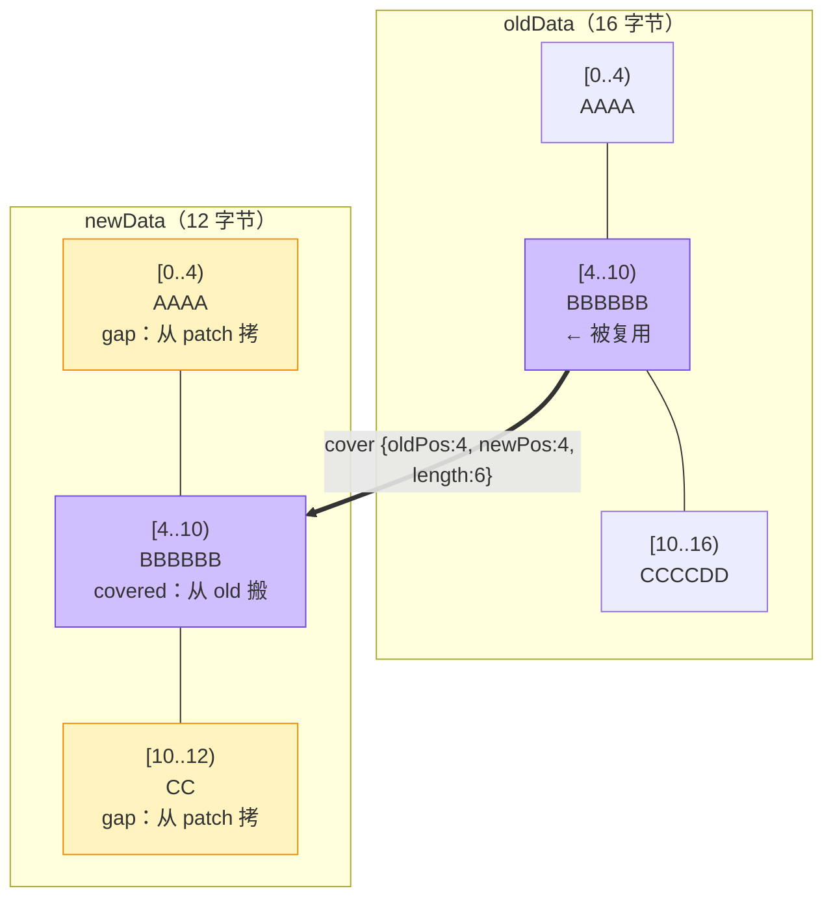

# cover：一条"复用指令"里到底放了什么

> 上一篇：[总览](/hot-update/) | 下一篇：[diff 生成](./hdiff-generate)
> 源码：`HDiffPatch v4.12.1`，本页每个行号都已按本机源码树逐条核对

<script setup>
import OldNewPatchFlow from './components/OldNewPatchFlow.vue'
import PatchBinaryAnatomy from './components/PatchBinaryAnatomy.vue'
</script>

## 一句话结论

整个 HDiffPatch 只围绕一个三元组运转：**「从旧文件的第 `oldPos` 字节，搬 `length` 个字节，贴到新文件的第 `newPos` 字节」**。
这个三元组叫 cover。一条 patch 就是"一串 cover + 没被 cover 盖住的那些新字节"。

## 它到底解决什么问题

如果不做差分，要做的事是"把 new 整个搬过去"。
有了 cover，要做的事变成"记住 N 条搬运关系，剩下的零头单独存"。

于是全部问题都压缩成两个：

1. **怎么找出这些搬运关系？** —— 是 [diff 生成](./hdiff-generate) 篇的事（后缀数组 + 收益模型）。
2. **怎么把搬运关系写得尽量短？** —— 是本篇的事。

因为一条 cover 如果裸存，要占 3 个 8 字节整数（`hpatch_StreamPos_t` 是 64 位，见 `patch_types.h:270-274`），一条就是 24 字节。一条 patch 里常有几十万条 cover，裸存直接爆掉。**所以真正的功夫在"怎么把它写小"。**

## 术语先对齐

| 术语 | 一句话解释 |
|---|---|
| **cover / 三元组** | `{oldPos, newPos, length}`：从哪搬、搬到哪、搬多长 |
| **inc_oldPos / inc_newPos** | 不存绝对值，只存"相对上一条 cover 差多少"，数字小就能用 1 字节表示 |
| **符号 tag** | 变长整数里额外借 1 个 bit 表示"这次是前进还是回退" |
| **变长整数（packUInt）** | 每字节 7 位数据 + 1 位"还有没有下一字节"，小数字 1 字节搞定 |
| **控制流成本** | 描述这条 cover 本身要花的字节数。cover 省的是数据，花的是控制流 |
| **residual / subDiff** | covered 区里 `new − old` 的逐字节差（模 256） |

## 主图解：一条 cover 在做什么



这张图就是 patch 的全部内容：**紫色区域从旧文件"搬"，黄色区域从补丁包里"拷"**。
本篇后面出现的所有字节数，都是在这个 `old="AAAABBBBCCCCDDDD"` / `new="AAAABBBBBBCC"` 的算例上算的——你可以拿纸笔跟着核一遍。

## 两个必须先纠正的认知

### ① cover 不是完整的 patch 算法

cover 只是"复用关系表"。一个完整的 patch 包还包含：

- 未覆盖新字节（`newDataDiff`，gap 区原样字节）
- 覆盖区残差（`subDiff`，经 rle0 编码）
- 压缩、以及文件头

生成器里**大部分代码在处理后面这几样**，而不是在找 cover。

### ② cover 不要求字节完全相同

搜索阶段找的是**完全相同**的片段，但 `extend_cover`（`diff.cpp:467`）会把"相似但不全同"的边界区域也吸收进 cover——差异部分用残差修正。
这样一次匹配能覆盖更长的区间，**省下的是"再多写一条 cover"的控制流成本**。这笔账在 [实战例子](./hdiff-example) 里会手算一遍。

## cover 的三条硬约束

从应用侧的解码逻辑可以反推生成侧**必须**保证的性质。这也是读源码的一个技巧：**看不懂编码规则时，去看解码器在假设什么**。

| 约束 | 为什么必须这样 | 源码证据 |
|---|---|---|
| cover 之间**有序且不重叠** | 应用侧靠 `cover.newPos − lastNewEnd` 反推 gap 长度。如果乱序或重叠，这个减法是负数，gap 就算不出来 | `patch.c:1000` `if (cover.newPos<newPosBack) return _hpatch_FALSE` |
| gap 长度**不存进 patch** | 它是算出来的，不是存的。这正是 `newDataDiff` 能做到"无分隔符连续存储"的原因 | `patch.c:2504-2506` |
| `oldPos` 允许**回退** | new 里两段内容可以都来自 old 的前半段，所以 oldPos 不单调；而 newPos 天然单调 | `patch.c:2261`（取 MSB 当符号）→ `:2265-2268`（前进/回退分支） |

第三点是本页最值得记住的细节。看真实代码（`sspatch_covers_nextCover`，函数从 `patch.c:2260` 开始）：

```cpp
// patch.c:2260-2273（还原一条 cover 的全过程）
hpatch_BOOL sspatch_covers_nextCover(sspatch_covers_t* self){
    // 先读当前字节的最高位：它就是"方向 tag"，必须在解数值之前先取出来
    hpatch_BOOL inc_oldPos_sign=(*(self->covers_cache))>>(8-1);
    self->lastOldEnd=self->cover.oldPos+self->cover.length;
    self->lastNewEnd=self->cover.newPos+self->cover.length;
    // 再按"带 1 个 tag 位"的规则解出 oldPos 增量
    if (!hpatch_unpackUIntWithTag(&self->covers_cache,self->covers_cacheEnd,&self->cover.oldPos,1)) return _hpatch_FALSE;
    if (inc_oldPos_sign==0)
        self->cover.oldPos+=self->lastOldEnd;          // 前进：oldPos = 上一条 oldEnd + 增量
    else
        self->cover.oldPos=self->lastOldEnd-self->cover.oldPos;  // 回退：oldPos = 上一条 oldEnd − 增量
    // newPos 没有 tag——它只可能前进
    if (!hpatch_unpackUInt(&self->covers_cache,self->covers_cacheEnd,&self->cover.newPos)) return _hpatch_FALSE;
    self->cover.newPos+=self->lastNewEnd;
    if (!hpatch_unpackUInt(&self->covers_cache,self->covers_cacheEnd,&self->cover.length)) return _hpatch_FALSE;
    return hpatch_TRUE;
}
```

注意第 2261 行：**"先读最高位"这个动作必须发生在解数值之前**——因为那个最高位同时是"续位标记"和"方向标记"的复用位。这是这套编码最省也最绕的地方。生成侧对应的编码是 `stream_serialize.cpp:94` 的 `__private_packCover`：

```cpp
// stream_serialize.cpp:94-101（生成侧的镜像实现）
#define __private_packCover(_TUInt,packWithTag,pack,dst,dst_end,cover,lastOldEnd,lastNewEnd){
    if (cover.oldPos>=lastOldEnd) /*save inc_oldPos*/
        packWithTag(dst,dst_end,(_TUInt)(cover.oldPos-lastOldEnd), 0, 1);   // tag=0：前进
    else
        packWithTag(dst,dst_end,(_TUInt)(lastOldEnd-cover.oldPos), 1, 1);   // tag=1：回退
    pack(dst,dst_end,(_TUInt)(cover.newPos-lastNewEnd));   // gap，无符号
    pack(dst,dst_end,(_TUInt)cover.length);
}
```

> ⚠️ **一处源码细节，别被带偏**：`patch.c:2261` 里 `inc_oldPos_sign` 取的是**当前字节的最高位**，而 `hpatch_unpackUIntWithTag(...,1)` 是"数值本身占第 0 位、tag 占第 1 位"的约定。两者配合在 HDiffPatch 里是自洽的（tag 位固定落在首字节最高位），但如果你自己写一个兼容实现，**必须照抄这个顺序**：先取 tag，再解数值。自己在生成侧"想当然"地用别的顺序写，patch 端会解出完全不同的 oldPos。

## 为什么这个设计能把 24 字节压到几个字节

裸存 3 个 64 位整数 = 24 字节。实际写法是三条增量：

| 字段 | 相对谁 | 典型量级 | 编码后 |
|---|---|---|---|
| `inc_oldPos` | 上一条 cover 的 **oldEnd** | 几百 ~ 几千 | 1~2 字节（带 1bit 符号 tag） |
| `inc_newPos` | 上一条 cover 的 **newEnd** | 几十（就是 gap 长度） | 1 字节 |
| `length` | 无（自己就是长度） | 几十 ~ 几万 | 1~2 字节 |

三条合起来是**通常 3~5 字节**。这个数字就是后面所有"收益模型"里的"入场费"。
下面这个组件把上面那个算例逐字节摊开——鼠标点任意一段、任意一个字节：

<OldNewPatchFlow />

<BitField
  title="cover 控制流的位布局：为什么 oldPos 需要 1 个符号位而 newPos 不需要"
  :bytes="[0x08, 0x06, 0x04]"
  :fields="[
    { name: 'inc_oldPos', from: 0, to: 7, desc: '本次算例：oldPos 增量是 4，但源码编码时先 ×2 把符号位让出来 → 8 = 0x08。最低位就是那个 tag（0=前进 / 1=回退）' },
    { name: 'length', from: 8, to: 15, desc: '复用长度 6' },
    { name: 'inc_newPos', from: 16, to: 23, desc: 'gap 长度 4。没有 tag 位，所以数值范围比 oldPos 大一倍' }
  ]" />

> 上面这个 BitField 用的是"每个字段各占 1 字节"的简化视角（本算例三个数都 < 128，确实各占 1 字节）。真实编码里每个 packUInt 的位数是可变的：**128 以下 1 字节、16384 以下 2 字节、200 万以下 3 字节**。想知道任意数字要几字节，去 [小文件与小重复](./hdiff-minmatch) 篇的收益模型计算器拖一下滑块。

## 从 cover 列表到真实字节

下面这个组件把整条 patch 的字节摊开——**同一个输入，两种格式并排**，你可以直接看到 classic 的 27 字节和 single 的 39 字节差在哪：

<PatchBinaryAnatomy />

对比结论先说：本例 new 只有 12 字节，**两种格式都不划算**。这不是 bug——它恰好演示了 [小文件与小重复](./hdiff-minmatch) 篇的核心结论：patch 有固定的结构性开销，文件越小，这笔税占的比例越高。

## 常见误解

::: warning "cover 存的是 oldPos 的绝对值"
不是。存的是**相对上一条 cover 的 oldEnd 的增量**。这个设计带来一个很漂亮的副作用：如果两条 cover 在 old 里挨得很近（比如连续复用一个未变动的大区间），第二条的增量接近 0，**1 字节就写得下**——换句话说，"在 old 里聚堆的匹配几乎免入场费"。这条性质直接塑造了 [diff 生成](./hdiff-generate) 篇里"密集重复区拼命挖、稀疏重复区全放弃"的宏观行为。
:::

::: warning "一条 cover 的 length 越大，控制流成本越高"
length 也只是一个变长整数：127 字节以下 1 字节，16383 以下 2 字节。**长度从 6 涨到 120，控制流成本一动不动。** 所以收益模型奖励"长匹配"，惩罚的是"多而散的匹配"。
:::

## 自检清单

- [ ] 能画出 `{oldPos:4, newPos:4, length:6}` 对应的 old/new 区间关系
- [ ] 能解释为什么 `newPos` 不需要符号位，而 `oldPos` 需要
- [ ] 能说出"cover 有序不重叠"对应用侧 gap 计算意味着什么
- [ ] 能解释为什么"在 old 里聚堆的匹配"控制流成本更低
- [ ] 能在 `patch.c:2260-2273` 与 `stream_serialize.cpp:94-101` 之间指出哪一行是互逆的

---

上一篇：[总览](/hot-update/) | 下一篇：[diff 生成：cover 搜索与序列化](./hdiff-generate) —— 后缀数组怎么找匹配、一条匹配凭什么"入选"cover
