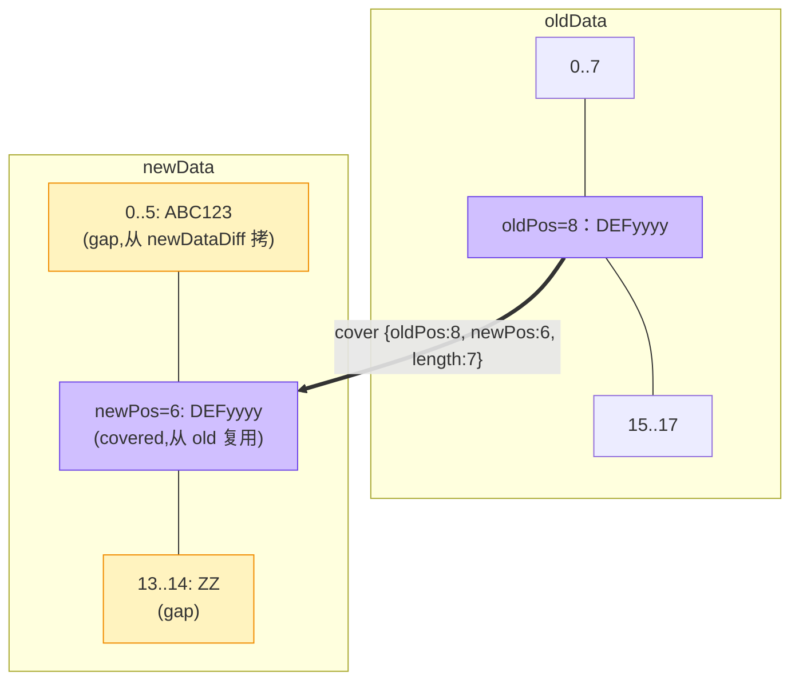

# cover：差量的核心数据结构

> 上一篇：[总览](/) | 下一篇：[diff 生成](./hdiff-generate)
> 源码：`HDiffPatch v4.12.1`，行号已对照本地源码验证

## cover 三元组

整个 HDiffPatch 围绕一个极简的结构体运转（`libHDiffPatch/HPatch/patch_types.h:270`）：

```cpp
typedef struct hpatch_TCover{
    hpatch_StreamPos_t oldPos;   // 从 oldData 的哪里开始复用
    hpatch_StreamPos_t newPos;   // 贴到 newData 的哪个位置
    hpatch_StreamPos_t length;   // 复用多长
} hpatch_TCover;
```



这张图就是 patch 的全部：**紫色的区域从旧文件"搬"，黄色的区域从 diff 包里"拷"**。

## 两个关键认知

### ① cover 不是完整 patch 算法

cover 只是"复用关系表"。一个完整的 diff 包 = cover 控制流 + 未覆盖新字节（newDataDiff）+ 覆盖区残差（subDiff/RLE）+ 压缩 + 头部。diff 生成器的大多数代码其实在处理后面几样东西。

### ② cover 不要求字节完全相同

搜索阶段找的是**相同片段**，但 `extend_cover`（`diff.cpp:467`）会把"相似但不全同"的边界区域也纳入 cover——差异部分用残差（`new - old`，逐字节模 256）修正。这样一次匹配能覆盖更长的区间，省下多条 cover 的控制流成本。

## cover 的三个操作约束

从 `sspatch_covers_nextCover`（`patch.c:2265`）的解码逻辑可以反推生成器必须保证的性质：

| 约束 | 原因 | 源码证据 |
|---|---|---|
| cover 按 newPos **有序** | patch 端用 `cover.newPos - lastNewEnd` 算 gap，无序则算不出 | `patch.c:2504` |
| cover 之间**不重叠** | 同上，`newPosBack` 单调前进 | `patch.c:998` `if (cover.newPos<newPosBack) return _hpatch_FALSE` |
| oldPos 可以**回退** | 复用区允许交叉引用旧文件前段，编码带 1bit 符号 tag | `patch.c:2266-2271` |

第三点展开看：`inc_oldPos` 用 `packWithTag(..., tag, 1)` 编码，tag=0 表示 `oldPos = lastOldEnd + inc`（前进），tag=1 表示 `oldPos = lastOldEnd - inc`（回退）。newPos 恒为前进（gap 语义），所以只有 oldPos 需要符号位。

## 为什么这个设计省空间

一个 cover 裸存要 3 个 8 字节指针（hpatch_StreamPos_t 是 64 位），但序列化时存的是**增量**：

- `inc_oldPos`：相对上一个 cover 的 oldEnd，通常几百~几千
- `inc_newPos`：相对上一个 cover 的 newEnd 的间隙，通常几十
- `length`：匹配长度本身

小数字用变长整数（PackedUInt：每字节 1 个 MSB 继续位 + 7bit 数据）编码后只要 1~3 字节。**匹配越连续，增量越小，控制流开销越低**——这直接决定了后面"哪些匹配值得保留"的算账方式（见下一篇的收益模型）。

## 自检

- [ ] 能画出 `{oldPos:8, newPos:6, length:7}` 对应的 old/new 区间关系
- [ ] 能解释为什么 newPos 不需要符号位而 oldPos 需要
- [ ] 能说出 cover 有序不重叠对 patch 端 gap 计算的意义

---
下一篇：[diff 生成：cover 搜索与序列化](./hdiff-generate) —— 后缀数组怎么找匹配、一条匹配凭什么"入选" cover
