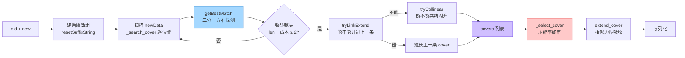
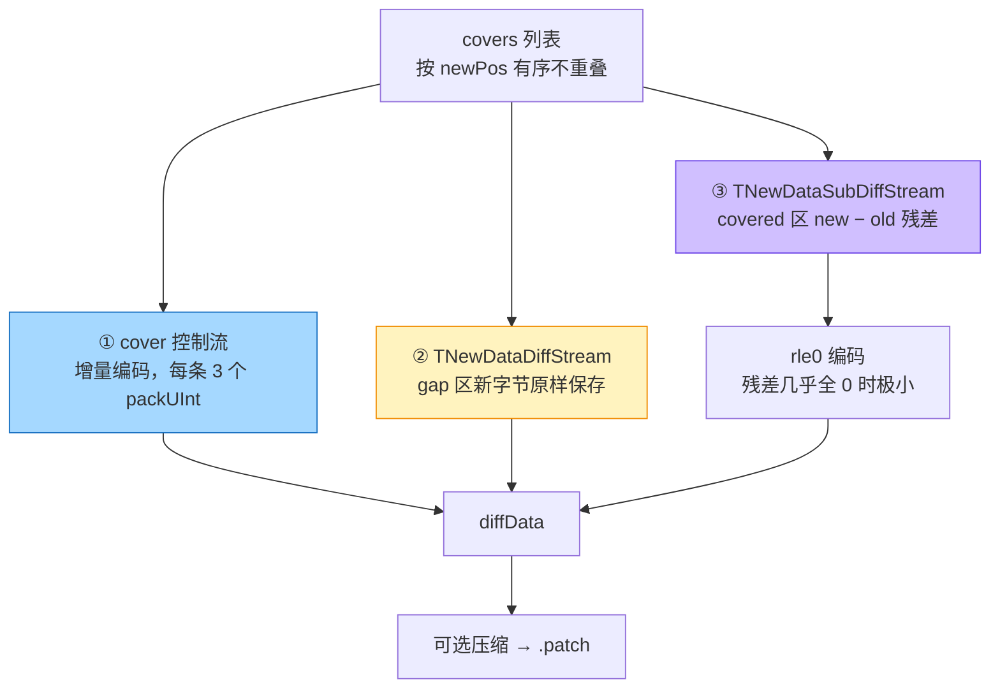

# diff 生成：后缀数组怎么找匹配，一条匹配凭什么入选

> 源码：`libHDiffPatch/HDiff/diff.cpp`，本页每个行号都已按本机源码树逐条核对
> 上一篇：[cover 数据结构](./hdiff-cover) | 下一篇：[patch 应用](./hdiff-patch)

<script setup>
import MatchCostScorer from './components/MatchCostScorer.vue'
import PatchBinaryAnatomy from './components/PatchBinaryAnatomy.vue'
import MatchSearchSimulator from './components/MatchSearchSimulator.vue'
</script>

## 一句话结论

生成侧做三件事：**① 在 old 里给每个位置排好序（后缀数组），② 拿 new 的每个位置去二分找最长匹配，③ 用一套"收益账"决定这条匹配配不配当 cover。** 找得不难，难在"什么该留"。

## 它到底解决什么问题

你已经知道 patch 里存的是一串 cover（[上一篇](./hdiff-cover)）。那么：

- 怎么知道 new 的第 3000 字节和第 8000 字节其实都来自 old 的同一段？→ **要找得快**。old 有 80MB，逐字节比对是 `80MB × 80MB` 的灾难。
- 找到的匹配，是不是都值得写成一条 cover？→ **要算得清**。一条 cover 至少要 3 字节的控制流开销，一个 4 字节的匹配存进去反而让 patch 变大。

第一个问题用**后缀数组**（把 old 的所有后缀按字典序排好，之后一次二分就能定位近似串），第二个问题用**收益模型**（把匹配长度和控制流成本相减，过关才留）。

生活类比：你要在一本 300 页的书里找"和这句引用最像的段落"。

- 笨办法：从第 1 页第 1 行开始逐字对。
- 后缀数组：先把书里所有"从某处开始到书末"的片段按首字排序做成索引——像字典的检字表。之后查一句话，翻两次检字表就知道它最可能落在哪。
- 收益模型：找到一段"像"的，还要判断"改写这一页的成本 vs 直接重印这一页的成本"，只有前者更省才动手。

## 术语先对齐

| 术语 | 一句话解释 |
|---|---|
| **后缀（suffix）** | 从 old 的第 i 个字节开始、一直到文件末尾的那一串 |
| **后缀数组（SA）** | 把 old 的所有后缀按字典序排好，只记"起点位置"的数组。`SA[i]` = 字典序第 i 小的后缀的起点 |
| **lower_bound** | 在有序数组里二分，找到第一个"不小于查询串"的位置。它是候选中心，不是答案 |
| **matchDeep** | 二分命中后，往左右各探测几个候选。默认 2——只看命中位和它的左邻 |
| **收益（score）** | `匹配长度 − 控制流成本`。正得越多越值得存 |
| **初审 / 终审** | 第一轮 `_search_cover` 用假设成本初筛；第二轮 `_select_cover` 用真实压缩率模型终审 |

## 主图解：四个阶段的职责



对应到源码，几个函数各管一段：

| 阶段 | 函数 | 位置 | 职责 |
|---|---|---|---|
| 找最长匹配 | `getBestMatch` | `diff.cpp:149` | 后缀数组 `lower_bound` + 左右探测 |
| 扫描 newData | `_search_cover` | `diff.cpp:299` | 裁决"这个匹配够不够格当 cover" |
| 连接相邻 cover | `tryLinkExtend` | `diff.cpp:229` | 相邻近似共线的 cover 合并 |
| 共线对齐 | `tryCollinear` | `diff.cpp:279` | 等差推进的匹配直接改 oldPos |
| 相似区扩展 | `extend_cover` | `diff.cpp:467` | 把"相似但不全同"的边界纳入 |
| 成本筛选 | `_select_cover` | `diff.cpp:345` | 用压缩率模型删掉不划算的 cover |

## 单步拆解：先动手，再读代码

先跑一遍下面的匹配查找可视化：它把"后缀数组二分 → 左右探测 → 定最长匹配"逐步放出来。看完再读后面的代码，会顺很多。

<MatchSearchSimulator />

## 源码逐行核实

### 总控：`get_diff()`（`diff.cpp:883`）

```cpp
// diff.cpp:883-905（省略与本篇无关的 listener 分支）
static void get_diff(TDiffData& diff,std::vector<TOldCover>& covers,
                     int kMinSingleMatchScore, ...){
    const hpatch_StreamPos_t maxCoverLen=(listener&&listener->get_limit_cover_length)?
                                            listener->get_limit_cover_length(listener):kDefaultLimitCoverLen;
    {
        TSuffixString _sstring_default(isUseBigCacheMatch);
        if (sstring==0){
            // 为 oldData 建后缀数组。这一步是生成侧最贵的一步（O(n) 但常数大）
            _sstring_default.resetSuffixString(diff.oldData,diff.oldData_end,threadNum);
            sstring=&_sstring_default;
        }
        first_search_and_dispose_cover_MT(covers,diff,*sstring,kMinSingleMatchScore,listener,threadNum,isCanExtendCover);
        _limitCoverLenth(covers,maxCoverLen);   // 单条 cover 长度上限（默认 1GB，见 diff.cpp:66）
        assert_covers_safe(covers,...);         // debug 断言：有序、不重叠、不越界
```

### `getBestMatch()`：后缀数组上的匹配（`diff.cpp:149`）

这个函数短，但每一行都有讲究。点开逐行看：

<CodeStepper
  file="libHDiffPatch/HDiff/diff.cpp（getBestMatch，diff.cpp:149 起）"
  :lines="[
    { n: 152, code: 'TInt sai=sstring.lower_bound(newData,newData_end);', note: '在有序的后缀数组里二分，找到第一个不小于查询串的位置。注意：这只是候选中心，不是最长匹配本身——所以下一行 sai<0 就直接返回 0' },
    { n: 154, code: 'const TInt matchDeep = diffLimit?diffLimit->kMaxMatchDeep:2;', note: '要不要多看几个候选。默认只看 2 个：命中位 sai 和它的左邻 sai-1。这是速度与匹配质量的直接取舍' },
    { n: 160, code: 'TInt bestLength= kMinMatchLen -1;', note: '整段代码最关键的一行。初值就是门槛减一（=4），意味着任何短于 5 字节的匹配都更新不了它 → 短匹配对算法来说根本不存在' },
    { n: 164, code: 'for (TInt mdi= 0; mdi< matchDeep; ++mdi) {', note: '左右探测循环：mdi=0 看 sai，mdi=1 看 sai-1，mdi=2 看 sai+1……（见下一行的摆动公式）' },
    { n: 170, code: 'TInt i = sai + (1-(mdi&1)*2) * ((mdi+1)/2);', note: '摆动定位：偶数轮往左、奇数轮往右，距离逐步拉开。一个循环同时覆盖两侧候选，不用写两个循环' },
    { n: 172, code: 'TInt curOldPos=sstring.SA(i);', note: 'SA(i) 就是候选在 old 里的起点位置' },
    { n: 175, code: '#define kTryEqLenLimit (1024*1+17)', note: '算公共前缀长度时的上限（1025 字节）。防止一次比较把整段几 MB 的相同区域全扫完——长区间的扩展交给后面的 extend_cover' }
  ]" />

两个阈值常量的真实定义（`diff.cpp:60-65`、`diff_types.h:71`）：

```cpp
// diff.cpp:60-65
#if (_SSTRING_FAST_MATCH>0)
static const int kMinMatchLen   = (_SSTRING_FAST_MATCH>kCoverMinMatchLen)?_SSTRING_FAST_MATCH:kCoverMinMatchLen;
#else
static const int kMinMatchLen   = kCoverMinMatchLen; //min length for match search.
#endif
static const int kMinMatchScore = 2; //min match benefit threshold for cover search.

// diff_types.h:71
static const int kCoverMinMatchLen=5;
```

> **注意**：`kMinMatchLen` 不是写死的 5，而是 `max(_SSTRING_FAST_MATCH, kCoverMinMatchLen)`——开启快速匹配模式时门槛更高。`kCoverMinMatchLen=5` 是它的下限。

### `_search_cover()`：从匹配到 cover 的裁决（`diff.cpp:299`）

真实代码（`diff.cpp:309-340` 主循环）：

```cpp
while (newPos<=maxSearchNewPos) {
    TInt matchOldPos=0;
    size_t limitSkip=1;                    // diffLimit 允许"一次跳过多字节"，普通模式恒为 1
    TInt matchEqLength=getBestMatch(&matchOldPos,sstring,diff.newData+newPos,diff.newData+newEnd,newPos,
                                    diffLimit,&limitSkip);
    if (matchEqLength<kMinMatchLen){        // ① 闸门一：长度不够
        newPos+=limitSkip;                  //    直接跳过（普通模式就是 +1）
        continue;
    }
    TOldCover matchCover(matchOldPos,newPos,matchEqLength);
    if (matchEqLength-getCoverCtrlCost(matchCover,lastCover)<kMinMatchScore){
        ++newPos;                           // ② 闸门二：扣掉控制流成本后不赚，逐字节前进
        continue;
    }//else matched

    if (isCanExtendCover){
        if (tryLinkExtend(lastCover,matchCover,diff,diffLimit)){   // ③ 能并进上一条就并
            if (covers.size()==cover_begin) covers.push_back(lastCover);
            else                            covers.back()=lastCover;
        }else{
            if (covers.size()>cover_begin)  tryCollinear(covers.back(),matchCover,diff,diffLimit);
            covers.push_back(matchCover);                          //    否则新增一条
        }
    }else{
        covers.push_back(matchCover);
    }
    lastCover=covers.back();
    newPos=std::max(newPos+1,lastCover.newPos+lastCover.length);// ④ cover 不允许重叠
}
```

四处细节值得单独指出：

1. **`newPos+=limitSkip` 和 `++newPos` 是两种不同的"前进"**。前者是 diffLimit 模式下的加速跳（跳过已知无匹配的区域），后者是普通模式的标准行为。
2. **收益判定用的是 `lastCover`，它在循环末尾才更新**——所以它始终是"目前为止最新一条 cover"。这意味着收益是相对最近一条 cover 算的，而不是全局最优。
3. **`newPos=std::max(newPos+1, lastCover.newPos+lastCover.length)`** 这一行决定了 cover 不重叠。源码自己在这行末尾留了注释：*"The selected cover does not allow overlap, which may not be the optimal strategy;"* —— 上游自己承认这可能不是最优策略。这是个诚实的注释，也说明这个算法是**工程折中**而不是理论最优。
4. **`tryLinkExtend` 成功后 `covers.back()` 被整体替换**，而不是新增。所以"接龙"这条路径不会让 cover 数量增加。

### 收益模型（这一节是 HDiffPatch 的灵魂）

一条 cover 不是白用的。应用侧要为它付出**控制流成本**：`getCoverCtrlCost`（`diff.cpp:216-221`）算的是 oldPos 增量 + length + newPos 增量这三个变长整数的**编码字节数**：

```cpp
// diff.cpp:216-221
inline static TInt getCoverCtrlCost(const TOldCover& cover,const TOldCover& lastCover){
    static const int kUnLinkOtherScore=0;//0--2
    return _getIntCost<TInt,TUInt>((TInt)(cover.oldPos-lastCover.oldPos))
         + _getUIntCost((TUInt)cover.length)
         + _getUIntCost((TUInt)(cover.newPos-lastCover.newPos)) + kUnLinkOtherScore;
}
```

只有满足下式，这条 cover 才值得保留：

```
匹配长度 − 控制流成本 ≥ kMinMatchScore (2)
```

**把公式变成可以拖的东西**——下面这个计算器用真实编码规则实时算三个变长整数的字节数，拖滑块就能看出"多长的匹配才付得起入场费"：

<MatchCostScorer />

这解释了一个直觉误区：**孤立的短匹配永远不会形成 cover**。3 字节的 `"ABC"` 连第一道长度门槛都过不了（`kMinMatchLen=5`）；6 字节的匹配要付 3~5 字节控制流，`6 − 5 = 1 < 2`，照样被拒。详细数字账见 [小文件与小重复](./hdiff-minmatch)。

### stream / block 模式（大文件路径）

old/new 放不进内存时，不建完整后缀数组，改用 rolling digest 分块匹配：

| 源码 | 说明 |
|---|---|
| `diff.cpp:1062` | single stream 用 `get_match_covers_by_block()` 产出 covers |
| `diff.cpp:1197` / `:1203` | `get_match_covers_by_block` 的两个重载（流式 / 内存内） |
| `diff.cpp:1310-1311` | classic stream 路径同样走 block 匹配 |

**权衡**：block 模式内存可控、支持超大文件，但匹配粒度粗 → patch 体积通常更大。项目里最终选择的是内存路径（配合 8MB native cache），见 [项目落地](./hdiff-unity)。

## cover 列表 → 三条数据流

搜出的 covers 不裸写进 patch，而是拆成控制流 + 两条数据流：



### ① 控制流：增量编码

就是 [cover 篇](./hdiff-cover) 里那段 `__private_packCover`（`stream_serialize.cpp:94-101`）。三个要点：

- `inc_oldPos`：相对上一条 cover 的 **oldEnd**，带 1bit 符号 tag（允许回退）
- `inc_newPos`：相对上一条 cover 的 **newEnd** 的间隙，恒 ≥ 0
- 增量小 → 变长整数编码后 1~3 字节

### ② gap 流：新字节原样保存

`TNewDataDiffStream::_read`（`stream_serialize.cpp:198` 起）只输出 cover 之间的间隙字节，**物理上连续、没有分隔符**。patch 端靠 `cover.newPos - lastNewEnd` 自己算出每段边界——这也是为什么 cover 必须有序不重叠。

### ③ 残差流：new − old

```cpp
// stream_serialize.cpp:312-315
static inline void _subData(unsigned char* dst,const unsigned char* src,size_t length){
    while (length--)
        (*dst++)-=*src++;      // subDiff = new − old（字节级，模 256）
}
```

匹配质量好时残差几乎全是 0，rle0 把连续 0 压成一个长度数字。应用侧逆运算：`new = subDiff + old`（`patch.c:326-328` 的 `addData`）。

## 序列化：两种格式的真实字节

不要只记"HDIFFSF20 是新的、HDIFF13 是旧的"。**它们的差别是"几条数据流"**——下面这个组件把同一个输入的两种格式逐字节摊开对照：

<PatchBinaryAnatomy />

### single compressed diff（`HDIFFSF20`，项目在用）

```cpp
// diff.cpp:994-1018（关键行 1012-1018）
void serialize_single_compressed_diff(const hpatch_TStreamInput* newStream,const hpatch_TStreamInput* oldStream,
                                      bool isZeroSubDiff,const TCovers& covers,const hpatch_TStreamOutput* out_diff,
                                      const hdiff_TCompress* compressPlugin,size_t patchStepMemSize){
    check(patchStepMemSize>=hpatch_kStreamCacheSize);
    if (patchStepMemSize>newStream->streamSize){    // 关键：step 大小会被钳到 newSize
        patchStepMemSize=(size_t)newStream->streamSize;
        if (patchStepMemSize<hpatch_kStreamCacheSize)
            patchStepMemSize=hpatch_kStreamCacheSize;
    }
    TStepStream stepStream(newStream,oldStream,isZeroSubDiff,covers,patchStepMemSize);

    TDiffStream outDiff(out_diff);
    { std::vector<TByte> out_type; _outType(out_type,compressPlugin,kHDiffSFVersionType);   // "HDIFFSF20&"
      outDiff.pushBack(out_type.data(),out_type.size()); }
    outDiff.packUInt(newStream->streamSize);         // newDataSize
    outDiff.packUInt(oldStream->streamSize);         // oldDataSize
    outDiff.packUInt(stepStream.getCoverCount());    // coverCount
    outDiff.packUInt(stepStream.getMaxStepMemSize()); // stepMemSize —— 被钳过的那个值
    outDiff.packUInt(stepStream.streamSize);         // uncompressedSize
    TPlaceholder compressed_sizePos=outDiff.packUInt_pos(compressPlugin?stepStream.streamSize:0);  // compressedSize 占位
    outDiff.pushStream(&stepStream,compressPlugin,compressed_sizePos);   // 只推一条流
}
```

核心是 `TStepStream`（`stream_serialize.cpp:475` 起）：把 cover 控制流、rle 码流、gap 新字节按 `patchStepMemSize`（默认 256KB，`diff.h:121`）切成 step 交织打包。cover 太大放不进一个 step 时会被切开（`doStep()`，`stream_serialize.cpp:578`）。

**优势**：应用侧只需 1 个解压句柄，峰值内存 ≈ stepMemSize + IO 缓冲，顺序流式读取。这是移动端热更的正确选择。

> **第 999-1002 行那个钳制很重要，容易被忽略**：如果 new 文件只有 12KB，stepMemSize 会从 256KB 被降到 12KB。所以小文件的 single patch 内存开销也跟着小——但相对而言，它的头部字段（6 个 packUInt）占比会显著上升。这正是 [小文件与小重复](./hdiff-minmatch) 里"patch 比 new 还大"的成因之一。

### classic compressed diff（`HDIFF13`，兼容旧格式）

```cpp
// diff.cpp:1269-1286
outDiff.packUInt(newData->streamSize);
outDiff.packUInt(oldData->streamSize);
outDiff.packUInt(covers.coverCount());
const hpatch_StreamPos_t cover_buf_size=TCoversStream::getDataSize(covers);
outDiff.packUInt(cover_buf_size);
TPlaceholder compress_cover_buf_sizePos=outDiff.packUInt_pos(compressPlugin?cover_buf_size:0);
outDiff.packUInt(rle_ctrlBuf.size());
TPlaceholder compress_rle_ctrlBuf_sizePos=outDiff.packUInt_pos(compressPlugin?rle_ctrlBuf.size():0);
outDiff.packUInt(rle_codeBuf.size());
TPlaceholder compress_rle_codeBuf_sizePos=outDiff.packUInt_pos(compressPlugin?rle_codeBuf.size():0);
const hpatch_StreamPos_t newDataDiff_size=TNewDataDiffStream::getDataSize(covers,newData->streamSize);
outDiff.packUInt(newDataDiff_size);
TPlaceholder compress_newDataDiff_sizePos=outDiff.packUInt_pos(compressPlugin?newDataDiff_size:0);
// 随后依次写 4 个独立数据段：cover / rle_ctrl / rle_code / newDataDiff（:1288-1300）
```

这里是**先声明 10 个尺寸，再依次写 4 段数据**，而且每段前面都有独立的压缩尺寸字段（无插件时为 0，`compress*Size` 就取 packUInt 的 1 字节）。所以 classic 的头部固定比 single 多几个字节。

4 段各自独立压缩 → 应用时要同时开 4 个解压 clip，内存和句柄开销都高于 single。**但小文件场景下 classic 反而更省，因为它没有每个 step 的两个 size 字段开销**——你可以在上面的组件里直接看到 27B vs 45B 的差距。

## 生成后默认 patch check

`hdiffz` 默认在生成后验证 `patch(old, diff) == new`（`hdiffz.cpp:380` 的 `-d` 才关闭，`:1502` 打印开始、`:1572-1574` 打印结果）：

```
load diffFile for patch check:
  patch check diff data ok!
```

这条别关——它能立刻发现 diff 生成错误和压缩/IO 异常，成本只是生成端多跑一次 patch。

## 常见误解

::: warning "matchDeep 越大匹配越好"
`matchDeep` 默认 2，看的是 `sai` 和 `sai-1` 两个候选。调大能找到更长匹配，但代价是每个 newPos 都要多算几次公共前缀。HDiffPatch 的选择是"默认浅、只在受限模式下用 `kDefaultMaxMatchDeepForLimit`"（`diff.cpp:910`）。匹配质量主要靠 `extend_cover` 事后补，而不是靠搜索时贪心。
:::

::: warning "被拒绝的匹配完全没代价"
被收益模型拒掉的匹配，其字节会走 `newDataDiff` 原样存储——**一个字节都省不下来**。这就是"小重复不生成 diff"的实质：不是算法懒得管，是存进去确实更亏。
:::

## 自检清单

- [ ] 能说出 `kMinMatchLen=5` 与 `kMinMatchScore=2` 分别卡什么
- [ ] 能用收益公式解释"孤立短匹配不形成 cover"
- [ ] 能说出 `_search_cover` 里 `newPos` 两种前进方式的区别
- [ ] 能画出 cover 列表 → 三条数据流的拆分图
- [ ] 能对比 single（HDIFFSF20）与 classic（HDIFF13）的应用侧开销差异
- [ ] 能在 `diff.cpp:160` 找到 `bestLength=kMinMatchLen-1` 这行，并解释它为什么让短匹配"隐形"

---

上一篇：[cover 数据结构](./hdiff-cover) | 下一篇：[patch 应用](./hdiff-patch) —— 拿到 patch 之后，新文件是怎么一个字节一个字节拼出来的
