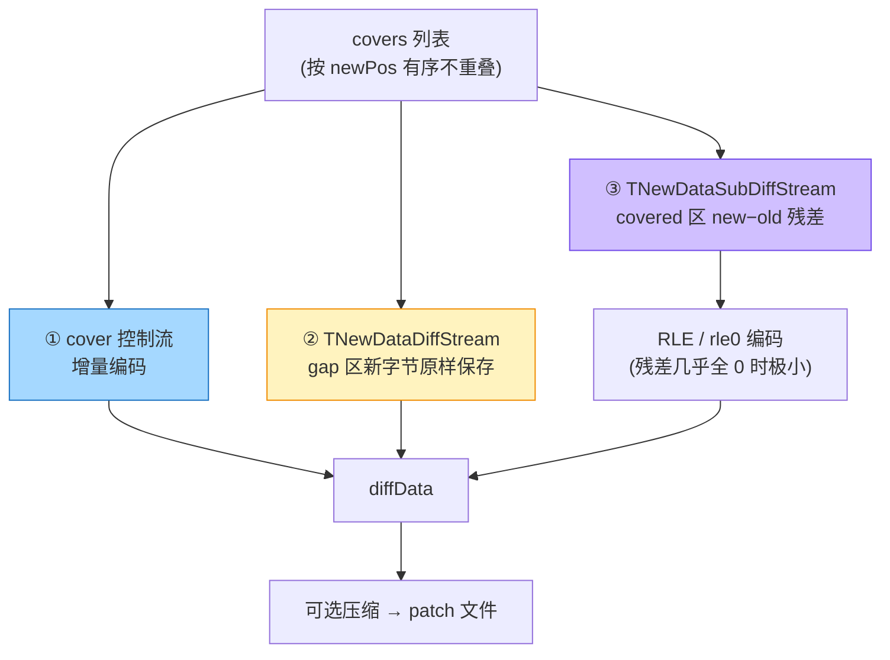

# diff 生成：cover 搜索与序列化

> 上一篇：[cover 数据结构](./hdiff-cover) | 下一篇：[patch 应用](./hdiff-patch)
> 源码：`libHDiffPatch/HDiff/diff.cpp`，行号已对照本地源码验证

## 总控：get_diff()

全内存模式下，diff 生成的主链路（`diff.cpp:883`）：

```cpp
static void get_diff(TDiffData& diff,std::vector<TOldCover>& covers,
                     int kMinSingleMatchScore, bool isUseBigCacheMatch,
                     ICoverLinesListener* listener, const TSuffixString* sstring,
                     size_t threadNum, bool isCanExtendCover=true){
    // ...
    TSuffixString _sstring_default(isUseBigCacheMatch);
    if (sstring==0){
        _sstring_default.resetSuffixString(diff.oldData,diff.oldData_end,threadNum);  // 为 oldData 建后缀数组
        sstring=&_sstring_default;
    }
    first_search_and_dispose_cover_MT(covers,diff,*sstring,kMinSingleMatchScore,listener,threadNum,isCanExtendCover);
    _limitCoverLenth(covers,maxCoverLen);
    assert_covers_safe(covers,diff.newData_end-diff.newData,diff.oldData_end-diff.oldData);  // debug 断言合法性
```

四个阶段的职责分工：

| 阶段 | 函数 | 位置 | 职责 |
|---|---|---|---|
| 找最长匹配 | `getBestMatch` | `diff.cpp:149` | 后缀数组 lower_bound + 左右探测 |
| 扫描 newData | `_search_cover` | `diff.cpp:299` | 裁决"这个匹配够不够格当 cover" |
| 连接相邻 cover | `tryLinkExtend` | `diff.cpp:229` | 相邻近似共线的 cover 合并 |
| 相似区扩展 | `extend_cover` | `diff.cpp:467` | 把"相似但不全同"的边界纳入 |
| 成本筛选 | `_select_cover` | `diff.cpp:345` | 删掉不划算的 cover |

## getBestMatch：后缀数组上的匹配

```cpp
// diff.cpp:149（关键行 152/154/160/164，注释为精读笔记）
static TInt getBestMatch(TInt* out_pos,const TSuffixString& sstring,
                         const TByte* newData,const TByte* newData_end,
                         TInt curNewPos,TDiffLimit* diffLimit=0,size_t* out_limitSkip=0){
    // 1. 后缀数组中二分，找第一个 ≥ 当前 newData 后缀的位置——只是候选中心，不是答案
    TInt sai=sstring.lower_bound(newData,newData_end);
    if (sai<0) return 0;
    // 2. 默认只看中心附近 2 个候选，不做全量搜索
    const TInt matchDeep = diffLimit?diffLimit->kMaxMatchDeep:2;
    // 3. bestLength 初始 = kMinMatchLen-1：短匹配根本不更新它 → 5 字节以下匹配"隐形"
    TInt bestLength= kMinMatchLen -1;
    TInt bestOldPos=-1;
    for (TInt mdi= 0; mdi< matchDeep; ++mdi) {
        // 4. 围绕 sai 左右摆动：mdi=0 看 sai，mdi=1 看 sai-1，mdi=2 看 sai+1...
        TInt i = sai + (1-(mdi&1)*2) * ((mdi+1)/2);
        // 5. SA(i) 就是 oldData 里的候选 oldPos
        TInt curOldPos=sstring.SA(i);
        // 6. 算公共前缀长度
        curLength=getEqualLength(newData,newData_end,src_begin+curOldPos,src_end);
        // 7. 只保留最长
        if (curLength>bestLength){ bestLength=curLength; bestOldPos=curOldPos; }
    }
    *out_pos=bestOldPos;
    return  bestLength;
}
```

两个阈值常量（`diff.cpp:60-65`、`diff_types.h:71`）：

```cpp
static const int kMinMatchLen = kCoverMinMatchLen;   // = 5
static const int kMinMatchScore = 2;                 // 最小收益阈值
```

> **注意**：`kMinMatchLen` 其实是 `max(_SSTRING_FAST_MATCH, kCoverMinMatchLen)`——快速匹配模式开启时门槛更高。`kCoverMinMatchLen=5` 是下限（`diff_types.h:71`）。

## _search_cover：从匹配到 cover 的裁决

```cpp
// diff.cpp:309（关键行 314/319/339）
while (newPos<=maxSearchNewPos) {
    TInt matchEqLength=getBestMatch(&matchOldPos,sstring,...);
    if (matchEqLength<kMinMatchLen){          // ① 长度 < 5 → 直接跳过
        newPos+=limitSkip;  continue;
    }
    TOldCover matchCover(matchOldPos,newPos,matchEqLength);
    if (matchEqLength-getCoverCtrlCost(matchCover,lastCover)<kMinMatchScore){
        ++newPos;  continue;                   // ② 扣掉控制流成本后不赚 → 逐字节前进
    }
    if (isCanExtendCover){
        if (tryLinkExtend(lastCover,matchCover,diff,diffLimit)){ /* 合并进 lastCover */ }
        else { tryCollinear(...); covers.push_back(matchCover); }
    }
    newPos=std::max(newPos+1,lastCover.newPos+lastCover.length); // ③ cover 不允许重叠
}
```

### 收益模型（这一节是 HDiffPatch 的灵魂）

一条 cover 不是白用的——patch 端要为它付出**控制流成本**：`getCoverCtrlCost` 计算 oldPos 增量 + newPos 增量 + length 三个变长整数的编码字节数。只有满足：

```
匹配长度 − 控制流成本 ≥ kMinMatchScore (2)
```

这条 cover 才值得保留。这解释了一个直觉误区：**孤立的短匹配（比如 3 字节的 "ABC"）永远不会形成 cover**——就算 0 成本，3 − 0 < 2 也不达标（何况控制流至少要占几个字节）。

### stream/block 模式（大文件路径）

old/new 放不进内存时，不建完整后缀数组，改用 rolling digest 分块匹配：

| 源码 | 说明 |
|---|---|
| `match_block.cpp:382-477` | `create_*_block()` 包装路径 |
| `diff.cpp:1055-1064` | single stream 用 `get_match_covers_by_block()` 产出 covers |
| `digest_matcher.cpp:629-676` | digest 命中后算最佳匹配，达标 `push_cover` |

**权衡**：block 模式内存可控、支持超大文件，但匹配粒度粗 → diff 体积通常更大。

## cover 列表 → 三条数据流

搜出的 covers 不裸写进 diff，拆成控制流 + 两条数据流：



### ① 控制流：增量编码

```cpp
// stream_serialize.cpp:94
#define __private_packCover(_TUInt,packWithTag,pack,dst,dst_end,cover,lastOldEnd,lastNewEnd){
    if (cover.oldPos>=lastOldEnd) /*save inc_oldPos*/
        packWithTag(dst,dst_end,(_TUInt)(cover.oldPos-lastOldEnd), 0, 1);
    else
        packWithTag(dst,dst_end,(_TUInt)(lastOldEnd-cover.oldPos), 1, 1);/*sub safe*/
    pack(dst,dst_end,(_TUInt)(cover.newPos-lastNewEnd)); /*save inc_newPos*/
    pack(dst,dst_end,(_TUInt)cover.length);
}
```

- `inc_oldPos`：相对上一个 cover 的 **oldEnd** 的增量，带 1bit 符号 tag（允许回退）
- `inc_newPos`：相对上一个 cover 的 **newEnd** 的间隙（恒 ≥0）
- 增量小 → PackedUInt 编码后 1~3 字节

### ② gap 流：新字节原样保存

`TNewDataDiffStream`（`stream_serialize.cpp:198-239`）只输出 cover 之间的间隙字节，**物理上连续无分隔符**——patch 端用 `cover.newPos - lastNewEnd` 重新算出每段边界（见下篇）。

### ③ 残差流：new − old

```cpp
// stream_serialize.cpp:312
static inline void _subData(unsigned char* dst,const unsigned char* src,size_t length){
    while (length--)
        (*dst++)-=*src++;      // subDiff = new - old（字节级，模 256）
}
```

匹配质量好时残差几乎全 0，rle0（专码全 0 段的 RLE）把连续 0 压得极小。patch 端逆运算：`new = subDiff + old`。

## 序列化：两种格式

### single compressed diff（`HDIFFSF20`，项目在用）

```cpp
// diff.cpp:994（关键行 1012-1018）
void serialize_single_compressed_diff(...){
    TStepStream stepStream(newStream,oldStream,isZeroSubDiff,covers,patchStepMemSize);
    outDiff.packUInt(newStream->streamSize);        // newDataSize
    outDiff.packUInt(oldStream->streamSize);        // oldDataSize
    outDiff.packUInt(stepStream.getCoverCount());   // coverCount
    outDiff.packUInt(stepStream.getMaxStepMemSize());
    outDiff.packUInt(stepStream.streamSize);        // uncompressedSize
    TPlaceholder compressed_sizePos=outDiff.packUInt_pos(...); // compressedSize 占位
    outDiff.pushStream(&stepStream,compressPlugin,compressed_sizePos);  // 单一压缩流
}
```

核心是 `TStepStream`（`stream_serialize.cpp:475-705`）：把 cover 控制流、RLE、gap 新字节按 `patchStepMemSize`（默认 256KB，`diff.h:121`）切成 step 交织打包。cover 太大放不进一个 step 时会被切成左右两段（`doStep()`，`:578`）。

**优势**：patch 端只需 1 个解压句柄，峰值内存 ≈ stepMemSize + IO 缓冲，顺序流式读取——移动端热更的正确选择。

### classic compressed diff（`HDIFF13`，兼容旧格式）

```cpp
// diff.cpp:1269（关键行 1272-1286）
outDiff.packUInt(newData->streamSize);
outDiff.packUInt(oldData->streamSize);
outDiff.packUInt(covers.coverCount());
outDiff.packUInt(cover_buf_size);        // + compress_cover_buf_size
outDiff.packUInt(rle_ctrlBuf.size());    // + compress_rle_ctrlBuf_size
outDiff.packUInt(rle_codeBuf.size());    // + compress_rle_codeBuf_size
outDiff.packUInt(newDataDiff_size);      // + compress_newDataDiff_size
// 随后依次写 4 个独立数据段：cover / rle_ctrl / rle_code / newDataDiff
```

4 段各自独立压缩 → patch 时要同时开 4 个解压 clip，内存和句柄开销都高于 single。

## 生成后默认 patch check

`hdiffz` 默认在生成后验证 `patch(old, diff) == new`（`hdiffz.cpp:380` 的 `-d` 才关闭，`:1502/:1572-1574` 执行）：

```
load diffFile for patch check:
  patch check diff data ok!
```

这条别关——能立即发现 diff 生成错误和压缩/IO 异常，成本只是生成端多跑一次 patch。

## 自检

- [ ] 能说出 `kMinMatchLen=5` 与 `kMinMatchScore=2` 分别卡什么
- [ ] 能解释为什么孤立短匹配不形成 cover（收益模型）
- [ ] 能画出 cover 列表 → 三条数据流的拆分图
- [ ] 能对比 single（HDIFFSF20）与 classic（HDIFF13）的 patch 端开销差异

---
上一篇：[cover 数据结构](./hdiff-cover) | 下一篇：[patch 应用](./hdiff-patch)
