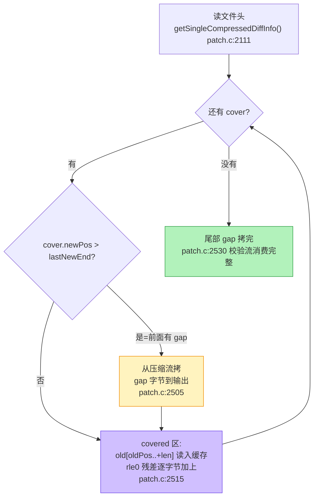

# patch 应用：新文件如何被重建

> 上一篇：[diff 生成](./hdiff-generate) | 下一篇：[实战例子](./hdiff-example)
> 源码：`libHDiffPatch/HPatch/patch.c`，行号已对照本地源码验证

## 统一消费模型

不管 single 还是 classic，patch 端逻辑一致：

> **按 newPos 顺序遍历 cover → gap 区从 newDataDiff 拷 → covered 区用 old + 残差恢复。**



## 残差加法：patch 的"逆运算"在哪

`_patch_add_old_with_rle0`（`patch.c:2244`）分两步：

**第 1 步：把 old 数据读进缓存**（`patch.c:2248-2255`）：

```cpp
while (addLength>0){
    decodeStep=min(aCacheSize, addLength);
    old->read(old,oldPos,aCache,aCache+decodeStep);   // 读 old
    _rle0_decoder_add(rle0_decoder,aCache,decodeStep); // 残差原地加上
    _TOutStreamCache_write(outCache,aCache,decodeStep); // 写出 = new
    oldPos+=decodeStep; addLength-=decodeStep;
}
```

**第 2 步：残差怎么"加"**。rle0 解码器（`patch.c:2192`）解码出"跳过 N 个 0"或"加 M 个字节"，真正做加法的是 `addData`（`patch.c:326`）：

```cpp
hpatch_inline static void addData(TByte* dst,const TByte* src,hpatch_size_t length){
    while (length--) { *dst++ += *src++; }   // new = old + subDiff（模 256）
}
```

rle0 的设计动机：生成端 `_subData` 产出 `new − old`，匹配好的区域残差几乎全 0，所以 rle0 用 `{len0: 跳过的 0 长度, lenv: 非零字节长度}` 交替编码——**0 区域一个字节都不存，只存长度**。

## cover 的流式解码

patch 端不一次性载入全部 cover，而是逐条解码（`patch.c:2265`）：

```cpp
hpatch_BOOL sspatch_covers_nextCover(sspatch_covers_t* self){
    hpatch_BOOL inc_oldPos_sign=(*(self->covers_cache))>>(8-1);   // MSB = oldPos 符号
    self->lastOldEnd=self->cover.oldPos+self->cover.length;
    self->lastNewEnd=self->cover.newPos+self->cover.length;
    hpatch_unpackUIntWithTag(&self->covers_cache,...,&self->cover.oldPos,1);
    if (inc_oldPos_sign==0)
        self->cover.oldPos+=self->lastOldEnd;      // 前进
    else
        self->cover.oldPos=self->lastOldEnd-self->cover.oldPos;  // 回退
    hpatch_unpackUInt(...,&self->cover.newPos);
    self->cover.newPos+=self->lastNewEnd;          // gap 累进
    hpatch_unpackUInt(...,&self->cover.length);
    return hpatch_TRUE;
}
```

生成端 `__private_packCover`（`stream_serialize.cpp:94`）编码的增量在这里被还原——两端是严格互逆的。

## single 格式的头解析与安全校验

`getSingleCompressedDiffInfo`（`patch.c:2111`）解析 `HDIFFSF20` 头（`:2120`），并做三条**防恶意 diff** 的校验（`:2136-2141`）：

```cpp
if (out_diffInfo->compressedSize>out_diffInfo->uncompressedSize)
    return _hpatch_FALSE;              // 压缩后不可能比原始大
if (out_diffInfo->stepMemSize>
    (out_diffInfo->newDataSize>=_kStepMemSizeSafeLimit ? out_diffInfo->newDataSize : _kStepMemSizeSafeLimit))
    return _hpatch_FALSE;              // stepMemSize 上限 = 16MB（patch.c:2110）
if (out_diffInfo->stepMemSize>out_diffInfo->uncompressedSize)
    return _hpatch_FALSE;
```

`_kStepMemSizeSafeLimit = 16MB`（`patch.c:2110`）——畸形 diff 想用超大 stepMemSize 撑爆 patch 端内存，在这里被拦下。

## single patch 的 step 循环

`patch_single_stream_diff`（`patch.c:2431`）的主循环（`:2471-2536`）：

```cpp
while (coverCount) {//step loop
    {//read step info
        _clip_unpackUIntTo(&bufCover_size,&inClip);
        _clip_unpackUIntTo(&bufRle_size,&inClip);
        #ifdef __RUN_MEM_SAFE_CHECK
            if ((bufCover_size>stepMemSize)|(bufRle_size>stepMemSize)|
                (bufCover_size+bufRle_size>stepMemSize)) return _hpatch_FALSE;  // 每步上限
        #endif
        // 读本 step 的 cover 表 + rle0 码流到 step_cache
    }
    while (sspatch_covers_isHaveNextCover(&covers)) {//cover loop
        sspatch_covers_nextCover(&covers);
        if (covers.cover.newPos>covers.lastNewEnd){                 // gap
            _TOutStreamCache_copyFromClip(&outCache,&inClip,
                covers.cover.newPos-covers.lastNewEnd);
        }
        --coverCount;
        if (covers.cover.length){
            #ifdef __RUN_MEM_SAFE_CHECK
                if ((covers.cover.oldPos>oldData->streamSize)|
                    (covers.cover.length>(oldData->streamSize-covers.cover.oldPos)))
                    return _hpatch_FALSE;                            // old 区间越界检查
            #endif
            _patch_add_old_with_rle0(&outCache,&rle0_decoder,oldData,
                covers.cover.oldPos,covers.cover.length,temp_cache,cache_size);
        }else{
            #ifdef __RUN_MEM_SAFE_CHECK
                if (coverCount!=0) return _hpatch_FALSE;             // 空 cover 只能是最后一个
            #endif
        }
    }
}
```

三层结构：**step loop → cover loop → 块内循环**（`_patch_add_old_with_rle0` 里按 cache 大小分块）。

### 运行时安全检查（`__RUN_MEM_SAFE_CHECK`）

上面代码里的越界检查编译开关默认开启。每个 cover 的 oldPos/length 都会在使用前验证不越界（`:2510-2513`），gap 长度由 `cover.newPos - lastNewEnd` 推出且 cover 有序受 `patchByClip` 同款检查保护。**恶意 diff 构造的越界读写在 patch 阶段会被拒绝**——这也是热更客户端应该保留默认编译配置的原因。

## 内存占用：为什么 single 适合手机

| 组成 | 大小 | 来源 |
|---|---|---|
| step_cache | ≤ stepMemSize（默认 256KB） | diff.h:121 |
| IO 缓冲 | hpatch_kStreamCacheSize 级别 | 常量 |
| 解压句柄 | 1 个（单一压缩流） | diff.cpp:1018 |

对比 classic：4 段独立压缩流 → 4 个解压 clip 同时活跃。项目的实测结论（8MB cache）：`NativeCacheMemory` 从 -1 改成 8MB，4MB 文件 patch 从 76.7ms → 9.4ms（见[项目落地篇](./hdiff-unity)）。

## 自检

- [ ] 能完整说出"gap 拷贝 + covered 区加残差"的两种输出路径
- [ ] 能解释 rle0 为什么用 `{len0, lenv}` 交替编码而不是普通 RLE
- [ ] 能指出 single 头解析的 3 条安全校验各自防什么
- [ ] 能算出 single patch 端峰值内存的大致构成

---
上一篇：[diff 生成](./hdiff-generate) | 下一篇：[实战例子：手推一遍](./hdiff-example)
