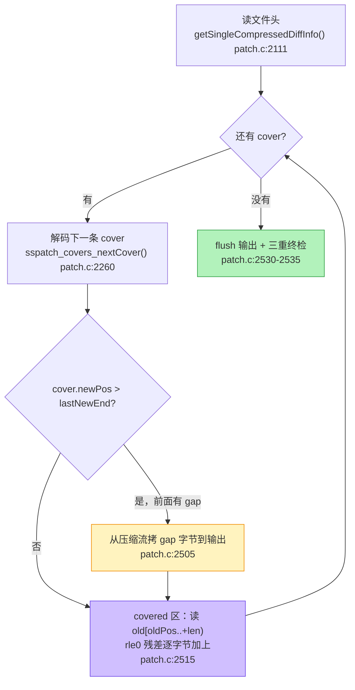

# patch 应用：新文件是怎么被一个字节一个字节拼回来的

> 源码：`libHDiffPatch/HPatch/patch.c`，本页每个行号都已按本机源码树逐条核对
> 上一篇：[diff 生成](./hdiff-generate) | 下一篇：[实战例子](./hdiff-example)

<script setup>
import OldNewPatchFlow from './components/OldNewPatchFlow.vue'
</script>

## 一句话结论

应用侧只有一个循环：**按 newPos 顺序走一遍 cover → 遇到没覆盖的区间就从补丁包里拷字节（gap）→ 遇到覆盖区间就把 old 的那一段读出来、把残差加上去。** 走完，新文件也就拼完了。

## 它到底解决什么问题

生成侧把"能复用"和"不能复用"分好了类。应用侧要做的是**在不知道边界的情况下，把两份数据严丝合缝地对上**：

- `newDataDiff` 里存的是 gap 字节，**物理上连续、没有分隔符**。应用侧怎么知道"这 6 个字节是第一个 gap、那 2 个字节是尾部 gap"？→ 靠 cover 算（`cover.newPos − lastNewEnd`）。
- 残差流和 gap 流是两条独立的流，但它们**交替作用于输出**。应用侧怎么知道"读几个残差、再读几个 gap"？→ 还是靠 cover 算，而且 gap 区的残差需要**同步跳过**。
- 最要命的：patch 包可能来自不可信的信道。**畸形 patch 声明一个 4GB 的 stepMemSize，patch 端会不会直接 malloc 4GB？**

第三个问题决定了这个模块的写法——你会在代码里看到大量 `#ifdef __RUN_MEM_SAFE_CHECK`。

## 术语先对齐

| 术语 | 一句话解释 |
|---|---|
| **step / step_cache** | single 格式把数据切成一块块（默认 256KB 一步），每步的数据先读进 `step_cache` 再消费 |
| **gap 拷贝** | 从补丁包的 `newDataDiff` 流里连续读 N 字节写进输出 |
| **残差加法** | `输出字节 = old 字节 + 残差字节`（模 256） |
| **rle0** | 残差的一种编码：交替给出"接下来 N 个残差是 0"和"M 个非零残差" |
| **`__RUN_MEM_SAFE_CHECK`** | 上游默认开启的越界检查开关（`patch.c:39-40`）。它防的是"恶意/损坏的 patch" |
| **outCache** | 输出侧缓存。攒够一块再写文件，避免大量小 IO |

## 主图解：一个 cover 的两种走法



下面这个组件把上图逐步放出来——**每一步给出当前 seek 位置、累计收益，鼠标放到任意字节能看它的来路**：

<OldNewPatchFlow />

## 残差加法：patch 的"逆运算"在哪

生成侧做的是 `subDiff = new − old`（`stream_serialize.cpp:312`），应用侧在这里做逆运算。`_patch_add_old_with_rle0`（`patch.c:2244`）分两步：

**第 1 步：把 old 数据读进缓存并原地加残差**（`patch.c:2247-2256`）：

```cpp
// patch.c:2244-2258
static hpatch_BOOL _patch_add_old_with_rle0(_TOutStreamCache* outCache,rle0_decoder_t* rle0_decoder,
                                            const hpatch_TStreamInput* old,hpatch_StreamPos_t oldPos,
                                            hpatch_StreamPos_t addLength,TByte* aCache,hpatch_size_t aCacheSize){
    while (addLength>0){
        hpatch_size_t decodeStep=aCacheSize;
        if (decodeStep>addLength) decodeStep=(hpatch_size_t)addLength;
        if (!old->read(old,oldPos,aCache,aCache+decodeStep)) return _hpatch_FALSE;   // 读 old
        if (!_rle0_decoder_add(rle0_decoder,aCache,decodeStep)) return _hpatch_FALSE;// 残差原地加上
        if (!_TOutStreamCache_write(outCache,aCache,decodeStep)) return _hpatch_FALSE;// 写出 = new
        oldPos+=decodeStep;
        addLength-=decodeStep;
    }
    return hpatch_TRUE;
}
```

注意这里的**分块循环**：一次 cover 可能有几十 MB，不可能全读进内存，所以按 `aCacheSize` 一块块处理。这就是"patch 端峰值内存与文件大小无关"的实现层原因。

**第 2 步：残差怎么"加"**。真正的加法只有一行（`patch.c:326-328`）：

```cpp
hpatch_inline static void addData(TByte* dst,const TByte* src,hpatch_size_t length){
    while (length--) { *dst++ += *src++; }   // new = old + subDiff（模 256）
}
```

### rle0 为什么长这样

生成侧 `_subData` 产出的 `new − old`，在匹配质量好的区域几乎全是 0。如果这些 0 老老实实存下来，一个 10MB 的 covered 区就要 10MB 残差流——**整个差分就没意义了**。

rle0 的解法是：**0 区域一个字节都不存，只存长度**。看解码器的主循环（`patch.c:2192`）：

```cpp
// patch.c:2192-2241（rle0 解码器的状态机，用 goto 在三个状态间跳）
static hpatch_BOOL _rle0_decoder_add(rle0_decoder_t* self,TByte* out_data,hpatch_size_t decodeSize){
    if (self->len0){                     // 还有"待跳过的 0"没跳完
    _0_process:
        if (self->len0>=decodeSize){ self->len0-=decodeSize; return hpatch_TRUE; }  // 整块都是 0，什么都不做
        else{ decodeSize-=self->len0; out_data+=self->len0; self->len0=0; goto _decode_v_process; }
    }
    if (self->lenv){                     // 还有"待加的非零字节"没加完
    _v_process:
        if (self->lenv>=decodeSize){ addData(out_data,self->code,decodeSize); ... return hpatch_TRUE; }
        else{ addData(out_data,self->code,self->lenv); ... goto _decode_0_process; }
    }
    // 两个游标都空了 → 从码流里读下一个长度
    if (self->isNeedDecode0){
    _decode_0_process:
        self->isNeedDecode0=hpatch_FALSE;
        if (!hpatch_unpackUInt(&self->code,self->code_end,&len0)) return _hpatch_FALSE;  // 读"接下来 N 个 0"
        self->len0=(hpatch_size_t)len0;  goto _0_process;
    }else{
    _decode_v_process:
        self->isNeedDecode0=hpatch_TRUE;
        if (!hpatch_unpackUInt(&self->code,self->code_end,&lenv)) return _hpatch_FALSE;  // 读"接下来 M 个非零"
        self->lenv=(hpatch_size_t)lenv;  goto _v_process;
    }
}
```

这段代码用 `goto` 而不是循环，读起来别扭，但**它揭示了 rle0 格式的全部规则**：

| 码流内容 | 含义 |
|---|---|
| `len0`（packUInt） | 接下来 `len0` 个字节的残差都是 0（输出 = old 原样） |
| `lenv`（packUInt） | 接下来 `lenv` 个字节要读 rle_code 流里的真实残差值 |
| 交替出现 | 顺序恒为 `len0 → lenv → len0 → lenv → …`，靠 `isNeedDecode0` 这个布尔量记住轮到谁 |

所以残差全 0 的一整条 cover，在码流里只占**一个 packUInt（0）加上它自己的长度**——这就是"匹配得准"省下来的钱。

## cover 的流式解码

应用侧不一次性载入全部 cover，而是**逐条解码、用完就丢**（`patch.c:2260`）：

```cpp
// patch.c:2260-2273
hpatch_BOOL sspatch_covers_nextCover(sspatch_covers_t* self){
    hpatch_BOOL inc_oldPos_sign=(*(self->covers_cache))>>(8-1);  // 从首字节最高位取出方向 tag
    self->lastOldEnd=self->cover.oldPos+self->cover.length;      // 先记下"上一条的结束位置"
    self->lastNewEnd=self->cover.newPos+self->cover.length;
    if (!hpatch_unpackUIntWithTag(&self->covers_cache,self->covers_cacheEnd,&self->cover.oldPos,1)) return _hpatch_FALSE;
    if (inc_oldPos_sign==0)
        self->cover.oldPos+=self->lastOldEnd;                    // 前进
    else
        self->cover.oldPos=self->lastOldEnd-self->cover.oldPos;  // 回退
    if (!hpatch_unpackUInt(&self->covers_cache,self->covers_cacheEnd,&self->cover.newPos)) return _hpatch_FALSE;
    self->cover.newPos+=self->lastNewEnd;                        // gap 累进
    if (!hpatch_unpackUInt(&self->covers_cache,self->covers_cacheEnd,&self->cover.length)) return _hpatch_FALSE;
    return hpatch_TRUE;
}
```

生成侧 `__private_packCover`（`stream_serialize.cpp:94`）编的增量在这里被还原——**两端严格互逆**。想知道这段代码在字节层面长什么样，看 [cover 篇](./hdiff-cover) 的字节解剖组件。

## single 格式的头解析与安全校验

`getSingleCompressedDiffInfo`（`patch.c:2111`）解析 `HDIFFSF20` 头，然后做**三条防恶意 patch 的校验**（`:2136-2141`）：

```cpp
// patch.c:2119-2142
{//type
    const char* kVersionType="HDIFFSF20";
    char* tempType=out_diffInfo->compressType;
    if (!_TStreamCacheClip_readType_end(diffHeadClip,'&',tempType)) return _hpatch_FALSE;
    if (0!=strcmp(tempType,kVersionType)) return _hpatch_FALSE;   // 不是 SF20 直接拒
}
{//read compressType
    if (!_TStreamCacheClip_readType_end(diffHeadClip,'\0',out_diffInfo->compressType)) return _hpatch_FALSE;
}
_clip_unpackUIntTo(&out_diffInfo->newDataSize,diffHeadClip);
_clip_unpackUIntTo(&out_diffInfo->oldDataSize,diffHeadClip);
_clip_unpackUIntTo(&out_diffInfo->coverCount,diffHeadClip);
_clip_unpackUIntTo(&out_diffInfo->stepMemSize,diffHeadClip);
_clip_unpackUIntTo(&out_diffInfo->uncompressedSize,diffHeadClip);
_clip_unpackUIntTo(&out_diffInfo->compressedSize,diffHeadClip);
out_diffInfo->diffDataPos=_TStreamCacheClip_readPosOfSrcStream(diffHeadClip)-diffInfo_pos;
// ↓↓↓ 三条安全校验
if (out_diffInfo->compressedSize>out_diffInfo->uncompressedSize)
    return _hpatch_FALSE;              // ① 压缩后不可能比原始大
if (out_diffInfo->stepMemSize>(out_diffInfo->newDataSize>=_kStepMemSizeSafeLimit?out_diffInfo->newDataSize:_kStepMemSizeSafeLimit))
    return _hpatch_FALSE;              // ② stepMemSize 上限 = 16MB 或 newDataSize（取小）
if (out_diffInfo->stepMemSize>out_diffInfo->uncompressedSize)
    return _hpatch_FALSE;              // ③ stepMemSize 不能超过未压缩数据总量
```

三条校验各自防什么：

| 校验 | 防的攻击 | 为什么这样写就够 |
|---|---|---|
| ① `compressedSize ≤ uncompressedSize` | 声称"解压后比压缩前小"，让解压器算出一个荒谬的输出尺寸 | 压缩算法不可能把数据变大（真大了就不该压缩） |
| ② `stepMemSize ≤ min(newDataSize, 16MB)` | **内存 DoS**：声明 4GB 的 stepMemSize，诱使 patch 端 `malloc` 4GB | `_kStepMemSizeSafeLimit` 就是 16MB（`patch.c:2110`：`(1<<20)*16`）；同时不可能超过 new 本身 |
| ③ `stepMemSize ≤ uncompressedSize` | 同上，换一个入口 | step 数据是从未压缩流里切出来的，不可能比总量还大 |

⚠️ **第二条里"取小"这个细节值得记住**：它不是"固定 16MB 上限"，而是 `newDataSize >= 16MB ? 16MB : newDataSize`。也就是说**小文件的 stepMemSize 天花板更低**——攻击者不能在小 patch 里塞一个 16MB 的 step 声明。

## single patch 的主循环

`patch_single_stream_diff`（`patch.c:2431`）的 step 循环（`:2471-2536`）：

```cpp
while (coverCount) {//step loop
    rle0_decoder_t rle0_decoder;
    {//read step info
        unsigned char* covers_cacheEnd;
        unsigned char* bufRle_cache_end;
        {
            hpatch_StreamPos_t bufCover_size;
            hpatch_StreamPos_t bufRle_size;
            _clip_unpackUIntTo(&bufCover_size,&inClip);       // step 头第 1 个字段
            _clip_unpackUIntTo(&bufRle_size,&inClip);         // step 头第 2 个字段
            #ifdef __RUN_MEM_SAFE_CHECK
                if ((bufCover_size>stepMemSize)|(bufRle_size>stepMemSize)|
                    (bufCover_size+bufRle_size>stepMemSize)) return _hpatch_FALSE;  // 每步上限
            #endif
            covers_cacheEnd=step_cache+(size_t)bufCover_size;
            bufRle_cache_end=covers_cacheEnd+(size_t)bufRle_size;
        }
        if (!_TStreamCacheClip_readDataTo(&inClip,step_cache,bufRle_cache_end)) return _hpatch_FALSE;
        sspatch_covers_setCoversCache(&covers,step_cache,covers_cacheEnd);   // cover 段
        _rle0_decoder_init(&rle0_decoder,covers_cacheEnd,bufRle_cache_end);  // rle 段紧跟其后
    }
    while (sspatch_covers_isHaveNextCover(&covers)) {//cover loop
        if (!sspatch_covers_nextCover(&covers)) return _hpatch_FALSE;
        if (covers.cover.newPos>covers.lastNewEnd){          // 前面有 gap
            if (!_TOutStreamCache_copyFromClip(&outCache,&inClip,covers.cover.newPos-covers.lastNewEnd))
                return _hpatch_FALSE;
        }
        --coverCount;
        if (covers.cover.length){
            #ifdef __RUN_MEM_SAFE_CHECK
                if ((covers.cover.oldPos>oldData->streamSize)|
                    (covers.cover.length>(hpatch_StreamPos_t)(oldData->streamSize-covers.cover.oldPos)))
                    return _hpatch_FALSE;                     // 越界检查：oldPos+length 必须落在 old 内
            #endif
            if (!_patch_add_old_with_rle0(&outCache,&rle0_decoder,oldData,covers.cover.oldPos,covers.cover.length,
                                          temp_cache,cache_size)) return _hpatch_FALSE;
        }else{
            #ifdef __RUN_MEM_SAFE_CHECK
                if (coverCount!=0) return _hpatch_FALSE;      // 长度为 0 的 cover 只能是最后一条
            #endif
        }
    }
}
if (!_TOutStreamCache_flush(&outCache)) return _hpatch_FALSE;
if (_TStreamCacheClip_isFinish(&inClip)&_TOutStreamCache_isFinish(&outCache)&(coverCount==0))
    return hpatch_TRUE;                                       // 终检：输入读完 && 输出写完 && cover 用光
else
    return _hpatch_FALSE;
```

三层结构：**step loop → cover loop → 块内循环**（`_patch_add_old_with_rle0` 里按 cache 大小分块）。每一层都有自己的边界检查。

<BitField
  title="step 头的两个 packUInt：patch 端靠它们切分 step_cache"
  :bytes="[0x05, 0x02]"
  :fields="[
    { name: 'bufCover_size', from: 0, to: 7, desc: '本 step 里 cover 控制流占几字节。本例 5 字节' },
    { name: 'bufRle_size', from: 8, to: 15, desc: '本 step 里 rle 码流占几字节。本例 2 字节' }
  ]" />

> 这两个字段是 single 格式**每步都要付**的固定开销（通常 2 字节）。step 数越多，这笔钱累计越大——这也是"大文件用 single、小文件用 classic"的一个量化依据。

### 三重终检为什么必须全部成立

主循环结束后的那一个 `if`（`patch.c:2532`）同时要求三件事：

| 条件 | 含义 | 少了它会怎样 |
|---|---|---|
| `_TStreamCacheClip_isFinish(&inClip)` | 补丁数据**全部**被消费完 | 攻击者可以在 patch 尾部藏垃圾数据而不被发现 |
| `_TOutStreamCache_isFinish(&outCache)` | 输出缓冲清空且写满 newDataSize | 会写出一个被截断的新文件 |
| `coverCount==0` | 头里声明的 cover 数确实用完了 | 头声称 1000 条 cover 但只给了 10 条，会被当成成功 |

**"校验完整性"比"算出结果"更重要**：patch 是一段二进制输入，任何"读完就信"的写法都是漏洞。

### 运行时安全检查（`__RUN_MEM_SAFE_CHECK`）

前面代码块里的越界检查由编译开关控制，默认开启（`patch.c:39-40` 明确写着 *"enables bounds checking for memory access to defend against potentially corrupted or maliciously crafted data"*）。每个 cover 的 oldPos/length 都在使用前验证不越界（`:2511-2513`），gap 长度由 `cover.newPos - lastNewEnd` 推出且受 cover 有序性保护。

**恶意 patch 构造的越界读写会在 patch 阶段被拒绝**——这是热更客户端应该保留默认编译配置的原因。关掉它省下的那点分支预测，换不回一个能被任意 patch 写内存的客户端。

## 内存占用：为什么 single 适合手机

<MemoryMap
  title="single patch 的峰值内存构成（stepMemSize 可调，默认 256KB）"
  :blocks="[
    { label: 'step_cache', size: 262144, kind: 'meta', note: '一个 step 的 cover 控制流 + rle 码流，≤ stepMemSize（默认 256KB，diff.h:121）' },
    { label: 'temp_cache', size: 262144, kind: 'used', note: '读 old 的中转缓冲（aCache/cache_size），与 step_cache 同量级' },
    { label: 'outCache', size: 65536, kind: 'used', note: '输出缓存，攒够一块再写文件' },
    { label: 'IO 缓冲', size: 65536, kind: 'free', note: 'hpatch_kStreamCacheSize 级别，文件读写用' },
    { label: '解压句柄 ×1', size: 16384, kind: 'pad', note: 'single 只有 1 条压缩流 → 只开 1 个解压句柄' }
  ]" />

| 组成 | 大小 | 来源 |
|---|---|---|
| step_cache | ≤ stepMemSize（默认 256KB；会被钳到 `newDataSize`） | `diff.h:121`、`diff.cpp:999-1002` |
| temp_cache | 与 cache_size 同量级 | `patch.c:2439-2450` 由调用方传入 |
| IO 缓冲 | `hpatch_kStreamCacheSize` 级别 | 常量 |
| 解压句柄 | **1 个**（单一压缩流） | `diff.cpp:1018` |

对比 classic：4 段独立压缩流 → 要同时开 4 个解压 clip。项目的实测结论（8MB cache）：`NativeCacheMemory` 从 -1 改成 8MB，4MB 文件 patch 从 **76.7ms → 9.4ms**（见[项目落地篇](./hdiff-unity)）。

> 注意"峰值内存 = 并行数 × cache"这个乘法。项目里 `MaxParallelTasks` 钳制在 [2,4]，`NativeCacheMemory` 是 8MB——所以最坏情况 native 侧约 32MB。这个数字是项目组的实测调优结论，不是源码常量。

## 常见误解

::: warning "rle0 就是普通 RLE"
普通 RLE 是"字符 + 重复次数"。rle0 是**零专用**的：它假设"0 是绝大多数"，于是把"非 0"当成异常来单独记录。所以它的码流里只有两种数字：`len0`（跳过的 0 个数）和 `lenv`（要读的非零个数），**一个非零残差才占一个数据字节**。这就是为什么"匹配得越准，patch 越小"。
:::

::: warning "gap 区的残差也要加"
不用。gap 区的字节已经在 `newDataDiff` 里原样存着了，加残差会加两次。但**残差流需要"同步跳过" gap 的长度**——在 classic 路径里这个动作叫 `_rle_decode_skip`（`patch.c:1008`）。single 路径因为 rle0 解码器是"按需消费"，靠 `len0` 自然吃掉了这部分，不需要单独 skip。
:::

::: warning "patch 端会把整个 old 读进内存"
不会。`_patch_add_old_with_rle0` 用 `old->read(old, oldPos, aCache, ...)` **按需从文件读**（`:2251`），而且分块循环。所以 patch 一个 2GB 的文件，内存占用仍然是 stepMemSize 量级——代价是磁盘随机读会变多，这正是 `NativeCacheMemory=8MB` 调优要解决的问题。
:::

## 自检清单

- [ ] 能说出"gap 拷贝 + covered 区加残差"两条输出路径，以及它们各自的数据来源
- [ ] 能解释 rle0 为什么用 `{len0, lenv}` 交替编码，以及它对"匹配质量"的依赖
- [ ] 能指出 single 头解析三条安全校验各自防什么
- [ ] 能说出三重终检（输入读完 / 输出写完 / cover 用光）分别在防什么
- [ ] 能算出 single patch 端峰值内存的大致构成
- [ ] 能在 `patch.c:2532` 找到终检那一行，并在 `patch.c:2511-2513` 找到越界检查

---

上一篇：[diff 生成](./hdiff-generate) | 下一篇：[实战例子：手推一遍 diff 与 patch](./hdiff-example)
