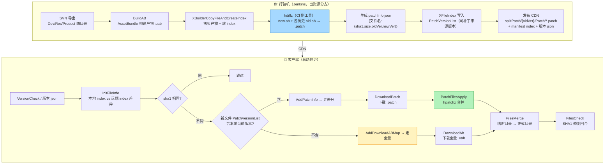

# 打包与合并：一条 .patch 的完整生命周期

> 上一篇：[安全与踩坑](./hdiff-security) | 返回：[总览](/)
> 代码：`D:\hdiff`（Editor 打包脚本 / Lua 热更状态机 / C# hdiff 包），行号已实测

本篇回答两个问题：**服务器侧一条 .patch 怎么被生产出来并发布**（打包流程），**客户端拿到之后怎么变成可用资源**（合并流程）。

## 全景：从 SVN 提交到进入游戏



## 一、打包流程（生成侧）

> ⚠️ 边界说明：`hdiffz` 的实际调用发生在**打包机 CI 侧**（Jenkins + 共享盘），不在 `D:\hdiff` 工程内——工程内可实测的是它的**输入准备**（AB 产物、index、共享盘结构）。以下 CI 步骤按产物结构反推 + vault 记录整理，标注了实测/推断。

### 1.1 AB 构建 → 产物准备【实测】

`XBuilder.cs` / `XBuilderCopyFileAndCreateIndex.cs`（Editor 打包脚本，Jenkins 以 `-executeMethod` 驱动）：

1. **BuildAB**：按 `PackBundle.tab` 规则打 AssetBundle（`.uab`），IFix 热更补丁（`Assembly-CSharp.patch.bytes`）在此阶段一并产出
2. **拷贝产物 + 建 index**（`XBuilderCopyFileAndCreateIndex.cs`）：
   - `WriteBuildInIndexTab()`（`:1306`）：出 apk 时写 `{platformPath}/{leastVersion}/manifest/Matrix/index.tab`，`InPkg==1`（包外）的资源计入 `inPatch` 集合（`:1329-1332`，注释明确：**InPatch 跟随 InPkg，包外资源才走补丁下载**）
   - `CheckPatchShareData()`（`:1822`）：校验共享盘 `{SharePath}/Cdn2client.json` 的 `PublishList` 非空——**打补丁前必须能定位"上次发布"**
   - `GetLastApkPackageSets()`（`:1841`）：读上次发布版本的 index，返回 `inPkgSet`/`outPkgBaseSet`。注释里有个真实踩坑：**不排除"包外基准资源"会让这批 ab 在新版本退化成分包资源，基准下载流程不再覆盖，登录界面依赖缺失**

### 1.2 差分生成与发布【推断，产物结构实测】

对每个有变化的新文件，CI 侧用 `hdiffz`（single compressed diff）生成 `new.ab + old.ab → xxx.patch`，然后：

1. **补丁清单**：`{CDN}/{newVersion}/splitPatch/{oldVersion}.json`——内容为 `{fileName: {sha1, size}}`（客户端 `XModuleUpdateStateDownloadPatchInfo.lua:21-46` 按此结构解析）
2. **补丁文件**：`{CDN}/{newVersion}/splitPatch/{oldVersion}/Patch/{fileName}.patch`（客户端 `XModuleUpdateStateDownloadPatch.lua:64-66` 按此 URL 拼装）
3. **index 里的可补丁版本链**：`XFileInfo.PatchVersionList`（`XLaunchManager.cs:271`，MsgPack `Key(4)`，`List<int>`）——**每个新文件记录"可以从哪些历史版本直接打补丁"**。这个列表由 CI 侧根据"为哪些 oldVersion 生成了 patch"写入

**为什么需要 PatchVersionList**：线上设备版本碎片化，同一个新文件可能需要从 v100/v101/v105 三种旧版本各自打补丁。CI 端选择为哪些旧版本生成补丁（磁盘成本 vs 用户流量），写入列表；客户端只认列表内的版本。

### 1.3 版本链文件

`LastBuildVersion.json` 里的 `PatchedList` + `VersionOrder`（`XLaunchUpdateManager.lua:309-310`）维护全局补丁链顺序，是"多版本灰度共存"的基础。

## 二、合并流程（应用侧，全实测）

matrix 模块 24 状态里与差分直接相关的四步：

### 2.1 差异计算：ListNormal 判定走哪条路

`XModuleUpdateStateListNormal.lua:40-70` 的判定树：

```lua
local isNeedDownload = oldInfo[XFileInfoSha1Index] ~= newSha1   -- sha1 不同才更新
if isNeedDownload and self._isMatrixMode then
    local curVersion = oldInfo[XFileInfoVersionIndex]            -- 本地文件所在版本
    local patchVersionList = newInfo[XFileInfoPatchVersionListIndex]
    local isAbUpdate = true
    for _, patchVersion in pairs(patchVersionList) do
        if patchVersion == curVersion then isAbUpdate = false; break end
    end
    if isAbUpdate then self.UpdateManager:AddDownloadABMap(fileName)   -- 无补丁 → 全量
    else self.UpdateManager:AddPatchInfo(fileName, curVersion, newVersion) end
end
```

关键点：**以"本地文件当前所在版本"为准匹配补丁链**——本地 index 的 Version 字段，不是模糊的"上一个版本"。

### 2.2 下载：DownloadPatch

`XModuleUpdateStateDownloadPatch.lua:64-71`：

```lua
local url = string.format("%s/%s/splitPatch/%s/Patch/%s.patch",
    DocumentUrl, newVersion, oldVersion, fileName)
group:AddTask(url, path, size, sha1)     -- 补丁文件也带 sha1/size 校验
```

下载缓存：完成的文件名追加写入 `_CacheFilePatchPath`（`XUpdateDataContext.lua:313-324`，**断点续跑的记账文件**，每行一个文件名）。

### 2.3 合并：PatchFilesApply

`XModuleUpdateStatePatchFilesApply.lua:55-126`（细节见[项目落地篇](./hdiff-unity)）：

1. `IsEnter` 里的平台判断：**移动平台旧文件在包内（APK 内部路径）native fopen 读不了 → 直接转全量 AB 下载**，不打补丁
2. 构建任务组：`AddTaskByFileName(fileName, sha1, size, srcDirIndex)`，源目录两个：`SRC_DIR_DOCUMENT=0`（包外）/ `SRC_DIR_APPLICATION=1`（包内）
3. C# `HDiffExecutor` 并行执行 `hpatchz(old, patch, new)`（默认并行 [2,4]）→ 每文件 patch 后立即 SHA1+size 校验
4. 结果回调：
   - 成功 → `WritePatchCache(fileName)` 记账
   - **失败 → `AddDownloadABMap(fileName)`，降级全量**（差分永远只是加速项）

### 2.4 落位：FilesMerge

`XModuleUpdateStateFilesMerge.lua:26-60`：

```lua
local moveHelper = CS.XFileMoveHelper(DownloadAbPath, DocumentDir, true)
-- 协程逐帧移动（不卡主线程），进度上报
if moveHelper.HasError then
    XLaunchConst.ShowStartErrorDialog("MovePreloadError", retry)   -- 失败弹窗可重试
else
    CsDirectory.Delete(DownloadAbPath, true)    -- 成功清理整个临时目录
    self:OnFinish()
end
```

三个出口：
- 临时目录不存在 / 缓存计数 0 → 直接 `OnFinish()`（幂等，支持跳过）
- 移动失败 → 弹 `MovePreloadError` 对话框，确认后 `OnEnter()` 重入
- 成功 → 删临时目录 → 下一状态

### 2.5 修复回合：FilesCheck → FilesCheckInvaildDownload

`XModuleUpdateStateFilesCheck.lua`：`CS.XHaruDownloader.XFileVerifier` **7 线程并行**校验 SHA1+size（`VERIFY_THREAD_COUNT = 7`），坏文件收集进 `SetMarkFileMap`。随后的状态把坏文件重新 `DownloadAb → FilesMerge` 一轮——这就是 matrix 状态机里 `DownloadAb→FilesMerge` 出现两次的原因：**第一次是正常更新，第二次是校验后的自动修复**。

## 三、断点续跑设计

| 阶段 | 机制 | 代码 |
|---|---|---|
| 补丁下载 | 完成记账文件（追加一行一个文件名），重入时跳过已完成 | `XUpdateDataContext.lua:313` |
| patch 执行 | `DstFile` 已存在直接成功返回（幂等） | `HDiffTask.cs:56` |
| 整机重入 | 外层 `PreUpdateMatrixModule` 清理上次临时版本残留 | vault 方案文档 §2.1 |
| 修复回合 | FilesCheck 校验失败的文件重走下载合并 | `XModuleUpdateStateFilesCheck.lua` |

## 四、这条链路的已知风险（与安全篇呼应）

1. **PatchFilesApply 直接覆盖目标文件**（无临时文件+原子 rename）——patch 中断 = 旧文件已损坏 + 新文件未完成 → 只能全量重下。P0 级，方案已定稿未合入（见[安全篇](./hdiff-security)）
2. **patch 产物虽然校验 SHA1，但校验失败的旧文件会污染下一轮差分判定**——`FilesCheck` 的修复回合是兜底，代价是多一轮下载
3. **包内资源补丁在移动端被跳过**（native 读不了 APK 内路径）——这部分流量永远走全量，是压缩率的硬上限

## 自检

- [ ] 能说出 `InPatch 跟随 InPkg` 的含义（只有包外资源走补丁下载）
- [ ] 能解释 `PatchVersionList` 为什么必须存在（版本碎片化下的补丁链路由）
- [ ] 能画出 ListNormal 的判定树（sha1 → PatchVersionList → AB/patch）
- [ ] 能说出 FilesMerge 的三个出口与幂等设计
- [ ] 能解释 matrix 状态机里 DownloadAb→FilesMerge 为什么出现两次

---
上一篇：[安全与踩坑](./hdiff-security) | 返回：[总览](/)
