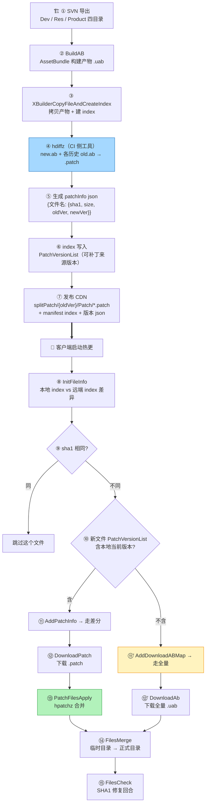
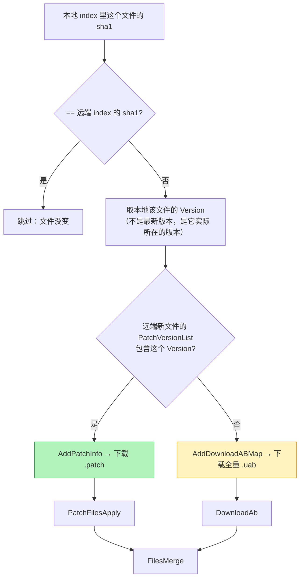

# 一条 .patch 的完整生命周期：从打包机到玩家手机

> 上一篇：[项目落地](./hdiff-unity) | 下一篇：[安全与踩坑](./hdiff-security)
> 代码：`D:\hdiff`（Editor 打包脚本 / Lua 热更状态机 / C# hdiff 包），本页行号已实测
> ⚠️ **口径说明**：本页区分【实测】与【推断】。凡标【实测】的行号都可在本机源码树里逐条核对；凡标【推断】的是按产物结构反推的结论，**没有源码可查**。

## 一句话结论

一条 `.patch` 要经过**四道门**才能变成玩家手机上可用的资源：打包机生成并发布 → 客户端算出"我该走差分还是全量" → 打补丁并校验 → 落位到正式目录（失败还有一轮修复）。
这条链路上任何一步失败都**不会让游戏坏掉**，只会多花流量——这是整套设计最值得学的地方。

## 它到底解决什么问题

差分算法只管"old + new → patch"。但真上线要回答一堆算法之外的问题：

| 问题 | 为什么难 | 答案在本文哪一节 |
|---|---|---|
| 线上有 v100/v101/v105 三种旧版本，给谁生成补丁？ | 每个旧版本都要存一份 patch，磁盘成本 × 版本数 | [1.2 补丁清单与版本链](#_1-2-差分生成与发布推断-产物结构实测) |
| 客户端怎么知道"我这个版本能不能打补丁"？ | 客户端只知道自己的旧文件内容，不知道服务端为谁生成了补丁 | [2.1 差异计算](#_2-1-差异计算-listnormal-判定走哪条路) |
| patch 打到一半断了怎么办？ | 目标文件可能已被写坏 | [三、断点续跑设计](#三-断点续跑设计) |
| 下载的 patch 本身过期/损坏怎么办？ | 校验只能发现"产物不对"，不能自动修 | [2.5 修复回合](#_2-5-修复回合-filescheck-filescheckinvailddownload) |

## 术语先对齐

| 术语 | 一句话解释 |
|---|---|
| **AB / .uab** | AssetBundle，Unity 的资源包 |
| **index** | 一张清单表，记录每个资源文件的 sha1 / size / 版本 / 是否在包内 |
| **InPkg** | 这个资源是否打进了安装包。`InPkg==0` 表示包内，`!=0` 表示包外（需要下载） |
| **InPatch** | 这个资源是否允许走补丁下载。**跟随 InPkg**：只有包外资源才可能走补丁 |
| **PatchVersionList** | 每个新文件的"可以从哪些历史版本直接打补丁"列表 |
| **splitPatch** | CDN 上放补丁的目录结构：`{版本}/splitPatch/{旧版本}/Patch/*.patch` |
| **矩阵模式（matrix）** | 项目里热更状态机的名字，指那套 24 状态的更新流程 |

## 全景：从 SVN 提交到进入游戏



## 一、打包流程（生成侧）

> ⚠️ **边界说明**：`hdiffz` 的实际调用发生在**打包机 CI 侧**（Jenkins + 共享盘），**不在 `D:\hdiff` 工程内**——工程内可实测的只有它的**输入准备**（AB 产物、index、共享盘结构）。以下 CI 步骤按产物结构反推 + vault 记录整理，已逐条标注【实测】/【推断】。

### 1.1 AB 构建 → 产物准备【实测】

`XBuilder.cs` / `XBuilderCopyFileAndCreateIndex.cs`（Editor 打包脚本，Jenkins 以 `-executeMethod` 驱动）：

1. **BuildAB**：按 `PackBundle.tab` 规则打 AssetBundle（`.uab`），IFix 热更补丁（`Assembly-CSharp.patch.bytes`）在此阶段一并产出
2. **拷贝产物 + 建 index**：
   - `WriteBuildInIndexTab()`（**定义在 `XBuilderCopyFileAndCreateIndex.cs:1370`，调用点 `:1335`**）：出 apk 时写 `{platformPath}/{leastVersion}/manifest/Matrix/index.tab`
   - **`InPatch` 跟随 `InPkg`**（`XBuilderCopyFileAndCreateIndex.cs:1389-1393`）。源码注释原文：
     ```csharp
     // XBuilderCopyFileAndCreateIndex.cs:1389-1393
     // InPatch 跟随 InPkg: InPkg==1 (包外, 需走补丁下载) 才计入 inPatch; InPkg==0 (包内)不计
     if (kv.Value.InPkg != 0)
     {
         inPatch.Add(kv.Key);
     }
     ```
     `inPatch` 集合最终交给 `XBuildTool.SaveIndexFiles(...)` 写成 index 表的 `InPatch` 列（`XBuilderCopyFileAndCreateIndex.cs:1429`；写入实现在 `XBuildTool.cs:456-477`，那一列就是 `\t{(inPatch.Contains(v.Path) ? 1 : 0)}`）
   - `CheckPatchShareData()`（`XBuilderCopyFileAndCreateIndex.cs:1916`，调用点 `:3544`）：打补丁（不出 apk）时校验共享盘 `{SharePath}/Cdn2client.json` 的 `PublishList` 非空，**否则直接抛异常**——源码注释写明：*"打补丁时共享盘数据: Cdn2client.json 必须存在且 PublishList 非空, 否则直接异常暴露问题"*（`:1915`）。**打补丁前必须能定位"上次发布"**
   - `GetLastApkInPkgSet()`（`XBuilderCopyFileAndCreateIndex.cs:1939`）：链路是 `Cdn2client.json → PublishList 首位 → BuildList[].SvnVersion → AssetBundleData/{SvnVersion}/matrix/index`（注释在 `:1938`），读上次发布 index 里 `InPkg==0`（包内）的集合（`:1974-1981`）。调用点在 `:3673`，注释：*"InPkg 只沿用上一次发布包的物理包内状态, 基准包归属按本次完整 ResId 映射重新计算"*（`:3667`、`:3672`）

> **一个真实踩坑（原文保留，实测状态已核对）**：不排除"包外基准资源"会让这批 ab 在新版本退化成分包资源，导致基准下载流程不再覆盖、登录界面依赖缺失。
> **核对结果**：本机 `XBuilderCopyFileAndCreateIndex.cs` 里能查到的是 `:3667` / `:3672` 那两句"基准包归属重新计算"的注释，**原文提到的那句"不排除包外基准资源会让 ab 退化成分包"的原话没有在这份文件里找到**（另一处"退化"字样在 `:366`、`:373`、`:403`，讲的是清单退化用最新版本，不是同一件事）。所以这条踩坑记录**保留为项目经验，但不标注具体行号**。

### 1.2 差分生成与发布【推断，产物结构实测】

对每个有变化的新文件，CI 侧用 `hdiffz`（single compressed diff）生成 `new.ab + old.ab → xxx.patch`，然后：

1. **补丁清单**：`{CDN}/{newVersion}/splitPatch/{oldVersion}.json`——内容为 `{fileName: {sha1, size}}`。客户端按这个结构解析：`XModuleUpdateStateDownloadPatchInfo.lua:32` 拼出 `"%s/%s/splitPatch/%s.json"` 这个 URL
2. **补丁文件**：`{CDN}/{newVersion}/splitPatch/{oldVersion}/Patch/{fileName}.patch`。客户端拼 URL 的代码在 `XModuleUpdateStateDownloadPatch.lua:66`
3. **index 里的可补丁版本链**：`XFileInfo.PatchVersionList`（`XLaunchManager.cs:270-271`，MsgPack `[Key(4)]`，类型 `List<int>`）——**每个新文件记录"可以从哪些历史版本直接打补丁"**。这个列表由 CI 侧根据"为哪些 oldVersion 生成了 patch"写入
4. **index 变更检测【实测】**：工程内有配套的 Editor 工具专门算两份 index 的差异，`PatchVersionList` 就是它跟踪的字段之一（`XFileIndexDiffCalculator.cs:18` 的 `PatchVersionList = 1 << 4`；字段对比在 `:130`；变化判定在 `:435`）。这说明**这个字段的变动是被当作"必须复查的变更"来管理的**，不是随手写的

**为什么需要 PatchVersionList**：线上设备版本碎片化，同一个新文件可能需要从 v100/v101/v105 三种旧版本各自打补丁。CI 端选择为哪些旧版本生成补丁（磁盘成本 vs 用户流量），写入列表；**客户端只认列表内的版本**。

### 1.3 版本链文件

`LastBuildVersion.json` 里的 `PatchedList` + `VersionOrder` 维护全局补丁链顺序，是"多版本灰度共存"的基础。客户端读取处：`XLaunchUpdateManager.lua:251-252`（赋值给 `XLaunchConst.PatchedList` / `XLaunchConst.VersionOrder`）。

## 二、合并流程（应用侧）

matrix 模块的状态里与差分直接相关的四步：

### 2.1 差异计算：ListNormal 判定走哪条路

`XModuleUpdateStateListNormal.lua:51-67` 的判定树：

```lua
-- XModuleUpdateStateListNormal.lua:51-67（整理为判定树的写法，逻辑与源码一致）
local isNeedDownload = oldInfo[XFileInfoSha1Index] ~= newSha1   -- sha1 不同才需要更新
if isNeedDownload then
    local curVersion = oldInfo[XFileInfoVersionIndex]            -- 本地文件当前所在版本
    local patchVersionList = newInfo[XFileInfoPatchVersionListIndex]
    local isAbUpdate = true
    for _, patchVersion in pairs(patchVersionList) do
        if patchVersion == curVersion then isAbUpdate = false; break end
    end
    if isAbUpdate then self.UpdateManager:AddDownloadABMap(fileName)          -- :65 无补丁 → 全量
    else               self.UpdateManager:AddPatchInfo(fileName, curVersion, newVersion) end  -- :67 有补丁 → 差分
end
```

关键点：**以"本地文件当前所在版本"为准匹配补丁链**——用的是本地 index 里的 `Version` 字段，不是模糊的"上一个版本"。



### 2.2 下载：DownloadPatch

`XModuleUpdateStateDownloadPatch.lua:66-68`：

```lua
local url = string.format("%s/%s/splitPatch/%s/Patch/%s.patch",
    DocumentUrl, newVersion, oldVersion, fileName)
local path = string.format("%s/%s.patch", DownloadPatch, fileName)
group:AddTask(url, path, size, sha1)     -- 补丁文件本身也带 sha1/size 校验
```

> **注意 `oldVersion` 出现在 URL 里**：同一个文件名，为 v100 生成的 patch 和为 v105 生成的 patch 是**两个不同的文件**。这解释了为什么 `PatchVersionList` 是必需的——它不是优化，是路由键。

下载缓存：完成的文件名追加写入 `_CacheFilePatchPath`（`XUpdateDataContext.lua:313-321` 的 `WritePatchCache`，**断点续跑的记账文件**，每行一个文件名；读取在 `:299-309` 的 `ReadPatchCache`）。

### 2.3 合并：PatchFilesApply

`XModuleUpdateStatePatchFilesApply.lua`（细节见[项目落地篇](./hdiff-unity)）：

1. `IsEnter` 里的平台判断（`:16-33`）：**移动平台旧文件在包内（APK 内部路径）native `fopen` 读不了 → 直接转全量 AB 下载**，不打补丁
2. 构建任务组：`AddTaskByFileName(fileName, sha1, size, srcDirIndex)`（`:72`），源目录两个：`SRC_DIR_DOCUMENT=0`（包外）/ `SRC_DIR_APPLICATION=1`（包内，定义在 `:18-19`）
3. C# `HDiffManager` / `HDiffTaskGroup` 并行执行 `hpatchz(old, patch, new)`（默认并行 [2,4]）→ 每文件 patch 后立即 SHA1+size 校验
4. 结果回调：
   - 成功 → `WritePatchCache(fileName)` 记账（`:85`）
   - **失败 → `AddDownloadABMap(fileName)`，降级全量**（`:89-92`）——差分永远只是加速项

### 2.4 落位：FilesMerge

`XModuleUpdateStateFilesMerge.lua:46-57`：

```lua
local moveHelper = CS.XFileMoveHelper(DownloadAbPath, DocumentDir, true)
-- 协程逐帧移动（不卡主线程），进度上报；:49-50
if moveHelper.HasError then
    XLaunchConst.ShowStartErrorDialog("MovePreloadError", self._MoveFailCallback)   -- 失败弹窗可重试
else
    CsDirectory.Delete(DownloadAbPath, true)    -- :55 成功清理整个临时目录
    self:OnFinish()                              -- :57
end
```

三个出口：

| 出口 | 条件 | 行为 |
|---|---|---|
| 直接完成 | 临时目录不存在 / 缓存计数 0（`:25`、`:31`） | `OnFinish()`（幂等，支持跳过） |
| 失败可重试 | `moveHelper.HasError` | 弹 `MovePreloadError` 对话框，确认后重入 |
| 成功 | 移动无错 | 删临时目录 → 下一状态 |

### 2.5 修复回合：FilesCheck → FilesCheckInvaildDownload

`XModuleUpdateStateFilesCheck.lua`：`CS.XHaruDownloader.XFileVerifier` **7 线程并行**校验 SHA1+size（`VERIFY_THREAD_COUNT = 7`，定义在 `:20`；启动在 `:60`），坏文件收集进 `SetMarkFileMap`（`:73`）。

随后的状态把坏文件重新走一遍 `DownloadAb → FilesMerge`——这就是 matrix 状态机里 `DownloadAb→FilesMerge` 出现两次的原因（`XModuleUpdateManager.lua:246-249` 那段 `table.insert`）：**第一次是正常更新，第二次是校验后的自动修复**。

## 三、断点续跑设计

| 阶段 | 机制 | 代码 |
|---|---|---|
| 补丁下载 | 完成记账文件（追加一行一个文件名），重入时跳过已完成 | `XUpdateDataContext.lua:313-321` |
| patch 执行 | `DstFile` 已存在直接成功返回（幂等） | `HDiffTask.cs:56-57` |
| 整机重入 | 外层清理上次临时版本残留 | 方案文档（本机无可查源码） |
| 修复回合 | FilesCheck 校验失败的文件重走下载合并 | `XModuleUpdateStateFilesCheck.lua` |

**这四条合起来才叫"断点续跑"**——单独任何一条都不够。比如只有 `DstFile` 幂等而没有记账文件，用户重进时会重新下载一遍已经下过的 patch。

## 四、这条链路的已知风险（与[安全篇](./hdiff-security)呼应）

| # | 风险 | 后果 | 现状 |
|---|---|---|---|
| 1 | **PatchFilesApply 直接覆盖目标文件**（无临时文件 + 原子 rename） | patch 中断 = 旧文件已损坏 + 新文件未完成 → 只能全量重下 | P0 级，方案已定稿**未合入** |
| 2 | patch 产物虽然校验 SHA1，但**校验失败的旧文件会污染下一轮差分判定** | `FilesCheck` 的修复回合是兜底，代价是多一轮下载 | 已有兜底 |
| 3 | **包内资源补丁在移动端被跳过**（native 读不了 APK 内路径） | 这部分流量永远走全量，是压缩率的硬上限 | 设计取舍 |

> 风险 1 的详细分析（为什么"先写临时文件再 rename"是必须的）见[安全篇](./hdiff-security)。

## 五、这一篇怎么自己验

本页的所有【实测】行号都可以这样复现：

```powershell
# 看 InPatch 跟随 InPkg 的原注释
Select-String -Path 'D:\hdiff\Dev\Client\Assets\Editor\XGame\XBuilderCopyFileAndCreateIndex.cs' `
  -Pattern 'InPatch 跟随 InPkg|CheckPatchShareData|GetLastApkInPkgSet' |
  ForEach-Object { "$($_.LineNumber): $($_.Line.Trim())" }

# 看 ListNormal 的判定树
Select-String -Path 'D:\hdiff\Product\Lua\Launch\XLaunchUpdate\XModuleUpdateState\XModuleUpdateStateListNormal.lua' `
  -Pattern 'AddDownloadABMap|AddPatchInfo|PatchVersionList' |
  ForEach-Object { "$($_.LineNumber): $($_.Line.Trim())" }
```

## 自检清单

- [ ] 能说出 `InPatch 跟随 InPkg` 的含义（只有包外资源才走补丁下载）
- [ ] 能解释 `PatchVersionList` 为什么必须存在（版本碎片化下的补丁链路由）
- [ ] 能画出 ListNormal 的判定树（sha1 → PatchVersionList → AB/patch）
- [ ] 能说出 FilesMerge 的三个出口与幂等设计
- [ ] 能解释 matrix 状态机里 `DownloadAb→FilesMerge` 为什么出现两次
- [ ] 能说出断点续跑四条机制各自补的是哪个洞

---

上一篇：[项目落地](./hdiff-unity) | 下一篇：[安全与踩坑：差分方案的攻击面与一次真实故障](./hdiff-security)
