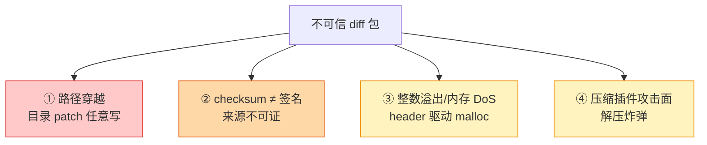

# 安全与踩坑

> 上一篇：[项目落地](./hdiff-unity) | 返回：[总览](/)
> 源码：`HDiffPatch v4.12.1` + `Packages/com.haru.hdiff`，行号已实测

## 风险总览



**风险前提**：diff 包只来自可信 CI+CDN+HTTPS+验签时，这些主要是健壮性问题；diff 可被外部上传或篡改时，①必须按高危处理。

## ① 路径穿越（目录 patch 特有）

目录 patch 输出时，diff 内保存的路径**直接拼接**到输出根目录（`dirDiffPatch/dir_patch/new_dir_output.c:310`）：

```cpp
const char* TNewDirOutput_getNewPathByIndex(const TNewDirOutput* self,size_t newPathIndex,...){
    if (!setPathWithRoot(out_pathBuf,out_pathBufEnd,
                         self->_newRootDir,self->_newRootDir_len,
                         self->newUtf8PathList[newPathIndex]))   // diff 内路径直接拼 root 后
```

`setPathWithRoot`（`dir_patch_tools.h:50`）就是先写 root 再追加 fileName，**无净化**。

未防护的输入形态：

| 攻击向量 | 示例 | 后果 |
|---|---|---|
| `../` 遍历 | `../../etc/cron.d/evil` | 写出到输出目录外 |
| 绝对路径 | `C:\Windows\evil.dll` | 任意位置写入 |
| Windows UNC | `\\server\share\x` | 网络写入 |
| 混合分隔符 | `..\/..\/x` | 绕过单一分隔符检查 |
| 软链接/junction | 输出目录内预置 symlink | 间接逃逸 |

**建议修复**（本项目用文件级 patch，路径来自自己的任务列表，此风险天然规避；若切换目录级 patch 则必须做）：

1. 解析目录 diff 后，对**所有**保存路径做拒绝式校验：统一分隔符、禁绝对路径/盘符/UNC/空路径/`..` 段
2. 写文件前取 canonical path，确认仍在输出 root 下
3. Windows 上拒绝/隔离 reparse point
4. fuzz path list：长路径、Unicode 归一化、NUL 边界

## ② checksum 不等于签名

目录 patch 默认 checksumSet 只检查 old/new ref 数据，**不**默认检查整个 diff 数据；diff 无 checksum 时 `hpatchz.c` 仅 warning。关键认知：

| checksum 能做 | checksum 不能做 |
|---|---|
| 发现传输损坏 | 证明发布者身份 |
| 发现 old/new 不匹配 | 防止攻击者重新打包 |
| 发现 copy 数据错误 | 替代版本策略和回滚 |

**推荐链路**：CI 生成 diff → manifest（版本/大小/hash/平台）→ Ed25519/RSA 签名 → 客户端验签+hash → 才进入 hpatch。本项目 Lua 侧传入的是 CDN manifest 里的新版本 SHA1（`AddTaskByFileName`），patch 后 `Verify` 校验——差分产物被完整校验覆盖。

## ③ 整数溢出与内存 DoS

目录 patch 元数据一次性 malloc，大小由 header 的 count/size 驱动（`dir_patch.c:345-350`）：

```cpp
memSize = (head->oldPathCount+head->newPathCount)*sizeof(const char*)
        + (head->oldRefFileCount+head->newRefFileCount+head->newExecuteCount)*sizeof(size_t)
        + head->sameFilePairCount*sizeof(hpatch_TSameFilePair)
        + (newRefFileCount)*sizeof(hpatch_StreamPos_t)
        + (oldPathLen+newPathLen+4) + pathSumSize;
self->_pDiffDataMem=malloc(memSize);
```

畸形 diff 构造超大 count → 溢出或 OOM。上游的既有防线：single 格式头解析时 `stepMemSize ≤ 16MB` 等三条校验（`patch.c:2136-2141`，见 [patch 应用篇](./hdiff-patch)）。自建接入层还应设：最大 path count、最大 ref count、最大 diff 文件大小。

**assert 不承担安全校验**：源码不变量多用 `assert()` 表达，release 构建可能被去掉。对外部输入影响的边界必须用运行时 `check()`（上游在 `__RUN_MEM_SAFE_CHECK` 里做了，别关）。

## ④ 压缩插件攻击面

diff 可用 zlib/lzma/lzma2/zstd（本项目 native 库实测四种都编入，见[项目落地篇](./hdiff-unity)）。缓解：对解压后大小设上限（stepMemSize 已有部分保护）、压缩库纳入漏洞更新流程、fuzz 解压路径。

## 踩坑实录：OPENREAD_ERROR(2)

> 项目真实故障（2026-07），从取证到修复的完整记录

### 症状

部分 .uab 文件 patch 失败：`hpatchz returned 2 => HPATCH_OPENREAD_ERROR`，同批其他文件正常。

### 错误含义

`HPATCH_OPENREAD_ERROR(2)` = hpatchz **打开输入文件读取失败**（fopen 阶段）——输入只有旧文件(SrcFile)和补丁(PatchFile)两者之一打不开。**不是数据损坏、不是校验失败**。

### 本机取证

- 旧文件存在（22KB）
- `download/matrix/Patch/` 目录整体已不存在（patch 会话结束后被清理），无法事后判断当时 patch 文件状态

### Windows 偶发 OPENREAD 的原因排序

1. **文件句柄占用（最可能）**：Defender 实时扫描/同步盘/下载线程句柄未关闭时 patch 线程并发 fopen → `ERROR_SHARING_VIOLATION`。"偶发+部分文件"是典型竞态分布
2. **patch 文件在执行时刻还不存在**：下载"临时名→rename"完成前任务已入队
3. 路径问题（本例排除：全 ASCII 不超长）

### 修复方案（两层）

**① pre-flight 区分"不存在"与"打不开"**（HDiffTask.ExecutePatch 开头）：

```csharp
if (!File.Exists(PatchFile)) {
    Error = $"PatchFile missing: {PatchFile}";        // 明确指向下载层
    ResultCode = (int)THPatchResult.HPATCH_OPENREAD_ERROR;
    State = HDiffTaskState.Failed; return false;
}
if (!File.Exists(SrcFile)) { /* 同上 */ }
```

**② 瞬态错误指数退避重试**（HDiffExecutor.DoPatch）：

```csharp
const int MaxRetry = 3;
for (int attempt = 0; attempt <= MaxRetry; attempt++) {
    task.RetryCount = attempt;
    patchSucceeded = task.ExecutePatch(nativeThreadNum, nativeCacheMemory);
    if (patchSucceeded) break;
    bool missing = task.Error?.Contains("missing") == true;
    bool transient = !missing &&
        (task.ResultCode == (int)THPatchResult.HPATCH_OPENREAD_ERROR ||
         task.ResultCode == (int)THPatchResult.HPATCH_FILEREAD_ERROR);
    if (!transient || ct.IsCancellationRequested) break;
    Thread.Sleep(100 * (1 << attempt));   // 100/200/400ms
}
```

设计要点：**真缺文件由 pre-flight 报 "missing" 并跳过重试**（重试也救不了下载层 bug）；句柄占用类瞬态错误退避后自愈。日志里 `retries=N` 的出现频率直接反映线上竞态率。

> ⚠️ 现状核对：此修复方案已在 vault 定稿，`D:\hdiff` 当前代码 `DoPatch` 仍是 `task.RetryCount = 0` 赋值后未用、失败即终态（`HDiffExecutor.cs:235-246`），**尚未合入**。

### 验证方法

1. 复现环境跑全量更新，观察 `retries=N` 频率——瞬态错误应自愈
2. 若仍有失败，新日志会明确 `PatchFile missing` / `SrcFile missing`，直接定位下载层
3. 人为压测：patch 过程中用另一进程持有 patch 文件句柄，验证重试生效

## 线上热更接入 checklist

- [ ] diff 包外层已验签（Ed25519/RSA/HMAC）
- [ ] patch 只在临时目录执行，不直接写生产目录
- [ ] patch 成功后原子 rename/swap（本项目 P0 风险：当前直接覆盖，中断可能损坏旧文件 → 只能全量重下兜底）
- [ ] 失败时清理临时目录 + 保留日志 + 回滚
- [ ] （目录级 patch）路径已拒绝 `..`/绝对路径/盘符/UNC
- [ ] 设最大输出大小、最大文件数、最大 stepMemSize
- [ ] 生成端保留 patch check（`hdiffz` 默认开）
- [ ] patch 后校验 manifest SHA1（本项目已在 Verify 实现）
- [ ] malformed diff / 压缩流已 fuzz
- [ ] 瞬态 IO 错误有重试（OPENREAD 实录）

**最稳线上链路**：验签 → sandbox patch → manifest hash 校验 → 原子替换 → 失败回滚。

---
上一篇：[项目落地](./hdiff-unity) | 返回：[总览](/)
