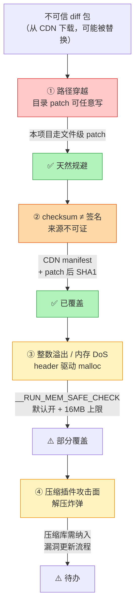

# 安全与踩坑：差分方案的攻击面，和一次真实的 OPENREAD 故障

> 上一篇：[打包与合并](./hdiff-pipeline) | 返回：[总览](/hot-update/)
> 源码：`HDiffPatch v4.12.1`（`dirDiffPatch/`、`HPatch/patch.c`、`hpatchz.c`）+ `Packages/com.haru.hdiff`，本页行号已实测

## 一句话结论

差分方案的风险**不在算法，在"它是一条把外部数据写进磁盘的路径"**。
四条攻击面（路径穿越 / checksum 冒充签名 / 内存 DoS / 解压炸弹）里，本项目因为走**文件级 patch** 天然规避了第一条；真正咬到我们的是第四条之外的一个不起眼的东西——**`fopen` 偶发失败**。

## 它到底解决什么问题

攻击者能拿到什么？取决于他能控制哪一环：

| 他能控制 | 他能做到 |
|---|---|
| 只改传输中的字节（中间人） | 篡改 patch → 需要绕过 SHA1 校验（如果 patch 外层验签就做不到） |
| 上传自己的 patch 到 CDN | 让客户端解压恶意 patch → 路径穿越写文件 / 内存耗尽 |
| 只让文件暂时打不开 | 让某个文件 patch 失败 → 只能降级全量下载（可用性问题，不是安全问题） |

本文前半部分讲前两条（**真正的安全风险**），后半部分讲第三条——那是我们线上真实遇到并取证过的那一类。

## 术语先对齐

| 术语 | 一句话解释 |
|---|---|
| **路径穿越** | patch 里的文件名写成 `../../etc/cron.d/evil`，拼到输出根目录后跑到目录外面 |
| **checksum vs 签名** | checksum 只能证明"数据没坏"，签名才能证明"数据是谁给的" |
| **内存 DoS** | 畸形头部声称一个巨大的尺寸，诱使程序 `malloc` 一大块内存然后 OOM |
| **解压炸弹** | 一小段压缩数据解压后体积爆炸（zip bomb 同理） |
| **`fopen` 竞态** | 两个进程同时打开同一个文件，其中一个被拒（`ERROR_SHARING_VIOLATION`） |
| **reparse point** | Windows 的符号链接/junction，可让"看起来在目录内"的路径实际指向别处 |

## 风险总览



**风险前提**：当 diff 包只来自"可信 CI + CDN + HTTPS + 验签"时，下面这些主要是**健壮性问题**；当 diff 可以被外部上传或篡改时，① 必须按高危处理。

## ① 路径穿越（目录 patch 特有）

目录 patch 输出时，diff 内保存的路径**直接拼接**到输出根目录（`dirDiffPatch/dir_patch/new_dir_output.c:310`）：

```cpp
// new_dir_output.c:310-315
const char* TNewDirOutput_getNewPathByIndex(const TNewDirOutput* self,size_t newPathIndex,
                                            char* out_pathBuf,char* out_pathBufEnd){
    if (!setPathWithRoot(out_pathBuf,out_pathBufEnd,
                         self->_newRootDir,self->_newRootDir_len,
                         self->newUtf8PathList[newPathIndex]))   // diff 内路径直接拼 root 后
        return 0;
    return out_pathBuf;
}
```

`setPathWithRoot`（`dir_patch_tools.h:50`）做的事就是"先写 root 再追加 fileName"，**没有任何净化**。

未防护的输入形态：

| 攻击向量 | 示例 | 后果 |
|---|---|---|
| `../` 遍历 | `../../etc/cron.d/evil` | 写出到输出目录外 |
| 绝对路径 | `C:\Windows\evil.dll` | 任意位置写入 |
| Windows UNC | `\\server\share\x` | 网络写入 |
| 混合分隔符 | `..\/..\/x` | 绕过单一分隔符检查 |
| 软链接 / junction | 输出目录内预置 symlink | 间接逃逸 |

**为什么本项目没被这个打中**：项目用的是**文件级 patch**（C# 层自己循环，文件名来自自己的任务列表），路径从不来自 diff 内部。**此风险天然规避**——但如果你要切换到目录级 patch，下面四条必须做：

1. 解析目录 diff 后，对**所有**保存路径做拒绝式校验：统一分隔符、禁绝对路径/盘符/UNC/空路径/`..` 段
2. 写文件前取 canonical path，确认仍在输出 root 下
3. Windows 上拒绝/隔离 reparse point
4. fuzz path list：长路径、Unicode 归一化、NUL 边界

## ② checksum 不等于签名

目录 patch 默认的 `checksumSet` 只检查 old/new ref 数据，**不**默认检查整个 diff 数据；diff 无 checksum 时 `hpatchz.c` 仅 warning。关键认知：

| checksum 能做 | checksum 不能做 |
|---|---|
| 发现传输损坏 | 证明发布者身份 |
| 发现 old/new 不匹配 | 防止攻击者重新打包 |
| 发现 copy 数据错误 | 替代版本策略和回滚 |

**推荐链路**：CI 生成 diff → manifest（版本/大小/hash/平台）→ Ed25519/RSA 签名 → 客户端验签 + hash → 才进入 `hpatch`。

本项目的实现是：Lua 侧把 **CDN manifest 里的新版本 SHA1** 通过 `AddTaskByFileName` 传下去（`XModuleUpdateStatePatchFilesApply.lua:72`），patch 后由 `HDiffTask.Verify`（`HDiffTask.cs:88`）校验。**差分产物被完整校验覆盖**——但注意：**这条链路的安全性上限 = manifest 本身的可信度**。manifest 没验签，后面所有环节的校验都只是在防"传输损坏"。

## ③ 整数溢出与内存 DoS

目录 patch 的元数据一次性 `malloc`，大小由 header 的 count/size 驱动（`dir_patch.c:345-350`）：

```cpp
// dir_patch.c:345-350
memSize = (head->oldPathCount+head->newPathCount)*sizeof(const char*)
        + (head->oldRefFileCount+head->newRefFileCount+head->newExecuteCount)*sizeof(size_t)
        + head->sameFilePairCount*sizeof(hpatch_TSameFilePair)
        + (newRefFileCount)*sizeof(hpatch_StreamPos_t)
        + (oldPathLen+newPathLen+4) + pathSumSize;
self->_pDiffDataMem=malloc(memSize);
```

畸形 diff 构造超大 count → 乘法溢出或直接 OOM。

<BitField
  title="为什么 header 里一个 count 就能撑爆内存：数量级的放大发生在乘法上"
  :bytes="[0xFF, 0xFF, 0xFF, 0x7F, 0x00, 0x00, 0x00, 0x00]"
  :fields="[
    { name: 'sameFilePairCount', from: 0, to: 31, desc: 'header 里直接读出来的整数（读入在 dir_patch.c:115 的 unpackToSize），本示意取 0x7FFFFFFF —— header 里只占 4 字节' },
    { name: 'sizeof(hpatch_TSameFilePair)', from: 32, to: 63, desc: 'memSize 里要和上面那个 count 相乘的元素大小。count 是 32 位、元素是 8 字节级 → 一次乘法把量级放大 8 倍' }
  ]" />

> 这个位域图想说明的是**乘法发生在哪里**：`memSize` 的第一项是指针数组、第三项是 `sameFilePairCount × sizeof(hpatch_TSameFilePair)`。
> count 本身只占 header 里几个字节，但它决定了一次性 `malloc` 的规模——**攻击者的成本是几字节，你的成本是几 GB**。这就是"header 驱动 malloc"这类漏洞的共同形状。

**上游已有的防线**（single 格式头解析时的三条校验，`patch.c:2136-2141`，逐条分析见 [patch 应用篇](./hdiff-patch)）：

| 校验 | 位置 | 防什么 |
|---|---|---|
| `compressedSize ≤ uncompressedSize` | `patch.c:2136-2137` | 荒谬的压缩比 |
| `stepMemSize ≤ min(newDataSize, 16MB)` | `patch.c:2138-2139` | 内存 DoS |
| `stepMemSize ≤ uncompressedSize` | `patch.c:2140-2141` | 同上，另一个入口 |

**自建接入层还应设**：最大 path count、最大 ref count、最大 diff 文件大小。

> **`assert` 不承担安全校验**：源码不变量多用 `assert()` 表达，release 构建可能被去掉。对外部输入影响的边界必须用运行时 `check()`——上游在 `__RUN_MEM_SAFE_CHECK` 里做了（`patch.c:39-40` 明确写了它的目的是 *"defend against potentially corrupted or maliciously crafted data"*），**别关**。

## ④ 压缩插件攻击面

diff 可用 zlib / lzma / lzma2 / zstd（本项目 native 库实测四种都编入，见[项目落地篇](./hdiff-unity)）。缓解措施：

- 对解压后大小设上限（`stepMemSize` 已有部分保护）
- 压缩库纳入漏洞更新流程
- fuzz 解压路径

## 踩坑实录：OPENREAD_ERROR(2)

> 项目真实故障（2026-07），从取证到修复方案的完整记录。
> ⚠️ **修复状态**：截至本页撰写，**修复方案尚未合入**（核对方法见本节末尾）。

### 症状

部分 `.uab` 文件 patch 失败：`hpatchz returned 2 => HPATCH_OPENREAD_ERROR`，**同批其他文件正常**。

### 错误含义

先看这个错误码在源码里到底是什么（`hpatchz.c:291-296`）：

```cpp
typedef enum THPatchResult {
    HPATCH_SUCCESS=0,
    HPATCH_OPTIONS_ERROR=1,
    HPATCH_OPENREAD_ERROR,      // = 2
    HPATCH_OPENWRITE_ERROR,     // = 3
    HPATCH_FILEREAD_ERROR,      // = 4
    ...
```

只要看它被 `check(...)` 抛出的三个位置，就能确定它的确切含义：

| 抛出处 | 源码 | 含义 |
|---|---|---|
| `hpatchz.c:1292-1293` | `check(hpatch_TFileStreamInput_open(&oldData,oldFileName), HPATCH_OPENREAD_ERROR,"open oldFile for read")` | **旧文件打不开** |
| `hpatchz.c:1295-1296` | `check(hpatch_TFileStreamInput_open(&diffData,diffFileName), HPATCH_OPENREAD_ERROR,"open diffFile for read")` | **补丁文件打不开** |
| `hpatchz.c:1137-1138` | `check(hpatch_TFileStreamInput_open(&diffData,fileName), HPATCH_OPENREAD_ERROR,"open file for read")` | 通用入口 |

所以：**`HPATCH_OPENREAD_ERROR(2)` = `fopen` 阶段打开输入文件失败**。输入只有旧文件（SrcFile）和补丁（PatchFile）两者之一打不开。

⚠️ **它不等于"文件不存在"**。源码里"路径不存在"走的是另一个错误码：`hpatchz.c:1440-1441` 的 `check((oldType!=kPathType_notExist),HPATCH_PATHTYPE_ERROR,"oldPath not exist")`。
**这个区分是整次排障的关键**——`OPENREAD` 意味着"文件在，但打开失败"。

### 本机取证

- 旧文件存在（22KB）
- `download/matrix/Patch/` 目录整体已不存在（patch 会话结束后被清理），**无法事后判断当时 patch 文件状态**

> 取证教训：**临时目录被清理得太早**。如果 patch 失败时保留现场（哪怕只是把文件名列表 dump 到日志），这次排障会快一个数量级。

### Windows 上偶发 OPENREAD 的原因排序

| 排序 | 原因 | 为什么符合"偶发 + 部分文件"的分布 | 排除依据 |
|---|---|---|---|
| 1 | **文件句柄占用（最可能）**：Defender 实时扫描 / 同步盘 / 下载线程句柄未关闭时，patch 线程并发 `fopen` → `ERROR_SHARING_VIOLATION` | 竞态本来就只在时间窗口重叠时发生，所以是"偶发"；只有被扫到的文件才中招，所以是"部分" | — |
| 2 | **patch 文件在执行时刻还不存在**：下载的"临时名 → rename"完成前任务已入队 | 同上是竞态 | — |
| 3 | 路径问题 | 通常是必现，不符合"偶发" | **本例排除：全 ASCII 不超长** |

### 修复方案（两层）

**① pre-flight：区分"不存在"与"打不开"**（`HDiffTask.ExecutePatch` 开头）：

```csharp
// 方案（尚未合入）：在调用 native 之前先用托管侧 File.Exists 判一次
if (!File.Exists(PatchFile)) {
    Error = $"PatchFile missing: {PatchFile}";        // 明确指向下载层，别让它冒充 native 错误
    ResultCode = (int)THPatchResult.HPATCH_OPENREAD_ERROR;
    State = HDiffTaskState.Failed; return false;
}
if (!File.Exists(SrcFile)) { /* 同上 */ }
```

**为什么要这一层**：native 只返回一个数字 `2`，托管侧无法区分"下载没下完"和"文件被占用"。**把错误分类的责任放在掌握更多信息的一侧**，是这类跨语言边界故障排查的通用手法。

**② 瞬态错误指数退避重试**（`HDiffExecutor.DoPatch`）：

```csharp
// 方案（尚未合入）：只对"可能自愈"的错误重试
const int MaxRetry = 3;
for (int attempt = 0; attempt <= MaxRetry; attempt++) {
    task.RetryCount = attempt;
    patchSucceeded = task.ExecutePatch(nativeThreadNum, nativeCacheMemory);
    if (patchSucceeded) break;
    bool missing = task.Error?.Contains("missing") == true;
    bool transient = !missing &&
        (task.ResultCode == (int)THPatchResult.HPATCH_OPENREAD_ERROR ||
         task.ResultCode == (int)THPatchResult.HPATCH_FILEREAD_ERROR);
    if (!transient || ct.IsCancellationRequested) break;
    Thread.Sleep(100 * (1 << attempt));   // 100 / 200 / 400 ms
}
```

设计要点：**真缺文件由 pre-flight 报 `"missing"` 并跳过重试**（重试也救不了下载层 bug）；句柄占用类瞬态错误退避后自愈。日志里 `retries=N` 的出现频率**直接反映线上竞态率**。

### 当前代码状态（实测核对）

| 声称 | 实测结论 |
|---|---|
| `DoPatch` 里 `task.RetryCount = 0` 赋值后未用、失败即终态 | ✅ 属实。`HDiffExecutor.cs:235` 是 `task.RetryCount = 0;`，其后 `:237` 调一次 `ExecutePatch`，`:241-245` 失败直接 `OnTaskFailed`。**全文件搜不到 `MaxRetry` / `Thread.Sleep` / `HPATCH_OPENREAD_ERROR`** |
| pre-flight 的 `File.Exists(PatchFile)` 检查 | ❌ 尚未加入。`HDiffTask.ExecutePatch`（`:52-81`）目前只检查了 `DstFile`（`:56`），**没有检查 `SrcFile` / `PatchFile`** |
| 重试计数属性 | ✅ `RetryCount` 属性已存在（`HDiffTask.cs:37`），但只被赋值、没被读 |

**结论：修复方案已在 vault 定稿，`D:\hdiff` 当前代码尚未合入。**

### 验证方法

1. 复现环境跑全量更新，观察 `retries=N` 频率——瞬态错误应自愈
2. 若仍有失败，新日志会明确 `PatchFile missing` / `SrcFile missing`，直接定位下载层
3. 人为压测：patch 过程中用另一进程持有 patch 文件句柄，验证重试确实生效

```powershell
# 验证"占住句柄会让 hpatchz 报 2"这个假设的最小实验（PowerShell）
$patch = 'D:\tmp\test.patch'
$fs = [System.IO.File]::Open($patch, 'Open', 'Read', 'None')   # 独占占用
# 另开一个终端跑 hpatchz old.patch.new，应看到 result=2
# 释放句柄后重跑，应成功 → 证明"2"确实来自句柄竞争而不是文件缺失
$fs.Close()
```

## 线上热更接入 checklist

- [ ] diff 包外层已验签（Ed25519/RSA/HMAC）
- [ ] patch 只在临时目录执行，不直接写生产目录
- [ ] patch 成功后原子 rename/swap（**本项目 P0 风险**：当前直接覆盖，中断可能损坏旧文件 → 只能全量重下兜底）
- [ ] 失败时清理临时目录 + 保留日志 + 回滚
- [ ] （目录级 patch）路径已拒绝 `..` / 绝对路径 / 盘符 / UNC
- [ ] 设最大输出大小、最大文件数、最大 stepMemSize
- [ ] 生成端保留 patch check（`hdiffz` 默认开）
- [ ] patch 后校验 manifest SHA1（**本项目已在 `Verify` 实现**）
- [ ] malformed diff / 压缩流已 fuzz
- [ ] 瞬态 IO 错误有重试（**OPENREAD 实录：方案已定稿，未合入**）

**最稳的线上链路**：验签 → sandbox patch → manifest hash 校验 → 原子替换 → 失败回滚。

## 常见误解

::: warning "校验了 SHA1 就等于安全了"
不等于。SHA1 只能证明"产物内容 = manifest 里写的那个 hash"。如果攻击者能同时改 manifest，校验就毫无意义。**校验解决完整性，签名解决来源**——两件事，缺一不可。
:::

::: warning "native 返回错误码，托管侧总能分清原因"
分不清。`HPATCH_OPENREAD_ERROR(2)` 至少覆盖了"旧文件打不开"和"补丁文件打不开"两种情形，而 `fopen` 失败的原因（不存在 / 被占用 / 权限不足 / 路径过长）在错误码里**没有任何体现**。这就是为什么修复方案要先在托管侧做 pre-flight——**在信息更多的那一层做分类**。
:::

::: warning "重试是万能的兜底"
只有**瞬态**错误值得重试。"文件真的不存在"这类错误重试 3 次只是把失败推迟 700ms。所以重试策略必须配一个"哪些错误不重试"的白名单——方案里那个 `missing` 判断就是干这个的。
:::

## 自检清单

- [ ] 能说出四条攻击面各自的前提条件，以及本项目为什么规避了①
- [ ] 能解释 checksum 和签名的分工（完整性 vs 来源）
- [ ] 能说出 `HPATCH_OPENREAD_ERROR(2)` 与"文件不存在"的区别，以及后者走哪个错误码
- [ ] 能解释 pre-flight 检查为什么必须放在托管侧而不是 native 侧
- [ ] 能说出指数退避为什么只对瞬态错误有意义
- [ ] 能在 `patch.c:2136-2141` 找到三条防恶意 patch 的校验

---

上一篇：[打包与合并](./hdiff-pipeline) | 返回：[总览](/hot-update/)
