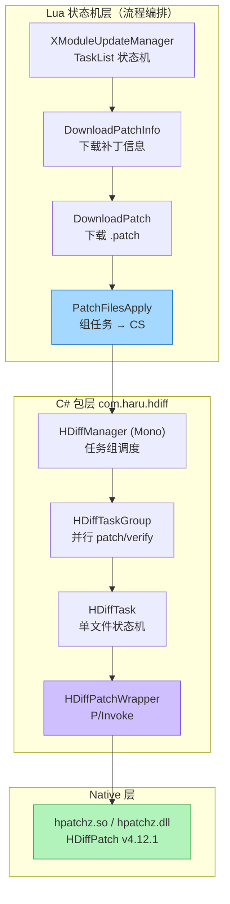
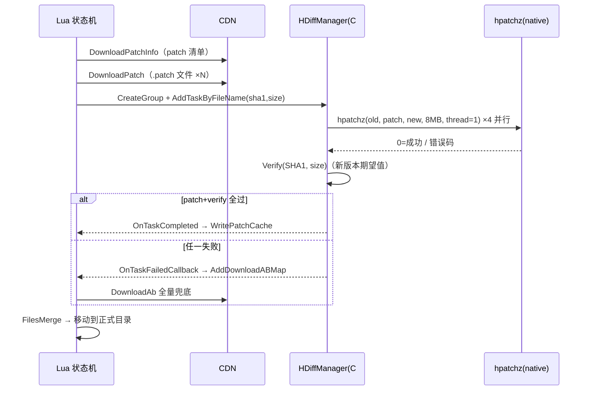

# 项目落地：Unity 热更中的完整链路

> 上一篇：[实战例子](./hdiff-example) | 下一篇：[安全与踩坑](./hdiff-security)
> 代码：`D:\hdiff\Dev\Client\Packages\com.haru.hdiff`（C#）+ `D:\hdiff\Product\Lua\Launch\XLaunchUpdate`（Lua），行号已实测

## 三层架构



分层原则：**性能关键的 IO/patch/校验放 C# 与 native，流程编排放 Lua**（热更友好，改流程不发版）。

## Lua 侧：状态机编排

`XModuleUpdateManager.lua` 的标准更新任务列表（`:237-248` 附近）：

```lua
self.TaskList = {
    XUpdateStateEnum.VersionCheck,        -- 版本检查
    ...
    XUpdateStateEnum.DownloadPatchInfo,   -- 下载补丁信息
    XUpdateStateEnum.ShowSelectDownload,
    XUpdateStateEnum.DownloadPatch,       -- 下载补丁
    XUpdateStateEnum.PatchFilesApply,     -- 应用补丁文件 ← 差分核心
    XUpdateStateEnum.DownloadAb,          -- 全量 AB 兜底
    XUpdateStateEnum.FilesMerge,
}
```

`XModuleUpdateStatePatchFilesApply.lua` 是 Lua → C# 的握手点（`:55-126`）：

```lua
local hdiffManager = CS.HDiffPatch.HDiffManager.Instance
hdiffManager:SetDirectories(srcPath, DownloadPatchPath, DownloadAbPath)

local group = hdiffManager:CreateGroup()
group:AddSrcDir(srcPath)
group:AddSrcDir(self.ModuleUpdateInfo:GetApplicationFilePathWithType())

for fileName, srcDirIndex in pairs(self._patchMap) do
    local info = self.UpdateManager:GetFileInfoByPath(fileName)
    -- sha1/size 是【新版本】信息，用于 patch 产物校验
    group:AddTaskByFileName(fileName, info[XLaunchConst.XFileInfoSha1Index],
                            info[XFileInfoSizeIndex], srcDirIndex)
end
group.OnTaskFailedCallback = function(fileName)
    self.UpdateManager:AddDownloadABMap(fileName)   -- ← 失败自动降级全量下载
end
hdiffManager:StartGroup(group)
```

**双轨制**：patch 成功 → `WritePatchCache` 记账；patch 失败 → 文件进 `AddDownloadABMap`，后面的 `DownloadAb` 状态全量补齐。差分永远是加速项，不是正确性的唯一依赖。

## C# 侧：任务组与并行

### HDiffTask（单文件状态机）

`HDiffTask.cs:8-14` 五状态：

```csharp
public enum HDiffTaskState { Pending, Running, Verifying, Completed, Failed }
```

`ExecutePatch`（`:52`）核心逻辑：

```csharp
if (File.Exists(DstFile)) return true;      // 幂等：已完成直接跳过（断点续跑）
ResultCode = HDiffPatchWrapper.ApplyPatch(SrcFile, PatchFile, DstFile,
                                          nativeThreadNum, cacheMemory);
if (ResultCode != 0) {
    Error = $"hpatchz returned {ResultCode} => {(THPatchResult)ResultCode}\n{SrcFile}\n{PatchFile}\n{DstFile}";
    State = HDiffTaskState.Failed;
}
```

`Verify`（`:88`）在 patch 后立即做 SHA1/size 校验（期望值来自 Lua 侧传入的**新版本** FileInfo）——**patch 产物校验是热更正确性的最后防线**。

### HDiffConst（并行与内存参数，实测调优结论）

`HDiffConst.cs` 的注释就是调优记录：

| 参数 | 值 | 依据 |
|---|---|---|
| `MaxParallelTasks` | 设备核心数，钳制 [2,4] | patch 线程阻塞在磁盘 IO，4 线程左右收益饱和；峰值内存 = 并行数 × cache |
| `NativeThreadNum` | **1** | 已按文件粒度并行，native 内部再开线程 = 超额订阅 |
| `NativeCacheMemory` | **8MB**（`8L << 20`） | 实测 -1 退化成小块 IO 模式慢 8 倍（4MB 文件 76.7ms→9.4ms），再大收益趋平 |
| `LowerWorkerPriority` | true | 满核并发时让 CPU 给主线程，防游戏卡顿 |
| `MaxParallelVerify` | 设备核心数，钳制 [2,4] | 峰值托管内存 = 并行数 × VerifyBufferSize |

> Android 冷启动时效率核可能下线，`Environment.ProcessorCount` 偏低——所以并行度不在静态初始化时固化，每次任务组启动重新快照（`HDiffConst.cs:22-32`）。

### HDiffPatchWrapper（P/Invoke）

`HDiffPatchWrapper.cs:9-31`：

```csharp
[DllImport("__Internal")]      // iOS 静态链进主二进制
private static extern int hpatchz(string oldPath, string diffPath, string newPath, long cacheMemory, int threadNum);
[DllImport("hpatchz")]         // Android libhpatchz.so
private static extern int hpatchz(string oldPath, string diffPath, string newPath, long cacheMemory, int threadNum);
[DllImport("libhpatchz")]      // 其他平台命名
private static extern int hpatchz(string oldPath, string diffPath, string newPath, long cacheMemory);
```

三平台三个 DllImport 别名——iOS `__Internal`（静态库）、Android `hpatchz`（so 名去 lib 前缀）、PC `libhpatchz`。

### native 库的压缩插件（实测 .so/.dll 符号）

`libhpatchz.so`（arm64, 175KB）与 `hpatchz.dll`（x64）内实测编入的解压插件：

| 平台 | 证据（strings 实测） |
|---|---|
| Android .so | `LzmaDec_DecodeReal_3`、`lzma`、`lzma2`、`zstd`、`zlib`、`pzlib` 符号全在 |
| Windows .dll | `LZMADECOPT`、`Z_OK==inflateEnd`（zlib）、`HDIFF13`/`HDIFFSF20` 格式串 |

即 patch 端四种解压插件都编进去了，diff 端用哪种压缩编码，patch 端都能解。

## 目录级 vs 文件级：项目选了文件级

HDiffPatch 自带目录级 diff（`dirDiffPatch/`，入口 `hdiffz.cpp:438 hdiff_dir`），但项目选择**在 C# 层自己做文件级循环**（HDiffTaskGroup 管理多个单文件 patch 任务）。权衡：

| | 目录级（原生 dir_diff） | 文件级（项目现方案） |
|---|---|---|
| 并行度 | 单进程内自管 | C# 层按文件并行，可控可观测 |
| 断点续跑 | 粒度 = 整个目录 | 粒度 = 单文件（DstFile 存在即跳过） |
| 失败隔离 | 一处失败影响整包 | 单文件失败只降级该文件 |
| 进度上报 | 粗 | 每文件回调（Lua 进度条直接用） |

代价是每个文件一次 P/Invoke + fopen——`NativeCacheMemory=8MB` 的实测调优就是为这个开销买单。

## 完整时序（一次热更）



---
上一篇：[实战例子](./hdiff-example) | 下一篇：[安全与踩坑](./hdiff-security)
