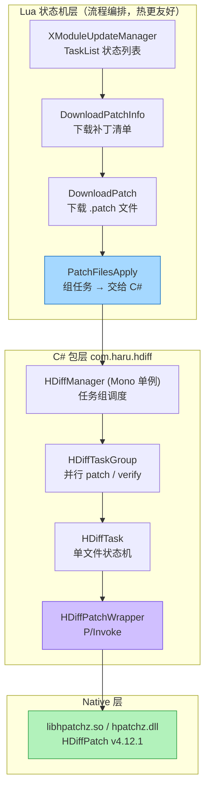
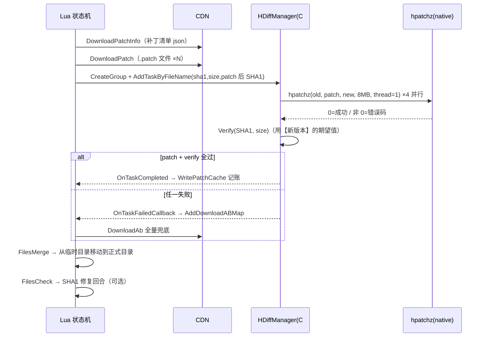

# 项目落地：Unity 热更里，这套 C 代码是怎么被用起来的

> 上一篇：[小文件与小重复](./hdiff-minmatch) | 下一篇：[打包与合并](./hdiff-pipeline)
> 代码：`D:\hdiff\Dev\Client\Packages\com.haru.hdiff`（C# 包）+ `D:\hdiff\Product\Lua\Launch\XLaunchUpdate`（Lua 状态机），本页行号已实测

<script setup>
import OldNewPatchFlow from './components/OldNewPatchFlow.vue'
</script>

## 一句话结论

项目把 HDiffPatch 包成了三层：**Lua 管流程（改流程不用发版）→ C# 管调度与校验（性能关键的 IO/patch/ SHA1 放这儿）→ native 管算（就是 v4.12.1 编出来的 `hpatchz`）。**
差分在这条链路上**永远是加速项，不是正确性的唯一依赖**——patch 失败就自动降级全量下载。

## 它到底解决什么问题

前四篇讲的都是"算法怎么工作"。真上线之后会遇到一堆算法书上没有的问题：

| 上线后会遇到的事 | 算法本身能解决吗 | 项目怎么解决 |
|---|---|---|
| 用户手机上有 3000 个资源文件要打补丁 | ❌ | C# 层按文件并行（`MaxParallelTasks` 钳制 [2,4]） |
| 用户打到一半杀进程/断网 | ❌ | 单文件幂等（目标文件已存在就直接成功）+ 记账文件 |
| patch 出来的文件被写坏了 | ❌ | 每个文件 patch 完立刻校验 SHA1 + size |
| 某个文件旧版本对不上，patch 一定失败 | ❌ | 失败回调 → 那个文件改走全量下载 |
| 补丁包被中间人篡改 | ❌ | 补丁外层验签 + patch 后 SHA1 校验（见[安全篇](./hdiff-security)） |

**所以真正决定线上体验的，不是差分算法本身，而是这五条兜底策略。**

## 术语先对齐

| 术语 | 一句话解释 |
|---|---|
| **Lua 状态机** | 热更流程被写成一张"状态列表"，一步步走。改流程只需更新 Lua |
| **HDiffTask** | 一个文件的补丁任务，有自己的五状态机 |
| **HDiffTaskGroup** | 一组任务，由 `HDiffManager` 调度，控制并行度 |
| **P/Invoke** | C# 调用 native 动态库的机制（`[DllImport]`） |
| **双轨制** | patch 走通了就用 patch，走不通就走全量 AB。两条路都通向"文件是新版本" |
| **AB** | AssetBundle，Unity 的资源包格式。`.uab` 是它的文件后缀 |

## 三层架构



分层原则很直白：**性能关键的 IO / patch / 校验放进 C# 与 native，流程编排放 Lua。**
这样"改一个下载顺序、加一个提示弹窗"不需要重新出包。

## Lua 侧：状态列表与握手

`XModuleUpdateManager.lua` 的标准更新状态列表（`:223-243`）：

```lua
-- XModuleUpdateManager.lua:223-243（matrix 模式，省略与本篇无关的中间状态）
self.TaskList = {
    XUpdateStateEnum.VersionCheck,          -- 版本检查
    XUpdateStateEnum.ZipVersionCheck,       -- 压缩包版本检查
    XUpdateStateEnum.InitPackageIndex,      -- 初始化包索引
    XUpdateStateEnum.InitLocalIndex,        -- 初始化本地索引
    XUpdateStateEnum.InitRemoteIndex,       -- 初始化远程索引
    XUpdateStateEnum.InitFileInfo,          -- 初始化文件信息
    XUpdateStateEnum.InitDlcInfo,           -- 初始化分包资源信息
    XUpdateStateEnum.ListNormal,            -- 收集下载列表
    XUpdateStateEnum.DownloadPatchInfo,     -- 下载补丁信息
    XUpdateStateEnum.ShowSelectDownload,    -- 显示下载选择
    XUpdateStateEnum.InitDlcAsset,          -- 初始化DLC资源
    XUpdateStateEnum.ListDlc,               -- 列表DLC
    XUpdateStateEnum.DownloadStartTips,     -- 下载开始提示
    XUpdateStateEnum.DownloadPatch,         -- 下载补丁
    XUpdateStateEnum.PatchFilesApply,       -- 应用补丁文件 ← 差分核心就在这一步
    XUpdateStateEnum.DownloadAb,            -- 下载AB文件
    XUpdateStateEnum.FilesMerge,            -- 合并文件
}
```

`XModuleUpdateStatePatchFilesApply.lua` 是 Lua → C# 的握手点（`:55-126`）：

```lua
-- XModuleUpdateStatePatchFilesApply.lua:55-91
local hdiffManager = CS.HDiffPatch.HDiffManager.Instance
hdiffManager:SetDirectories(srcPath, DownloadPatchPath, DownloadAbPath)

local group = hdiffManager:CreateGroup()
group:AddSrcDir(srcPath)                                                    -- 源目录 0：包外
group:AddSrcDir(self.ModuleUpdateInfo:GetApplicationFilePathWithType())     -- 源目录 1：包内

for fileName, srcDirIndex in pairs(self._patchMap) do
    local info = self.UpdateManager:GetFileInfoByPath(fileName)
    -- sha1/size 是【新版本】的信息，用于 patch 产物校验（不是旧版本的！）
    group:AddTaskByFileName(fileName, sha1, size, srcDirIndex)
end
group.OnTaskFailedCallback = function(fileName)
    self.UpdateManager:AddDownloadABMap(fileName)   -- ← 失败自动降级全量下载
end
hdiffManager:StartGroup(group)                      -- :126
```

**双轨制**：patch 成功 → `WritePatchCache` 记账（`:85`）；patch 失败 → 文件进 `AddDownloadABMap`（`:91`），后面的 `DownloadAb` 状态全量补齐。
**差分永远是加速项，不是正确性的唯一依赖。** 这一句是整个项目落地里最重要的一句话。

> `XModuleUpdateStatePatchFilesApply.lua:18-19` 定义了两个源目录索引：`SRC_DIR_DOCUMENT = 0`（包外资源）/ `SRC_DIR_APPLICATION = 1`（包内资源）。
> 移动平台上**包内资源的旧文件在 APK 里面，native 的 `fopen` 读不到** ——所以 `IsEnter` 里会把这部分直接转成全量 AB 下载（`:16-33`）。这部分流量永远走全量，是压缩率的硬上限。

## C# 侧：任务组与并行

### HDiffTask：单文件状态机

五状态定义在 `HDiffTask.cs:8-15`：

```csharp
public enum HDiffTaskState
{
    Pending,      // 已入队
    Running,      // native 正在打补丁
    Verifying,    // 正在校验 SHA1 / size
    Completed,    // 成功
    Failed,       // 失败（Error 里有原因）
}
```

`ExecutePatch`（`HDiffTask.cs:52`）的核心逻辑：

```csharp
// HDiffTask.cs:52-73
internal bool ExecutePatch(int nativeThreadNum, long cacheMemory)
{
    try
    {
        if (File.Exists(DstFile))
            return true;                       // 幂等：产物已存在直接成功（断点续跑靠这一行）

        State = HDiffTaskState.Running;

        string dstDir = Path.GetDirectoryName(DstFile);
        if (!string.IsNullOrEmpty(dstDir))
            Directory.CreateDirectory(dstDir);

        ResultCode = HDiffPatchWrapper.ApplyPatch(SrcFile, PatchFile, DstFile, nativeThreadNum, cacheMemory);

        if (ResultCode != 0)
        {
            Error = $"hpatchz returned {ResultCode} => {(THPatchResult)ResultCode}\n{SrcFile}\n{PatchFile}\n{DstFile}";
            State = HDiffTaskState.Failed;
            return false;
        }
        return true;
    }
    ...
}
```

`Verify`（`HDiffTask.cs:88`）在 patch 之后立即做校验，两步：

| 检查 | 行 | 为什么不能省 |
|---|---|---|
| `File.Exists(DstFile)` | `:101` | 产物根本不存在（native 静默失败） |
| size 相等 | `:110-118` | 产物被截断/多写 |
| SHA1 相等 | `:121-127` | 产物内容错了但大小对 |

期望的 SHA1/size 来自 **Lua 侧传入的新版本 FileInfo**（也就是 CDN manifest 里的那个值）——**patch 产物校验是热更正确性的最后防线。**

### HDiffConst：并行与内存参数（实测调优结论）

`HDiffConst.cs` 里的注释本身就是调优记录：

| 参数 | 值 | 依据 | 源码位置 |
|---|---|---|---|
| `MaxParallelTasks` | 设备核心数，钳制 [2,4] | patch 线程阻塞在磁盘 IO，4 线程左右收益饱和；峰值内存 = 并行数 × cache | `:22-27`、`:62` |
| `NativeThreadNum` | **1** | 已按文件粒度并行，native 内部再开线程 = 超额订阅 | `:41-43` |
| `NativeCacheMemory` | **8MB**（`8L << 20`） | 实测 -1 退化成小块 IO 模式慢 8 倍（**4MB 文件 76.7ms → 9.4ms**），再大收益趋平 | `:51` |
| `LowerWorkerPriority` | `true` | 满核并发时让 CPU 给主线程，防游戏卡顿 | `:58` |
| `MaxParallelVerify` | 设备核心数，钳制 [2,4] | 峰值托管内存 = 并行数 × `VerifyBufferSize` | `:32-37` |

> **`NativeThreadNum=1` 这个配置值得单独说**：很多人以为"多开线程更快"。但这里已经在**文件粒度**并行了（4 个文件同时 patch），如果 native 内部再开 4 个线程，就成了 16 个线程抢 4 个核——超额订阅只会让上下文切换吃掉收益。

> Android 冷启动时效率核可能下线，`Environment.ProcessorCount` 会偏低——所以并行度**不在静态初始化时固化**，每次任务组启动重新快照（`HDiffConst.cs:20-27` 的注释）。

### HDiffPatchWrapper：P/Invoke

`HDiffPatchWrapper.cs:9-16`：

```csharp
[DllImport("__Internal")]      // iOS：静态链进主二进制
private static extern int hpatchz(string oldPath, string diffPath, string newPath, long cacheMemory, int threadNum);
[DllImport("hpatchz")]         // Android：libhpatchz.so（DllImport 名要去掉 lib 前缀）
private static extern int hpatchz(string oldPath, string diffPath, string newPath, long cacheMemory, int threadNum);
[DllImport("libhpatchz")]      // 其他平台（PC）命名
private static extern int hpatchz(string oldPath, string diffPath, string newPath, long cacheMemory);
```

三个平台三个 `DllImport` 别名——iOS `__Internal`、Android `hpatchz`、PC `libhpatchz`。

### native 库的压缩插件（实测 .so/.dll 符号）

`libhpatchz.so`（arm64, 175KB）与 `hpatchz.dll`（x64）内实测编入的解压插件：

| 平台 | 证据（`strings` 实测） |
|---|---|
| Android `.so` | `LzmaDec_DecodeReal_3`、`lzma`、`lzma2`、`zstd`、`zlib`、`pzlib` 符号全在 |
| Windows `.dll` | `LZMADECOPT`、`Z_OK==inflateEnd`（zlib）、`HDIFF13`/`HDIFFSF20` 格式串 |

即应用侧四种解压插件都编进去了：生成侧用哪种压缩，应用侧都能解。

## 完整时序（一次热更）



注意时序图里 `Verify` 的期望值来自 **Lua 在 `AddTaskByFileName` 里传进来的新版本信息**，而不是本地算的。这意味着**校验的"标准答案"来自 CDN manifest**——所以 manifest 本身的可信度决定了整条链路的安全性上限（见[安全篇](./hdiff-security) 的"checksum ≠ 签名"）。

## 目录级 vs 文件级：项目选了文件级

HDiffPatch 自带目录级 diff（`dirDiffPatch/`，入口 `hdiffz.cpp:438 hdiff_dir`、调用点 `hdiffz.cpp:1253`），但项目选择**在 C# 层自己做文件级循环**（`HDiffTaskGroup` 管理多个单文件任务）：

| | 目录级（原生 `dir_diff`） | 文件级（项目现方案） |
|---|---|---|
| 并行度 | 单进程内自管 | C# 层按文件并行，可控可观测 |
| 断点续跑 | 粒度 = 整个目录 | 粒度 = 单文件（`DstFile` 存在即跳过） |
| 失败隔离 | 一处失败影响整包 | 单文件失败只降级该文件 |
| 进度上报 | 粗 | 每文件回调（Lua 进度条直接用） |
| 代价 | — | 每个文件一次 P/Invoke + fopen |

`NativeCacheMemory=8MB` 的实测调优，就是为"每文件一次 fopen"这个开销买单——它让单次 patch 的磁盘随机读代价可控。

## 单步看一遍数据流

如果你还没完全建立"old + patch → new"的直觉，用下面这个组件走一遍——它就是上面时序图里 `hpatchz` 那一格内部发生的事：

<OldNewPatchFlow />

## 常见误解

::: warning "patch 失败说明差分不可靠"
反过来。**项目的设计前提就是"patch 可能失败"**，所以每一层都有兜底：单文件幂等 → SHA1 校验 → 失败回调 → 全量 AB。差分只负责省流量，正确性由"校验 + 降级"保证。把差分当成唯一路径的管线才是不可靠的。
:::

::: warning "并行度越高越快"
`NativeThreadNum` 明确设为 1，`MaxParallelTasks` 钳制在 [2,4]。原因是瓶颈在磁盘 IO 和内存带宽，不在 CPU 核数。峰值内存 = `MaxParallelTasks × NativeCacheMemory`——调大并行数会成倍吃内存，在低端机上会先 OOM 再变慢。
:::

::: warning "包内资源也能打补丁"
移动平台上包内资源（APK 内部路径）native `fopen` 读不了，`XModuleUpdateStatePatchFilesApply.lua:16-33` 已经把这部分直接转成全量下载。**这是压缩率的硬上限**——包内资源越大，差分的潜在收益就越用不上。
:::

## 自检清单

- [ ] 能说出三层各自负责什么，以及为什么要这么分（改流程不发版）
- [ ] 能说出双轨制两个分支的触发条件
- [ ] 能解释 `NativeThreadNum=1` 而 `MaxParallelTasks=[2,4]` 为什么不矛盾
- [ ] 能说出 `Verify` 的期望 SHA1 从哪里来
- [ ] 能举出至少三个"算法本身解决不了、必须工程兜底"的问题

---

上一篇：[小文件与小重复](./hdiff-minmatch) | 下一篇：[打包与合并：patch 的完整生命周期](./hdiff-pipeline)
