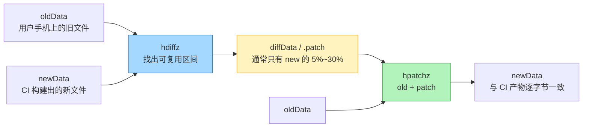
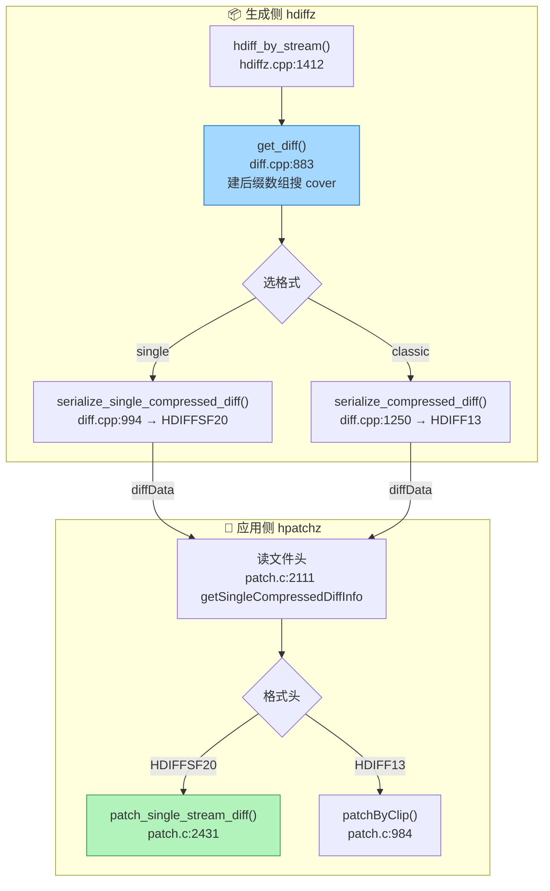
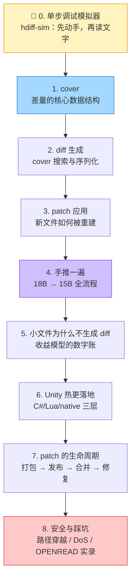

# 热更新为什么要"差分"：从一次 80MB 的更新说起

> 源码：`HDiffPatch v4.12.1`（本机源码树 `C:\References\haru_hdiff\HDiffPatchv4_12_1`，本页每个行号都已按该树逐条核对）
> 项目落地：`D:\hdiff\Dev\Client\Packages\com.haru.hdiff`（C# 层）+ `D:\hdiff\Product\Lua\Launch\XLaunchUpdate`（Lua 状态机层）

## 一句话结论

**HDiffPatch 不保存完整的新文件，它保存的是"如何把旧文件变成新文件"的一份指令单。**
这份指令单只有两种句子：「从旧文件的第 X 字节起搬 N 个字节过来」和「这里塞一段新字节」。
新版本里 90% 的字节通常和上一版一模一样，所以指令单往往只有新文件的百分之几。

## 它到底解决什么问题

假设你做了一个手游，新版本只改了 3 个 Lua 脚本、2 张图。

- **没有差分**：玩家手机上那份资源包有 80MB，你只能让他重新下载 80MB。改了 200KB 的东西，付 80MB 的流量。
- **有差分**：你的打包机手里同时有"上一版的 80MB"和"这一版的 80MB"，它能算出两者之间**哪些区间是原样搬过来的**，把这些区间写成"从旧文件第 A 字节起搬 B 字节"这样的短路指令。玩家下载的是这份指令单（几十 KB 到几 MB），本地由 `hpatchz` 拿旧文件 + 指令单，**原地拼出新文件**。

生活类比：你要把一本 300 页的书换成修订版。

- 全量更新 = 把整本书重印寄给你。
- 差分更新 = 寄给你一张勘误表：「第 12 页整页替换、第 40 页删掉两行、第 200~260 页原样保留、附录新增 3 页」。

勘误表比整本书轻得多——**但这张表本身也是要花纸墨的**。改动越碎、越孤立，勘误表写得越长；碎到一定程度，不如直接重印。后面几篇讲的"收益模型""为什么小文件不生成 diff"，本质都是在算这笔账。

## 术语先对齐

| 术语 | 一句话解释 |
|---|---|
| **old / new** | 旧版本文件、新版本文件。差分就是算这两个之间的差 |
| **diff（补丁包）** | 也就是 `.patch` 文件，本系列里也叫 patch。它是"指令单"本体 |
| **hdiffz** | 生成侧命令行工具：读 old + new，写出 patch |
| **hpatchz** | 应用侧命令行工具/动态库：读 old + patch，还原出 new |
| **cover** | 一条"复用指令"：`{oldPos, newPos, length}` = 从 old 的第 oldPos 字节搬 length 个字节，贴到 new 的第 newPos 字节 |
| **gap** | new 里**没有被任何 cover 覆盖**的区间。这些字节 old 里没有对应内容，只能原样存进 patch |
| **残差（subDiff）** | covered 区里 `new[i] − old[i]` 的差值。字节级、模 256。全 0 表示这块和 old 完全一样 |
| **rle0** | 一种专为"连续 0"设计的压缩编码：连续的 0 只存一个长度，不存数据 |
| **变长整数（packUInt）** | 小数字用 1 字节、大数字用多字节的编码。每字节最高位表示"后面还有没有" |
| **HDIFF13 / HDIFFSF20** | 两种 patch 文件格式。`HDIFF13` 是经典格式（4 条独立数据流），`HDIFFSF20` 是 single 格式（1 条交织流，移动端首选） |

## 主图解：一次差分的全局

注意图中 `oldData` 出现了两次：**生成侧和用户在的是两份不同的拷贝，但内容逐字节相同**。整条链路能成立，全靠这个前提——所以后面"安全与踩坑"那篇里，patch 失败最常见的两个原因就是"旧文件其实不是我以为的那一版"和"旧文件打不开"。

## 全链路：生成侧到应用侧，每一步在哪一行

生成侧和应用侧是**严格互逆**的一对实现：生成侧把 cover 列表编码成字节流（`stream_serialize.cpp:94` 的 `__private_packCover`），应用侧按同一套规则解回来（`patch.c:2260` 的 `sspatch_covers_nextCover`）。理解其中一半，另一半就是倒着读。

## 三个词抓住全局

| 核心词 | 一句话 | 代码位置 |
|---|---|---|
| **cover** | 新文件某段可以从旧文件某段复用：`{oldPos, newPos, length}` | `patch_types.h:270` |
| **step stream** | single 格式把 patch 数据按 256KB 一步切开，让 patch 端低内存顺序消费 | `stream_serialize.cpp:475`（`TStepStream` 构造函数） |
| **ref stream** | 目录级差分把多个文件拼成一条逻辑流，套在单文件 hdiff 外面 | `dir_diff.cpp:349`（`CRefStream`）+ 目录差分入口 `dir_diff.cpp:281` |

## 一页看清 10 篇的关系

## 建议的读法

1. **先去 [单步调试模拟器](./hdiff-sim) 玩五分钟**。改一改 old/new 的文本、点几次"下一步"，看 cover 怎么被选中、patch 二进制怎么长出来。先有直觉，再读推导。
2. 然后按 1→5 顺序读：这五篇是一条完整的因果链（数据结构 → 怎么找 → 怎么还原 → 手推验证 → 边界条件）。
3. 6~8 篇是工程落地，可以跳到你有需要的那一篇。

## 常见误解

::: warning "diff 一定比全量小"——不一定
patch 有固定的结构性开销（类型串 + 头部字段），实测小文件场景里 **patch 会比新文件本身还大**（[小文件与小重复](./hdiff-minmatch) 篇实验 1：80B → 64B，patch 却是 86B）。所以成熟的热更管线一定配"差分失败/不划算就回退全量"的双轨制，而不是把差分当成唯一路径。
:::

::: warning "残差是压缩出来的"——不是，是先做减法再做 RLE
covered 区不是直接存 `new` 的字节，也不是存压缩后的 `new`，而是存 `new − old`（逐字节模 256）。匹配质量好的时候这个差值是**大片的 0**，rle0 再把大片 0 压成一个长度数字。所以 patch 体积既取决于"能复用多长"，也取决于"复用得多准"。
:::

## 自检清单

- [ ] 能用一句话说清 patch 里存的是什么（不是新文件，是"怎么从旧文件变过去"的指令）
- [ ] 能说出 cover 三元组三个字段各自什么意思
- [ ] 能解释 gap 和 covered 区的区别，以及它们各自的数据从哪儿来
- [ ] 能说出为什么小文件差分可能"亏本"
- [ ] 能在源码树里找到 `get_diff`（`diff.cpp:883`）与 `getSingleCompressedDiffInfo`（`patch.c:2111`）这两个入口函数

---

下一篇：[cover：差量的核心数据结构](./hdiff-cover) —— 一条"复用指令"里到底放了什么，为什么它只要几个字节
