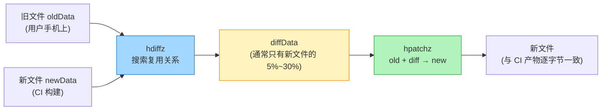
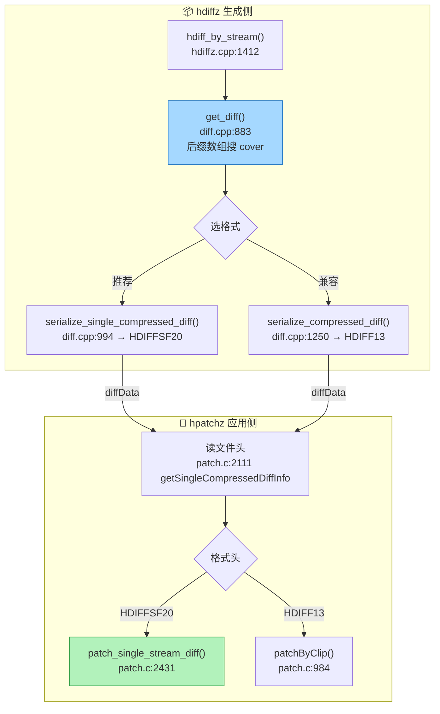

# HDiffPatch：热更差分补丁的原理与实现

> 源码：`HDiffPatch v4.12.1`（`C:\References\haru_hdiff\HDiffPatchv4_12_1`，所有行号已逐条对照本地源码验证）
> 项目落地：`D:\hdiff\Dev\Client\Packages\com.haru.hdiff`（C# 层）+ `Product/Lua/Launch/XLaunchUpdate`（Lua 状态机层）

## 一句话模型

> **HDiffPatch 不保存完整新文件，而是保存"如何从旧文件恢复新文件"的指令集合。**

学习时抓住三个词就够了：

| 核心词 | 一句话 | 所在代码 |
|---|---|---|
| **cover** | 新文件某段可从旧文件某段复用，`{oldPos, newPos, length}` | `patch_types.h:270` |
| **step stream** | single diff 把 patch 数据按 256KB 步进切块，低内存顺序消费 | `stream_serialize.cpp:475` |
| **ref stream** | 目录 diff 把多文件拼成逻辑流，套在文件级 hdiff 外面 | `dir_diff.cpp:281` |

## 生成侧 → 应用侧全链路

## 本文结构

1. **[cover：差量的核心数据结构](./hdiff-cover)** —— 三元组怎么来、怎么算账、怎么被裁剪
2. **[diff 生成：cover 搜索与序列化](./hdiff-generate)** —— 后缀数组匹配、收益模型、HDIFFSF20/HDIFF13 两种格式
3. **[patch 应用：新文件如何被重建](./hdiff-patch)** —— gap 拷贝 + 残差加法、step 流式消费、运行时安全检查
4. **[实战例子：手推一遍 diff 与 patch](./hdiff-example)** —— 18 字节 → 15 字节，逐步重放
5. **[小文件与小重复：为什么没生成 diff](./hdiff-minmatch)** —— kMinMatchLen/收益模型/_select_cover 终审 + 7 组实测
6. **[项目落地：Unity 热更中的完整链路](./hdiff-unity)** —— C# HDiffManager/Lua 状态机/native 库三层如何协作
7. **[打包与合并：patch 的完整生命周期](./hdiff-pipeline)** —— 打包机侧生成/发布流程 + 客户端差异计算/下载/合并/校验修复回合
8. **[安全与踩坑](./hdiff-security)** —— 路径穿越、内存 DoS、OPENREAD_ERROR 排查实录
