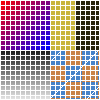
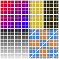

# ASTC 压缩单步：4×4 / 5×5 / 6×6 分别怎么压同一张 100×100

> 上一篇：[ETC 压缩单步 + 100×100 实例](./etc-encode-100x100) ｜ 下一篇：无（板块末篇）
> 数据可信度：用 **ARM astcenc v5.7.0**（`-cl -fast`，LDR linear）真实压缩；每个输出块的 128bit 位流用按官方 `physical_to_symbolic` 移植的解析器逐块拆字段（625/400/289 块零解析错误、位预算全部自洽）。

## 与 ETC1 的本质差异（先建立直觉）

ETC1 是"格式写死"，ASTC 是"**每块自己选配置**"：

| | ETC1 | ASTC |
|---|---|---|
| 每块大小 | 64 bit 恒定 | **128 bit 恒定** |
| footprint | 只有 4×4 | 4×4 ~ 12×12 任意（本页演示 3 种） |
| 表达模型 | 2 基色 + 标量亮度修正 | 2 个**任意方向**端点色 + **每像素独立 weight** |
| 分区 | 无（最多切成 2 个规则半块） | 每块可切成 **1~4 个不规则分区**，各自独立端点 |
| 每像素存储 | 2bit 查表 | weight grid + 双线性上采样 |
| 编码器搜索空间 | 小（本页 ETC 文章穷举 64 组合/块） | 巨大（astcenc 要搜 block mode × partition × CEM × 量化） |

> ASTC 编码器的工作 = 在 128bit 预算里**分三段**：block mode（11bit，定 weight grid 与量化档）+ 配置（partition/CEM）+ weight 数据 + 端点数据。预算给 weight 多、端点就少——**编码器每块都在做这个权衡**，这就是它慢但质量高的原因。

## 分块：同图三种切法

| footprint | 每块像素 | 100×100 切成 | 每块 128bit → bpp | 文件 payload |
|---|---|---|---|---|
| 4×4 | 16 | 25×25 = 625 块 | 8.00 | 10,000 B |
| 5×5 | 25 | 20×20 = 400 块 | 5.12 | 6,400 B |
| 6×6 | 36 | 17×17 = **289 块** | 3.56 | 4,624 B |

    

⚠️ 注意 6×6 那行：100 不能被 6 整除 → `ceil(100/6)=17`，**实际覆盖 102×102**，右侧/下方各 pad 2 像素（规范允许 pad 任意颜色，但 pad 内容会参与该块优化、污染边缘像素质量——真实工程坑，见文末）。

## 每个块怎么编码（机制单步）

解码一个 128bit 块要按序读出：

1. **block mode（bit 0..10）**：决定 weight grid 尺寸（≤ footprint）与 weight 量化档数
2. **partition count（bit 11..12）**：1~4 个分区
3. **CEM（bit 13..16 或更高）**：Color Endpoint Mode，决定端点怎么存（LDR RGB direct / base+offset / RGBA…16 种）
4. **weight 数据**：从 bit 127 往下填，每个 weight 用 ISE 打包（非 2 的幂档数如 3/6/10 用 trit/quint 编码）
5. **color endpoint 数据**：从低位往高位填，量化档数由剩余 bit 预算反推

编码器就是反向搜索这套配置。下面三种 footprint 各解剖一个真实块。

---

## 4×4 实例：25×25 块

### 解剖真实块 block(6,6)（Q1 渐变中段）

astcenc 对这块的 128bit 真实输出：

```
8de7797e59964000fb18000102e50241
```

| 位段 | 内容 | 值 |
|---|---|---|
| 0..10 | block mode | `01001000001` = 577 |
| 11..12 | partition count − 1 | `00` → **1 个分区** |
| 13..16 | CEM | `1000` = 8 → **LDR RGB direct**（两个端点各存 8bit RGB） |
| 17..69 | color endpoint 数据区 | 预算 53 bit |
| 70..127 | weight 数据（58 bit） | grid **4×4**、量化 **10 档** |

一次真实的"预算权衡"：Q1 渐变块颜色沿一条平滑曲线走，两个 8bit 端点 + 每像素插值足以还原 → 编码器把大头（58/128）给了 **weight**（4×4 grid = 每像素一个 weight，量化 10 档 ≈ 每 weight 3.6bit）；端点只花 53bit 存 6 个 8bit 端点值的量化。

> 为什么 weight 不存更多档？block mode 的 (H,R) 只能表达 **12 种 weight 档**（2,3,4,5,6,8,10,12,16,20,24,32），10 档已是"预算花不完时的常见选择"；档数再高 weight 区变长，会挤掉端点预算。

### 4×4 全图配置统计（真实）

| 项 | 值 |
|---|---|
| 总块数 / void-extent | 625 / **193 块（31%）是 void** |
| 正常块 partition | pc1=388，pc2=42，pc3=2 |
| dual-plane | 2 块 |
| weight grid | 几乎全部 4×4（footprint=grid，无上采样） |
| weight 档分布 | 4 档×197、10 档×60、16 档×56、32 档×48、3 档×33、12 档×28… |
| 解码 PSNR | **55.02 dB** |

**193 块 void-extent** 是 4×4 最出彩的一点：Q2 右半大块纯黄、Q4 部分纯色区，整块颜色恒定。astcenc 用 void-extent 块（block mode 特例 `0x1FC`）只存 **RGBA 各 16bit 常量**，例：

```
block(13,0)  Q2 纯黄区 → ffff3c3cb4b4c8c8fffffffffffffdfc
               bits 8..15 = 常量色（官方解码 = (200,180,59) ≈ 原图 (200,180,60)）
```

### 分区块的例子（为什么用 2 个分区）

block(12,2) 覆盖像素 (48..51, 8..11)——正好骑在 **Q1/Q2 交界**：左边是红蓝渐变、右边是亮黄。两个色簇完全不相干，一个 partition 的两个端点不够描述。astcenc 选 **2 个分区**（partition seed=28，过程式哈希生成分区图案），解码结果：左 (106,0,148) 渐变、右 (200,180,59) 亮黄，各自独立端点。

> 分区机制不用逐像素存"属于哪个区"——只存 10bit seed，解码器用同一个哈希函数重建分区形状（vault 有 `hash52`/`select_partition` 完整代码）。

  

---

## 5×5 实例：20×20 块

每块 25 像素但只有 128bit（5.12bpp）——比 4×4 少 36% 的每像素预算。astcenc 靠 **weight grid 仍 5×5 但降档**来省钱。

### 解剖真实块 block(0,0)（Q1 左上角）

```
ee9ce9ca9ca1ca0ca00b920014eb20f3
```

| 位段 | 内容 | 值 |
|---|---|---|
| 0..10 | block mode | `00011110011` = 243 |
| 11..12 | partition count − 1 | `00` → 1 分区 |
| 13..16 | CEM | `1001` = 9 → **LDR RGB base+offset** |
| 17..52 | color endpoint 数据区 | 预算 36 bit |
| 53..127 | weight 数据（75 bit） | grid **5×5**、量化 **8 档** |

与 4×4 同位置块的对比很直观：5×5 有 25 个 weight（比 16 多 9 个）→ weight 区 75bit（多 17bit）→ **端点预算从 53 掉到 36bit**。于是 CEM 从"direct（6 个 8bit 值）"降级为 **base+offset（省一半）**。

### 5×5 全图统计（真实）

| 项 | 值 |
|---|---|
| 总块数 / void-extent | 400 / 132（33%） |
| 正常块 partition | pc1=256，pc2=11，pc3=1 |
| weight 档分布 | **8 档×256**（全部正常块的 96%）、2 档×12 |
| 解码 PSNR | **51.67 dB** |

5×5 的编码器几乎全场选 **8 档 weight + CEM 8/9**——这是它在"25 像素 × 128bit"约束下的甜点。质量只比 4×4 掉 3.4dB，但体积省 36%。

---

## 6×6 实例：17×17 块（含 padding）

### 解剖真实块 block(0,0)——weight grid 比 footprint 小

```
9f8ff8778bb89a541281c9000ab7206f
```

| 位段 | 内容 | 值 |
|---|---|---|
| 0..10 | block mode | `00001101111` = 111 |
| 11..12 | partition count − 1 | `00` → 1 分区 |
| 13..16 | CEM | `1001` = 9 → LDR RGB base+offset |
| 17..49 | color endpoint 数据区 | 预算 33 bit |
| 50..127 | weight 数据（78 bit） | grid **5×6**、量化 **6 档** |

**6×6 footprint 的 weight grid 不是 6×6 而是 5×6**（30 个 weight，78bit）。weight 个数 < 像素数（36）→ 解码时把 5×6 weight grid **双线性上采样**到 6×6。这是 ASTC 与 ETC 的又一大差异：weight 密度可调。block(0,0) 是 Q1 平滑渐变，相邻像素 weight 高度相关，用 5×6 grid 上采样几乎无损，省下的 bit 给端点。

全图看 grid 选择（真实）：

| 6×6 块用的 weight grid | 块数 |
|---|---|
| 5×6 | 143 |
| 6×6 | 54 |
| 4×6 / 6×5 / 6×4 等 | 11 |

### 6×6 全图统计（真实）

| 项 | 值 |
|---|---|
| 总块数 / void-extent | 289 / 81（28%） |
| 正常块 partition | pc1=190，pc2=16，pc3=2 |
| weight 档分布 | 6 档×148、2 档×52 |
| 解码 PSNR | **42.67 dB** |

### 6×6 的 padding 代价（工程要点）

100/6 = 16.67 → 编码器 pad 到 102×102，最右列和最底行的块有一半像素是 pad。astcenc 官方解码输出仍回 100×100，但那 17 个"骑在边缘"的块里 pad 像素参与了误差优化，可能拉低真实边缘像素质量。这也是规范建议**纹理尺寸取 footprint 倍数**（6×6 就用 12/24/48…）的原因。

  

---

## 三 footprint 终极对比

| | 4×4 | 5×5 | 6×6 |
|---|---|---|---|
| 每块像素 | 16 | 25 | 36 |
| payload | 10,000 B | 6,400 B | 4,624 B |
| bpp | 8.00 | 5.12 | 3.56 |
| PSNR | **55.02 dB** | 51.67 dB | 42.67 dB |
| 相对 4×4 体积 | 1× | −36% | −54% |
| 相对 4×4 质量 | — | −3.4 dB | −12.4 dB |
| 典型用途（vault 选型表） | UI/法线/关键角色 | 法线/重要道具 | **场景/角色主力** |

质量-体积的剪刀差在 5×5→6×6 之间最大（体积再省 28%，代价却是 8.9dB）——这也是"**6×6 不是万能**：远处场景无所谓，近景角色/UI 掉画质一眼可见"这句工程经验的数据来源。

## 复现数据的三句话

- ASTC 全部用 astcenc 5.7.0 `-cl -fast` 压同一张测试图，官方 `-dl` 解码算 PSNR
- 每块字段用按官方解码移植的解析器拆：625+400+289 块零解析错误、每块位预算自洽（block mode + pc + CEM + weight + endpoint = 恰好 128bit）
- 想验证任意一个 hex：`astcenc -dl xxx.astc out.png` 后对照像素

## 自检

- [ ] 能解释 ASTC"三段竞争"：weight 拿多了端点拿什么？
- [ ] 能说出 4×4 为什么 weight grid = footprint，而 6×6 常见 5×6
- [ ] 能解释 void-extent 块怎么做到近乎无损地表示纯色区
- [ ] 能说出 100×100 压 6×6 时发生了什么（pad），以及工程上怎么避免
- [ ] 能从三行对比表里读出"6×6 省 28% 体积却掉 8.9dB"的含义

---
板块结束。完整格式原理、ETC2 T/H/Planar、EAC、ASTC 全部 16 种 CEM 与 6 条 Illegal 约束、工程选型见 vault《ETC 与 ASTC 纹理压缩实现原理》。
