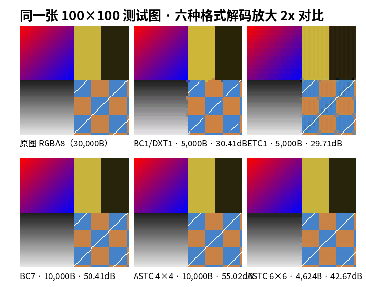

# DXT / BC 压缩家族：另一种块压缩范式，与 ETC/ASTC 差在哪

> 上一篇：[ASTC 压缩单步 + 100×100 实例](./astc-encode-100x100) ｜ 下一篇：[纹理压缩实验台](./lab)（建设中）
> 数据可信度：BC1 用本板块 Python 教学编码器（4-color 模式，真实合法 bitstream）；BC7 用 bc7enc16（richgel999，modes 1/6）真实压缩；全部在同一张 100×100 测试图上，解码 PSNR 实测。

## 一句话模型

> **BC 家族 = "线性调色板"：每块存 2 个（或 4 个）16bit 端点色，让像素在端点之间线性插值选色。**
> 如果说 ETC 是"基色 + 沿灰度轴修正"，BC1 就是"**在 RGB 空间任意拉一条线段**，像素在线段上选点"——比 ETC 多了一个自由度，这是 DXT 家族在 PC/主机上统治十几年的根本原因。



> 看图顺序建议：先看 BC1（左中）和 ETC1（右中）——同尺寸 5000B，画质相近但**伪影形状不同**（BC1 偏"色块平滑"，ETC1 偏"明暗断层"）；再看 BC7 与 ASTC 4×4（下行）——同样 8bpp，两者都远超 BC1/ETC1，ASTC 略胜。

## BC1（DXT1）：最基础的线性调色板

### 机制单步（与 ETC1 对照学）

| 步骤 | BC1 | ETC1（对照） |
|---|---|---|
| 每块 | 4×4 → **64bit（8B）** | 4×4 → 64bit（8B） |
| 存什么 | 2 个 **RGB565** 端点 + 每像素 2bit 索引 | 2 个基色 + 2 张修正表 + 每像素 2bit 索引 |
| 像素还原 | 在 c0→c1 线段上插值：`c0, c1, ⅔c0+⅓c1, ⅓c0+⅔c1` | 基色 ± 修正表（同一亮度方向） |
| 端点方向 | **RGB 空间任意方向** | 只有"更亮/更暗"一个方向 |

BC1 的编码器工作与 ETC1 惊人地像，只是把"找两个基色"换成"找两个端点"：本板块教学编码器穷举 16 个像素两两当端点（256 组合）挑 MSE 最小——代码骨架：

```python
# bc1_enc.py  encode_block：BC1 真实 8 字节
for i in range(16):
    for j in range(16):                 # 256 组端点候选
        c0, c1 = to565(flat[i]), to565(flat[j])
        if c0 <= c1: c0, c1 = c1, c0    # 4-color 模式要求 c0 数值 > c1
        cands = [c0色, c1色, ⅔c0+⅓c1, ⅓c0+⅔c1]   # 4 档候选色
        ...每像素挑最近的 2bit 索引，累计 MSE
# 打包：c0(16bit) | c1(16bit) | 索引(32bit)
```

解码就两行：`idx = 查表位`，`color = 候选色[idx]`。

### 特殊技巧：3-color + 1bit 透明

BC1 存两个 16bit 数，比较它们的**数值大小**就能多表达一种模式：`c0 > c1` 时按 4-color 解码；`c0 ≤ c1` 时按 **3-color + 透明**解码（第 4 档 = 全透明黑）。这就是"1-bit alpha"——**不花额外空间**，植被/铁丝网这类要么全透要么不透的贴图白赚一个 alpha。

> ⚠️ 这也解释了 DDS 里 `DXT1` 处理 alpha 的经典坑：如果原始图某些块需要 4-color 插值但又要透明，编码器被迫在"画质"和"透明"里二选一——这也是 BC1 不太适合 UI 的原因之一。

## BC2 / BC3：把 alpha 单独拿出来存

BC1 的 1bit alpha 不够半透明用。BC2/BC3 把块扩到 **128bit**：颜色部分沿用 BC1 的 64bit，另外 64bit 存 alpha：

| 格式 | 颜色部分 | alpha 部分 | 适合 |
|---|---|---|---|
| BC1/DXT1 | 64bit（2 端点） | 1bit（3-color 技巧） | 不透明贴图 |
| BC2/DXT3 | 64bit BC1 | **4bit × 16 像素**（显式，无插值） | 硬 alpha 边缘 |
| BC3/DXT5 | 64bit BC1 | **2 端点 + 3bit × 16 像素**（8 档插值） | 平滑半透明 |

BC3 的 alpha 通道就是"单通道版 BC1"（α0、α1 两个 8bit 值，中间插 6 档）——这个思路再进一步就是 BC4。

## BC4 / BC5：压根不用颜色

有些数据不是颜色：单通道高度图、双通道法线（XY）。BC4 把整块 64bit 全用来压单通道（2 端点 8bit + 每像素 3bit，8 档）；BC5 是两个 BC4（128bit）——**法线贴图用 BC5 存 XY 是 PC 多年的标准姿势**（Z 由单位长度重建）。

## BC6H / BC7：128bit 高端局

| 格式 | 面向 | 机制一句话 | 备注 |
|---|---|---|---|
| BC6H | **HDR** RGB | 半浮点端点（有符号/无符号）压缩 | 不能压 alpha；lightmap/IBL 用 |
| BC7 | 最高质量 LDR RGBA | **8 种模式**：1~3 个分区、4~8 个端点、不同权重精度，编码器逐块挑 | 无 1bit alpha 技巧，真正 8bpp 高质量 |

BC7 的 8 种模式很像 ASTC 的"配置化"雏形（但没有 ASTC 的 footprint 可变和 trit/quint）。BC7 编码器（如 bc7enc16）要试 64 种分区 × 多种端点组合——和 ASTC 一样慢而精。

## 同图真数据（100×100 测试图，全部实测）

| 格式 | 块 bit | payload | bpp | PSNR | 备注 |
|---|---:|---:|---:|---:|---|
| **BC1/DXT1** | 64 | 5,000 B | 4 | 30.41 dB | 教学 4-color 编码器 |
| ETC1 | 64 | 5,000 B | 4 | 29.71 dB | 对照 |
| **BC7** (u0) | 128 | 10,000 B | 8 | 50.41 dB | bc7enc16 modes 1/6 |
| ASTC 4×4 | 128 | 10,000 B | 8 | **55.02 dB** | 对照 |
| ASTC 6×6 | 128 | 4,624 B | 3.56 | 42.67 dB | 对照 |

两个看点：
1. **同 bpp 下 BC1 ≈ ETC1**（30.41 vs 29.71）——本图 ETC1 略输但差距很小；真正常见的差异出现在"色相丰富的 UI/角色图"上，那时 BC1 的任意方向端点优势会拉大。
2. **同 8bpp 下 BC7 输 ASTC 4×4 约 4.6dB**——bc7enc16 只是模式 1/6 的快速编码器，上限没拉满；ASTC 的优势更多来自 footprint 与 trit/quint 预算弹性。真实项目里两者同档工具下差距约 1~3 dB。

## 与 ETC/ASTC 的范式差异（一张表）

| 维度 | BC1/BC3/BC5 | ETC1/ETC2 | ASTC | BC7 |
|---|---|---|---|---|
| 块大小 | 4×4 固定 | 4×4 固定 | 4×4~12×12 | 4×4 固定 |
| 每块 bit | 64/128 | 64/128 | 恒定 128 | 128 |
| 表达范式 | 线性调色板 | 基色+亮度修正 | 端点+weight（可配置） | 端点+weight（8 模式） |
| 分区 | 无 | 无（ETC2 有 T/H 但规则） | 1~4 不规则（10bit seed） | 最多 3 个规则分区 |
| alpha | 1bit（BC1）/显式/插值 | EAC/1bit | CEM 任意组合 | 每模式内嵌 |
| HDR | 仅 BC6H | 不支持 | 支持（HDR CEM） | 不支持 |
| 平台 | PC/主机（DX） | Android/移动（GLES） | 移动+桌面新硬件（ES 3.2+/Vulkan） | PC/主机（DX11+） |
| 硬件解压 | 有 | 有 | 有 | 有 |

**选型口诀**（详细版见 vault 工程实践章）：
- PC/主机全平台：不透明 → BC1；高质量 RGBA → BC7；法线 → BC5（或 BC7）
- Android：ETC2（老设备兜底）或 ASTC（新设备主力）；iOS：ASTC
- 一套贴图多平台：Basis Universal/KTX2 中间格式 + 运行时转码（vault 有 P1-⑤ 方案）

## 0 基础一分钟版

把 16 个像素想成 RGB 空间里的 16 个点：
- **BC1**：在这堆点里拉一条直线（两个端点），每个点挪到直线上离自己最近的位置 → 8 字节
- **ETC1**：不找直线，而是"把整堆点拍扁到亮度轴" → 也是 8 字节，但方向被限制
- **BC7 / ASTC**：如果 16 个点聚成两三堆（不同材质交界），就先分区再各自拉线 → 16 字节

## 源码解析：去哪看真实现

- BC1 教学编码器（真实 bitstream）：`bc1_enc.py`（本板块配套，625 块自洽解码）
- BC7 参考：`bc7enc16`（richgel999，MIT/public domain）——单文件 C，`bc7enc16_compress_block` 是入口；它只用模式 1（分区 RGB）和 6（带 alpha）
- 完整 BC7/BC6H 权威编码：`Compressonator`（AMD）、`texconv`（微软 DirectXTex）

## 自检

- [ ] 能说出 BC1 与 ETC1 表达模型的本质差异（线段 vs 灰度轴）
- [ ] 能解释 `c0 > c1` 与 `c0 ≤ c1` 两种解码的含义（4-color vs 3-color+透明）
- [ ] 能说出法线贴图该用 BC5 而不是 BC3 的理由
- [ ] 能解释为什么 BC7 慢而精、ASTC 又是怎么做到比 BC7 更灵活

---
板块完整阅读顺序：[总览](./) → [ETC 单步](./etc-encode-100x100) → [ASTC 单步](./astc-encode-100x100) → [DXT/BC](./dxt-bc1-7) → [纹理压缩实验台](./lab)
