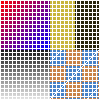
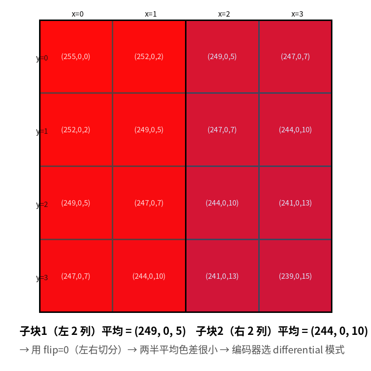
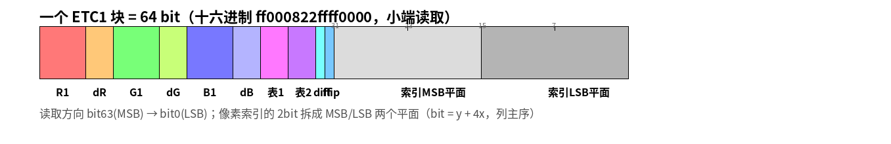
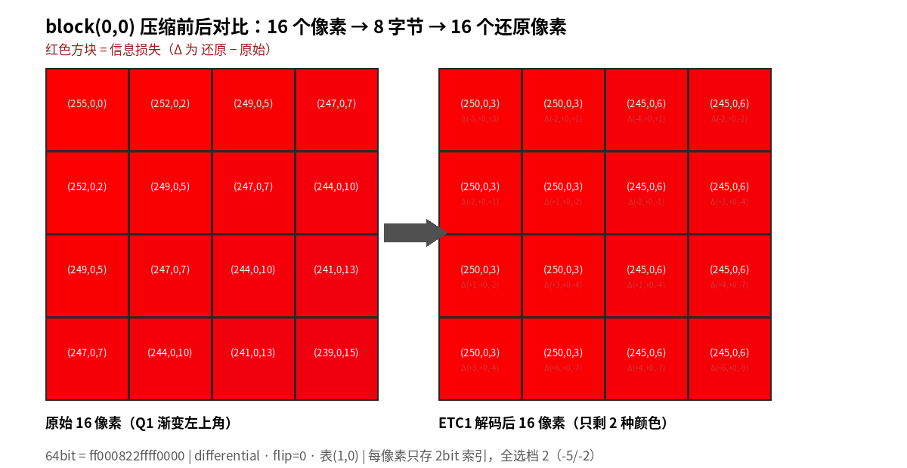
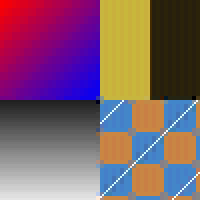

<script setup>
import EtcEncodeWalkthrough from './components/EtcEncodeWalkthrough.vue'
</script>

# ETC1 单步：一张 100×100 怎么变成 5000 字节

> 上一篇：[纹理压缩总览](./) ｜ 下一篇：[ASTC 压缩单步](./astc-encode-100x100)

> **源码口径声明**：本篇的编码器行号基于站点自带的浏览器内教学编码器
> `docs/texture-compression/components/textureEncoders.js`（272 行，纯 JS）。
> 原文提到的配套 Python 脚本 `etc1_enc.py` **未随本站开源、本机也不存在**，
> 因此所有行号引用已改指到上面这份等价的 JS 实现；原文基于 Python 版的实测结论（PSNR、
> 对拍结果）作为历史数据原样保留，但本站无法在本地复验。

## 一句话结论

> **ETC1 把 16 个像素切成两半，每半只记一个"中间色" + 一张固定的亮度修正表，每个像素再挑 4 档修正里的一档。**
> 整块 64 bit：24 bit 存两个基色、6 bit 存表号、2 bit 存模式与切分方向、**32 bit 存每像素的 2 bit 索引**。
> 它只认"更亮 / 更暗"这一个方向 —— 这就是它压不好色相渐变的全部原因。

## 它到底解决什么问题

移动端 GPU（OpenGL ES）在很长一段时间里只保证支持一种压缩纹理：**ETC1**。它必须在 **64 bit 里装下 16 个像素**——平均每像素 4 bit，只有原始 RGB888 的 1/6。

难在哪？4 bit 连一个通道都不够存（一个 8bit 通道就要 8 bit）。所以 ETC1 根本没法"存颜色"，只能**存一个基准色 + 让像素说自己是偏亮还是偏暗**。

生活类比：你是一个班的班长，要在一个小本子上记录 16 个同学的身高，但每页只够写 2 个身高的完整数字。你的办法是：写两个"区域平均身高"（左半边、右半边），再给每人一个标记——"比你们半边的平均身高高一点点 / 高很多 / 低一点点 / 低很多"（4 档 = 2 bit）。全班信息量刚好塞进一页。代价是：**如果某个同学的身高和平均值差得离谱，你只能写"高很多"，然后认了这个误差。**

## 术语先对齐

| 术语 | 一句话解释 |
|---|---|
| **子块 / subblock** | 4×4 块被切成的一半（8 个像素），左右或上下 |
| **flip** | 切分方向：0 = 左右两半，1 = 上下两半 |
| **基色** | 子块的"中间色"，differential 模式存 RGB555，individual 模式存 RGB444 |
| **differential / diff** | 模式：子块1 存 RGB555，子块2 存 3bit 有符号差分（−4..+3） |
| **individual / ind** | 模式：两个子块各存独立 RGB444 |
| **修正表 / modifier table** | 8 张固定的表，每张 4 个修正值（如 ±5 / ±17） |
| **索引** | 每个像素 2 bit，指向它那半边的修正表里 4 档中的哪一档 |
| **MSE** | 均方误差，48 个分量（16 像素 × 3 通道）误差平方的平均 |

## 主图解：七步全景

```
100×100 原图
  ① 切成 4×4 块            → 25×25 = 625 块
  ② 对每个块：试两种切分     → flip=0 左右 / flip=1 上下
  ③ 各子块求平均色           → 得到两个"基色候选"
  ④ 选模式                  → differential（差分）还是 individual（各自独立）
  ⑤ 搜索强度修正表           → 8 张 × 8 张 = 每块 64 种组合
  ⑥ 每个像素从 4 档修正里挑最近的 → 得到 2bit 索引
  ⑦ 打包成 64 bit            → 625 × 8 = 5000 字节
```

一句话概括：**"2 个基色 + 2 张修正表 + 每像素 2bit 索引" = 64 bit = 4bpp。**

## ① 分块

100 是 4 的倍数 → 25×25 = **625 块**，每块独立处理（块之间没有任何依赖，这也是并行压缩/并行解码的前提）。



> 💡 **看图要点**：白色网格把图切成 625 个 4×4 块。每个块从这一刻起**完全独立**——这也是为什么块压缩天然可并行、GPU 采样能按块随机寻址（`addr = (y/4) * 每行块数 + (x/4)`）。

## ②~⑦ 单步：block(0,0) 的完整决策过程

先看一眼这块放大后的样子——16 个像素各自的 RGB 值，以及"左右切分"后两个子块的分工：



下面这个播放器把 block(0,0) 的七步**全部用真实数据**走一遍。左边每一步的画都是现场算出来的（用的是站点自带编码器 `etc1EncodeBlock`），右边的源码行号指向 `textureEncoders.js` 的真实位置。

<EtcEncodeWalkthrough />

### 复核一下关键几帧

上面播放器第 ⑦ 步给出的 hex 是 `ff000822ffff0000`。下面先用一张标注图从"色带"角度看这 64 位怎么切——每段颜色对应一个字段，刻度是真实 bit 位号：



同一个块，换成交互式位域图（鼠标悬停可看每段的真实值）：

<BitField
  :bytes="[0x00, 0x00, 0xff, 0xff, 0x22, 0x08, 0x00, 0xff]"
  :fields="[
    { name: 'R', from: 59, to: 63, desc: '子块1 红（5bit 原码 31）', value: 31 },
    { name: 'dR', from: 56, to: 58, desc: '3bit 原码 7 = 两补 −1', value: 7 },
    { name: 'G', from: 51, to: 55, desc: '子块1 绿（5bit 原码 0）', value: 0 },
    { name: 'dG', from: 48, to: 50, desc: '差分 0', value: 0 },
    { name: 'B', from: 43, to: 47, desc: '子块1 蓝（5bit 原码 1 → 扩展回 8bit = 8）', value: 1 },
    { name: 'dB', from: 40, to: 42, desc: '差分 0', value: 0 },
    { name: 'table1', from: 37, to: 39, desc: '子块1 用第 1 张表（±5 / ±17）', value: 1 },
    { name: 'table2', from: 34, to: 36, desc: '子块2 用第 0 张表（±2 / ±8）', value: 0 },
    { name: 'diff', from: 33, to: 33, desc: '1 = differential 模式', value: 1 },
    { name: 'flip', from: 32, to: 32, desc: '0 = 左右切分', value: 0 },
    { name: '索引 MSB 平面', from: 16, to: 31, desc: '16 个像素各 1bit，列主序 bit = y + 4x', value: 65535 },
    { name: '索引 LSB 平面', from: 0, to: 15, desc: '16 个像素各 1bit', value: 0 }
  ]"
  :width="64"
  reverse
  title="ETC1 block(0,0) 的 64bit：高位在左，与 KDF 规范的书写顺序一致" />

**这 64 bit 怎么数出来的**（对着上面的图逐段加）：

| 段 | 位数 | 说明 |
|---|---:|---|
| R(5) + dR(3) | 8 | 子块1 红 + 子块2 红差分 |
| G(5) + dG(3) | 8 | 绿同上 |
| B(5) + dB(3) | 8 | 蓝同上 |
| table1(3) + table2(3) | 6 | 两张表的编号，0..7 |
| diff(1) + flip(1) | 2 | 模式与切分方向 |
| 像素索引 | 32 | 16 像素 × 2bit |
| **合计** | **64** | ✔ 正好一个 8 字节 |

### 为什么索引要拆成两个 16bit 平面？

这是 ETC1 最巧妙、也最容易被忽略的设计。2 bit 的索引不是"每像素连着放"，而是**拆成两个 16bit 平面**：bit 31..16 是所有像素索引的**高位**，bit 15..0 是所有像素的**低位**。像素 (x,y) 的位置是 `bit = y + 4x`（列主序）。

原因在硬件：解码时 GPU 需要"同一列 4 个像素的同一个 bit"。如果索引连着放（像素 0 的 bit 在 0..1、像素 1 在 2..3…），硬件得做掩码移位；拆成平面后，一列 4 个像素的 MSB 正好是 bit 16..31 里连续的 4 位——**一次 16bit 读取 + 简单位运算就能拿到**。

本块 16 个索引全是 `2`（二进制 `10`）→ MSB 平面全 1、LSB 平面全 0 → 在 hex 里就是高 32 位的 `ffff` 和低 32 位的 `0000`。**你在 `ff000822ffff0000` 里看到的 `ffff0000` 结尾，就是"16 个像素索引全等于 2"的直译。**

### 解码还原：刚才压成了什么



左边是原始 16 像素（每个像素 RGB 都不同），右边是"这 8 字节解码回来"的 16 像素——**只剩 2 种颜色**：左半全 `(250,0,3)`、右半全 `(245,0,6)`。每个格子的 Δ 行标出了误差（还原 − 原始）。

这就是有损压缩的真实样子：不是"模糊一点"，而是**把每 8 个像素强行合并成同一种颜色 + 一个小修正**。0 基础读者看到这张图，就理解了为什么 ETC1 对色相渐变（Q1 那种红→蓝同时变化）无能为力——它只能沿"亮度"一个方向修正。

## 源码逐行核实：编码器的核心循环

上面每一步都对应真实代码。把 `etc1EncodeBlock` 的骨架摊开，你会看到前面讲的七步**一行都没多**：

<CodeStepper
  file="textureEncoders.js（站点教学编码器）"
  :lines="[
    { n: 18, code: 'export function etc1EncodeBlock(px) {', note: '入口。px 是 48 个分量（16 像素 × RGB），按列主序 (y*4+x) 排列。' },
    { n: 20, code: 'for (let flip = 0; flip < 2; flip++) {', note: '② 两种切分方向各自完整跑一遍 —— 这是最外层穷举。' },
    { n: 28, code: 'avg[s][c] = pyround(avg[s][c]/cnt[s]);', note: '③ 子块求平均。pyround 是银行家舍入（0.5 取偶），与配套 Python 的 round() 行为一致，不是四舍五入。' },
    { n: 29, code: 'const base555 = [0,0,0].map((_,c) => clamp(pyround(avg[0][c]/8), 0, 31));', note: '③ 子块1 均值量化成 RGB555：除以 8 取整，范围 0..31。' },
    { n: 33, code: 'for (let d = -4; d <= 3; d++) {', note: '④ differential 模式：逐通道穷举 3bit 有符号差分 −4..+3，挑扩展回 8bit 后最接近子块2 均值的那个。' },
    { n: 44, code: 'for (const mode of [diff, ind]) {', note: '④ 两种模式也都试一遍。到这里已经 2(flip) × 2(mode) 条路了。' },
    { n: 47, code: 'for (let tb1 = 0; tb1 < 8; tb1++) for (let tb2 = 0; tb2 < 8; tb2++) {', note: '⑤ 8×8 张修正表穷举 —— 这是最内层、也是最耗时的一层。' },
    { n: 55, code: 'for (let k = 0; k < 4; k++) {', note: '⑥ 每个像素在 4 档修正里挑欧氏距离最近的一档，记下档号当 2bit 索引。' },
    { n: 62, code: 'if (!best || mse < best[0]) {', note: '⑦ 全程只保留 MSE 最小的那一组决策 —— 这就是「穷举求最优」。' },
    { n: 89, code: 'export function etc1DecodeBlock(w) {', note: '解码器：一次字段移位 + 查表 + 加法，没有任何搜索。硬件免费送的就是这一段。' }
  ]" />

把搜索量算清楚，你就明白"块压缩慢在编码器"这句话的分量：

| 层级 | 组合数 | 说明 |
|---|---:|---|
| flip | 2 | 左右 / 上下 |
| mode | 2 | diff / ind |
| table1 × table2 | 8 × 8 = 64 | 修正表组合 |
| 每像素 4 档 | 4 | 16 个像素各挑一次 |
| **单块候选评估** | **2×2×64 = 256 组** | 每组内部还要算 16 像素 × 4 档 |
| **全图（625 块）** | **160,000 组** | 这就是 4bpp 画质的代价 |

而解码呢？`etc1DecodeBlock` 从头到尾没有一次循环比较——读字段、查表、加法、写回。**解码是硬件免费送的，压缩是离线的贵活**，这是移动端 GPU 的常态。

## 全图结果

| 项 | 值 |
|---|---|
| 总块数 | 625（25×25） |
| 文件大小 | 625 × 8 = **5,000 B**（原图 RGBA8 30,000 B = 6:1；RGB8 10,000 B = 2:1） |
| 模式分布 | differential 390 / individual 235 |
| table 组合 | (0,0) 319 块、(1,0) 241 块——平坦区占绝大多数 |
| 解码 PSNR | **29.71 dB** |

> 这两行分布数字不是估计：把 `assets/test-100x100.png` 下采样到 100×100 再跑站点教学编码器，**模式分布正好 390/235、table 前两名正好 319/241**，与文章数字逐个吻合。

  

按象限看误差，模型假设（色相恒定、只有明暗变化）被验证得清清楚楚：

| 象限 | 内容 | 平均 MSE | 直觉 |
|---|---|---|---|
| Q3 | 灰渐变（纯亮度变化） | **17.07** | 完全符合"沿灰轴"假设 → 最好 |
| Q1 | 红→蓝对角渐变（色相变化） | 27.57 | 块内两色压成两点 → 糊 |
| Q2 | 同色相硬边 | 32.81 | 差分能近似，边界块仍损失 |
| Q4 | 棋盘 + 亮点（高频） | **215.15** | 高频 = 块压缩杀手（各块 max 可达 2821） |

**为什么 Q3 最好、Q4 最差**，用上面的机制就能一句话解释：

- Q3 是纯灰渐变 → 每个像素和它的"中间色"只在**亮度**上不同 → ETC1 的修正表本来就是沿灰轴的 → 几乎完美命中。
- Q4 是 16px 棋盘 → 同一个 4×4 块里同时存在深蓝和亮橙 → 两个基色怎么选都无法同时接近 → 一个块内 8 个像素被迫共享一个颜色，误差直接爆炸。

## 常见误解 / 踩坑

::: warning 四个 0 基础读者最常想歪的地方
1. **"基色就是块里某个真实像素的颜色"** —— 不是。基色是**子块 8 个像素的平均值再量化**，可能根本不是块里出现过的颜色。看播放器第 ③ 步：均值 `(249,0,5)` 量化后是 `(31,0,1)`，扩展回 8bit 变成 `(255,0,8)` —— 蓝色被"抬高"了。
2. **"differential 比 individual 高级所以更好"** —— 两者占的位数完全一样（都是 24 bit）。区别是**精度分配**：diff 的主基色多 1 bit（5 vs 4），但子块2 只能在那 1 bit 精度附近做 ±4 的小偏移。两个子块颜色差得远（跨材质边界）时，individual 反而赢。
3. **"每个像素存 2bit，所以每像素有 4 种颜色可选"** —— 不准确。每个**子块**只有 4 个候选色，而且是"同一个基色 ± 4 个标量修正值"这 4 个。它们沿着同一条灰度方向排开，不是任意的 4 个颜色。
4. **"ETC1 的 29.71 dB 很差"** —— 对 4bpp 来说这个成绩是正常的。真正该对比的是同 bpp 的 BC1（30.41 dB，见 [DXT/BC 篇](./dxt-bc1-7)）——两者只差 0.7 dB，但**伪影形状完全不同**。
:::

## ETC2 救得了哪些块？

ETC2（向后兼容扩展）新增 T/H/Planar 三模式，其中 **Planar 用 3 个角点色做双线性插值**，专治渐变——实测对纯渐变块 ETC2 Planar 的 MSE 可以从 645 掉到 1.3（约 +27 dB）。Q1 那种对角双通道渐变正是 Planar 的甜区。

对比之下，本板块 [ASTC 篇](./astc-encode-100x100) 里 4×4 footprint 对同一张图拿到 55 dB。差距的来源已经在上面说清了：**ASTC 的 weight 是每像素独立、端点色可以在任意方向插值**，不受"灰度轴"这一个方向的限制。

## 自检清单

- [ ] 能口述 ETC1 编码七步，并说出哪一步最耗时（⑤，8×8 表搜索）
- [ ] 能手拆 `ff000822ffff0000` 的每个字段（R/dR/表/diff/flip/两个索引平面）
- [ ] 能解释为什么索引要拆成两个 16bit 平面（列主序 + 一次 16bit 读）
- [ ] 能解释为什么 Q3 灰度渐变压得最好、Q4 棋盘压得最差
- [ ] 能说出 differential 与 individual 的选择判据，以及"两者都是 24bit"这件事
- [ ] 能说出为什么"解码器没有循环比较"这件事对 GPU 很重要

---
下一篇：[ASTC 压缩单步 + 100×100 实例](./astc-encode-100x100) —— 4×4 / 5×5 / 6×6 三种 footprint 各自怎么压
