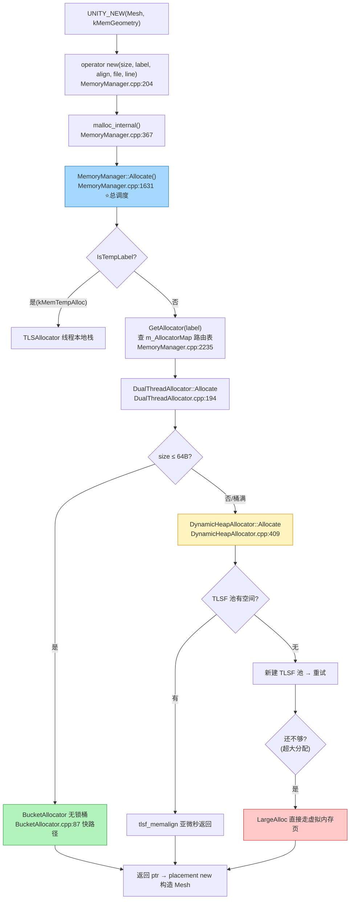

# 一次分配的完整旅程：`UNITY_NEW` 从宏到物理内存

> 源码：`Runtime/Allocator/MemoryManager.cpp` / `DualThreadAllocator.cpp` / `DynamicHeapAllocator.cpp`
> 核心：**给每一字节标注身份，再按身份分流**——`label → allocator` 路由是整套内存系统的主轴。

## 为什么一次 new 要走这么多层

引擎代码里随处可见的写法：

```cpp
Mesh* mesh = UNITY_NEW(Mesh, kMemGeometry);
```

C 运行时的 `malloc` 一步就能给内存，Unity 为什么要垫 5 层？因为 malloc 满足不了游戏的四个诉求：

| 诉求 | malloc 的缺陷 | Unity 的对策 |
|------|--------------|-------------|
| **按用途统计**（Profiler 里能看到"纹理占了 800MB"） | 无来源信息 | 每次分配携带 `MemLabel`，按 label 记账 |
| **不同生命周期不同策略**（一帧就丢的临时数据 vs 常驻资源） | 单一策略 | label 路由到不同 Allocator（Temp 走栈式，常驻走堆） |
| **多线程不互相拖累** | 全局锁或竞争 arena | 主线程/工作线程各一个 allocator + 小对象无锁桶 |
| **碎片可控、OOM 可诊断** | 黑盒 | TLSF 固定策略 + fallback 链 + 分配失败点可追踪 |

## 完整路径



## 环节 1：`UNITY_NEW` 只是语法糖

```cpp
// Runtime/Allocator/MemoryMacros.h:202
#define UNITY_NEW(type, label)    new (label, alignof(type), __FILE_STRIPPED__, __LINE__) type
```

这是 C++ 的 **placement new 重载**——括号里是传给自定义 `operator new` 的额外参数。展开后：

```cpp
Mesh* mesh = new (kMemGeometry, alignof(Mesh), "Mesh.cpp", 123) Mesh;
//           └── 先调 operator new 拿内存 ──┘  └─ 再在这块内存上跑构造函数
```

`__FILE_STRIPPED__/__LINE__` 埋在这里，是 Profiler 能定位"这块内存谁分配的"的源头——**信息在入口处采集，成本只在开 Profiler 时支付**。

## 环节 2：operator new → malloc_internal —— 薄封装

```cpp
// MemoryManager.cpp:204
void* operator new(size_t size, MemLabelRef label, size_t align, const char* file, int line)
{
    return malloc_internal(size, align, label, kAllocateOptionNone, file, line);
}
```

两层都不做实事，只是把 C++ 语法世界（operator new）接到引擎单例世界（MemoryManager）。注意 `kAllocateOptionNone`——默认**分配失败直接崩溃**而不是返回 NULL。

## 环节 3：MemoryManager::Allocate —— 总调度

```cpp
// MemoryManager.cpp:1631
void* MemoryManager::Allocate(size_t size, size_t align, MemLabelRef label, AllocateOptions allocateOptions, const char* file, int line)
{
    DebugAssert(IsPowerOfTwo(align));                    // (a) 对齐必须是 2 的幂
    if (size == 0) size = 1;                             // (b) 0 字节也给唯一指针
    align = MaxAlignment(align, kDefaultMemoryAlignment); // (c) 至少默认对齐(16B)

    if (!IsActive())
        return FallbackAllocate(size, align, label, file, line); // (e) 引擎未初始化时的兜底

    if (IsTempLabel(label))                              // (f) Temp 标签分流 → TLS 栈分配器
    {
        void* ptr = ((TLSAllocator*)m_FrameTempAllocator)->TLSAllocator::Allocate(size, align);
        if (ptr != NULL) return ptr;
        return Allocate(size, align, GetFallbackLabel(label), allocateOptions, file, line); // 栈满 → fallback
    }

    BaseAllocator* alloc = GetAllocator(label);          // (h) ⭐ label → allocator 路由
    void* ptr = alloc->Allocate(size, align);            // (i) ⭐ 真正干活

    if (ptr == NULL && GetLabelIdentifier(GetFallbackLabel(label)) != kMemInvalidLabelId)
        return Allocate(size, align, GetFallbackLabel(label), ...); // (j) 失败 → fallback 链

    if (ptr == NULL && (allocateOptions & kAllocateOptionReturnNullIfOutOfMemory))
        return NULL;                                     // (k) 显式允许 NULL 才返回 NULL

    CheckAllocation(ptr, size, align, label, file, line); // (l) 否则 OOM 直接 FatalError
    return ptr;
}
```

**路由表本体**：

```cpp
// MemoryManager.h:298
struct LabelInfo
{
    BaseAllocator*     alloc;                  // 该 label 用哪个 allocator
    MemLabelIdentifier relatedThreadAllocator; // DualThread 模式下的线程版
    MemLabelIdentifier fallbackLabel;          // 满了退到哪个 label
};
LabelInfo m_AllocatorMap[kMemLabelCount];      // ⭐ 核心路由表：数组下标=labelId，O(1) 查询
```

`GetAllocator(label)` 就是一次数组索引（MemoryManager.cpp:2235）。所有"按用途分流"的魔法落地就是这么一张平坦数组表——**没有 map、没有 hash、没有锁**。

## 环节 4：DualThreadAllocator —— 线程分流 + 小对象快路径

```cpp
// DualThreadAllocator.cpp:194
void* DualThreadAllocator<UnderlyingAllocator>::Allocate(size_t size, int align)
{
    // 第一优先级：≤64B 的小对象走无锁 BucketAllocator（不分线程，全局共享）
    if (m_BucketAllocator != NULL && m_BucketAllocator->BucketAllocator::CanAllocate(size, align))
    {
        void* ptr = m_BucketAllocator->BucketAllocator::Allocate(size, align);
        if (ptr != NULL) return ptr;           // 快路径命中，几十纳秒级返回
    }

    // 第二优先级：按当前线程选 allocator——主线程版免锁，工作线程版带锁
    UnderlyingAllocator* alloc = GetCurrentAllocator();
    return alloc->UnderlyingAllocator::Allocate(size, align);
}
```

三个关键决策点：

1. **小对象截流**：海量小 node/handle/字符串头在这里被拦下，主堆压力骤减；
2. **主线程免锁**：主线程分配最频繁，给它专属 `m_MainAllocator`（构造时 `m_UseLocking=false`），工作线程共享 `m_ThreadAllocator`（带锁）；
3. **延迟删除**：工作线程 free 主线程的内存不直接操作（会破坏免锁前提），挂到 `m_DelayedDeletion` 队列，主线程下次分配时顺手清——**把同步成本转移到已经免锁的一方**。

## 环节 5A：BucketAllocator 快路径（≤64B 的小分配）

```cpp
// BucketAllocator.cpp:87
void* BucketAllocator::Allocate(size_t size, int alignment)
{
    if (!CanAllocate(size, alignment))   // 只收 16/32/48/64B 四档
        return NULL;

    Buckets* buckets = GetBucketsForSize(size);
    while (true)
    {
        newRealPtr = buckets->PopBucket();       // ⭐ 无锁栈 Pop（AtomicStack）
        if (newRealPtr != NULL) { buckets->UpdateUsed(1); break; }
        // ... 只有"栈空了要扩容"这个低频事件才进 mutex，且 double-check 别人是否已扩容
    }
    return newRealPtr;
}
```

空闲桶用 **Lock-Free AtomicStack** 串起来，分配=Pop、释放=Push，热路径上没有任何锁。经典的**乐观快路径 + 悲观慢路径**分层。

## 环节 5B：DynamicHeapAllocator 慢路径（我们的 Mesh 走这里）

```cpp
// DynamicHeapAllocator.cpp:409
void* DynamicHeapAllocator::Allocate(size_t size, int align)
{
    // 1) 先给 BucketAllocator 一次机会（这层也挂了桶，双保险）
    // 2) 计算真实大小：用户 size + AllocationHeader（记录归属/大小的头部）
    size_t realSize = AllocationHeader::CalculateNeededAllocationSize(size, align);

    // 3) TLSF 主路径：O(1) 定位合适的空闲块
    newRealPtr = (char*)tlsf_memalign(m_TlsfInstance, allocationAlignment, realSize);

    if (newRealPtr == NULL)
    {
        // 4) 池满 → 向 OS 要一块新池（默认 16MB chunk）挂进 TLSF 再试
        if (size < m_RequestedPoolSize / 2)
        {
            void* memoryBlock = CreateTLSFPool(blockSize);
            tlsf_add_pool(m_TlsfInstance, memoryBlock, blockSize);
            newRealPtr = (char*)tlsf_memalign(m_TlsfInstance, allocationAlignment, realSize);
        }
        // 5) 超大分配（> 池的一半）不进池，直接虚拟内存页对齐分配
        if (newRealPtr == NULL) { ... LargeAlloc ... }
    }
    return header->GetUserPtr();  // 跳过 header 返回用户可用地址
}
```

**三级瀑布**：TLSF 池命中（常态，亚微秒）→ 建新池重试（偶发，一次 mmap/VirtualAlloc）→ LargeAlloc 直通页分配（罕见，纹理/AB 包这种大块头）。`size < poolSize/2` 这个分水岭很讲究：大块进池会把池切得稀碎，不如单独管理，释放时整页归还 OS。

## 三种规模，三条结局

| 场景 | 走到哪层返回 | 耗时量级 | 触发条件 |
|------|-------------|---------|---------|
| `UNITY_NEW(ListNode, ...)` 48B | 环节 5A BucketAllocator，CAS 一次 | ~几十 ns | size≤64 且桶有货 |
| `UNITY_NEW(Mesh, ...)` 1.2KB | 环节 5B TLSF 池命中 | ~百 ns | 常态 |
| 分配 40MB 动画数据 | 环节 5B LargeAlloc 直通 OS | ~µs~ms（缺页） | size > 池大小/2 |

## 设计点权衡（精选）

| 设计点 | 为什么这么做 | 代价/缺点 |
|--------|------------|----------|
| `size==0 → size=1` | free 需要唯一指针可注销 | 每个 0 长度分配浪费 1B+header |
| label 路由用**平坦数组**而非 map | labelId 编译期已知且连续，数组索引无锁 O(1) | label 数量编译期固定（改 label 要重编引擎） |
| fallback 是 **label 链**而非 allocator 链 | 复用同一入口递归，Profiler 记账自动跟随，统计不丢 | 误配环形链会栈溢出（引擎内有断言防护） |
| 默认 OOM **崩溃**而非返回 NULL | 游戏运行时 OOM 基本无法优雅恢复，早崩早拿 dump | 库代码想做降级处理必须记得传 option |
| Bucket 只做 **16/32/48/64B** 四档 | 档位少→内碎片可控（最坏 15B）且 Buckets 数组小 | 65~256B 的中小对象没有快路径 |
| LargeAlloc 分水岭 = poolSize/2 | 大块进池会造成"池被一个分配占一半"的伪碎片 | 大分配路径每次都有系统调用开销 |

> 与其他引擎对比：UE5 用 MallocBinned2/3（也是 bucket 思想但档位更多），全局单一 allocator + 每线程 TLS 缓存；Unity 选择"按 label 多 allocator 实例"，**牺牲统一性换按用途隔离与统计**。两者殊途同归的点：小对象无锁化、大对象直通 OS。

## 延伸阅读

- 下一篇：[Deallocate 全流程：指针如何找回自己的 Allocator](./deallocate) — 释放路径的镜像
- [TLS：每线程临时内存分配](./tls) — 环节 3(f) 的 Temp 分支详解
- [TLSF：两级分割适应算法](./tlsf) — 环节 5B 的底层算法
- [AtomicStack：无锁栈](./atomic-stack) — 环节 5A 的 `PopBucket` 黑盒拆解
