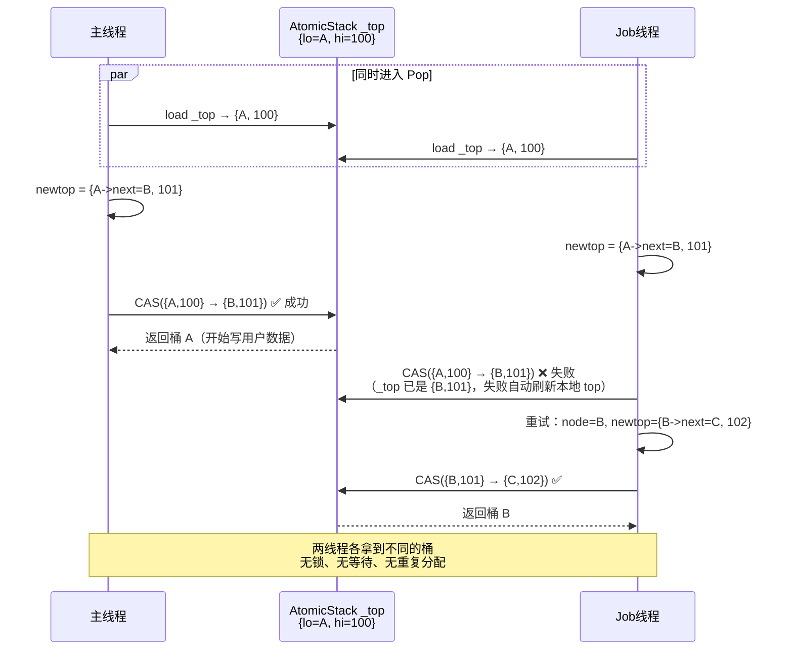

# AtomicStack 无锁栈：DCAS、ABA 问题与内存序

> 源码：`Runtime/Threads/AtomicQueue.h` / `AtomicQueue.cpp`
> 核心：**用 128 位 DCAS（指针 + 版本号）免疫 ABA 问题**，release/acquire 最小充分内存序。
> 本页行号由 `scripts/verify_srcrefs.py` 校验。

<script setup>
import AbaSimulator from './components/AbaSimulator.vue'
</script>

## 先说人话：无锁的"乐观"是有代价的

有锁的写法是**悲观**的：我先把门锁上，别人都别进来，我改完再开门。
简单可靠，但"等锁"这件事本身很贵——一个线程被操作系统挂起时，别人只能干等。

无锁的写法是**乐观**的：我不锁门，我先记下当前状态、算好新状态，
然后用一条原子指令问一句"**状态还是我刚看到的那个吗？是就换成我的，不是就当我没说**"。
这条指令就是 CAS。被拒绝了就重读重来——**任何线程被挂起都不会阻塞别人**。

乐观方案的软肋在于那句"还是我刚看到的那个吗"——**它只比较值，不比较历史**。
如果一个值被改走、又被改回来，CAS 就会误判"没人动过"。这就是 ABA 问题。

下面这个模拟器把 ABA 事故现场完整走一遍，并且可以一键切换"加不加版本号"看结果差异：

<AbaSimulator />

（下面是逐步深入的源码细节。）

## 术语先对齐

| 术语 | 一句话解释 |
|---|---|
| **CAS** | Compare-And-Swap，CPU 原子指令："值还是我以为的那个，就换成新值" |
| **lock-free** | 无锁：任一线程被挂起都不会阻塞其他线程的推进 |
| **ABA 问题** | 值从 A 变成 B 又变回 A，CAS 误判"没人动过"，实际世界已变 |
| **DCAS** | Double-width CAS，一次比较两个机器字（x64 上是 128 位的 `cmpxchg16b`） |
| **版本号 / counter** | 与栈顶指针捆绑的只增计数器，让"改回来"这件事留下痕迹 |
| **内存序** | 编译器/CPU 允许重排读写；release/acquire 用来划定不许越过的边界 |
| **伪共享** | 两个线程改同一缓存行里不同的变量，导致缓存行反复失效 |

## 朴素无锁栈：一个 CAS 就够了？

栈只有一个可变点——栈顶指针 `_top`。Push/Pop 都是"读旧顶 → 算新顶 → CAS 替换"：

```
Push(node):  do { node->next = top } while (!CAS(&top, top, node));
Pop():       do { node = top }      while (!CAS(&top, top, node->next));
```

CAS（Compare-And-Swap）是 CPU 原子指令：**"如果 `_top` 还是我刚才看到的值，就换成新值；否则告诉我失败"**。失败就重读重试——没有锁，任何线程被挂起都不阻塞别人（这是 lock-free 的定义）。

## ABA 问题：无锁栈的经典翻车现场

朴素版有个致命漏洞。设栈为 `A → B → C`，线程 1 执行 Pop：

```
线程1: 读到 top=A, 准备 newtop=B          （即将 CAS(&top, A, B)）
        ── 此刻被 OS 调度挂起 ──
线程2: Pop A, Pop B（B 被挪作他用），再把 A push 回来 → 栈变成 A → C
线程1: 恢复，执行 CAS(&top, A, B)
        _top 的值确实还是 A → CAS 成功！
        但 B 早已不在栈里 → 栈顶指向已被复用的 B → 数据损坏 💥
```

问题本质：**CAS 只比较"值"，不比较"历史"**。地址 A 经历"弹出→放回"后值相同但世界已变（A→B→A）。

对 BucketAllocator 这尤其致命：AtomicNode 就是内存桶本身，Pop 出去立刻被写用户数据——被 ABA 污染的栈顶会让两个线程拿到同一个桶，等价于**双重分配**。

## 解法：DCAS + 版本号（Unity 的选择）

给栈顶捆绑一个**只增计数器**，两者拼成 128 位一起 CAS（Double-width CAS，x64 的 `cmpxchg16b` 指令）：

```
_top = { lo: 栈顶指针 , hi: 版本号 }
每次成功修改：hi += 1
```

线程 2 无论把指针折腾回什么值，**版本号已经 +3**——线程 1 的 CAS 比较的是 128 位整体，`hi` 对不上就失败重试。ABA 变成了 A(v1)→B(v2)→A(v4)，永不相等。

```cpp
// AtomicQueue.h:15 源码注释直接说明
// some whining about DCAS define and its usage: AtomicQueue/AtomicStack do actually use DCAS
//   as in second "word" in atomic_word2 is for counter to avoid ABA problem
```

## 结构：极简到只有一个字段

```cpp
// AtomicQueue.h:39
class alignas(PLATFORM_CACHE_LINE_SIZE) AtomicStack   // ⭐ 缓存行对齐(64B)
{
#if defined(ATOMIC_HAS_DCAS)
    volatile atomic_word2   _top;    // {lo=栈顶指针, hi=ABA版本号} 128位
#else
    volatile atomic_word    _top;    // 无DCAS平台退化为单字(用LL/SC等替代方案)
#endif
public:
    void Push(AtomicNode *node);
    AtomicNode *Pop();
    void PushAll(AtomicNode *first, AtomicNode *last);  // 批量版(一次CAS挂整条链)
    AtomicNode *PopAll();                               // 整栈取走(TLSF回收批量用)
};
```

```cpp
// AtomicNode.h:5
class AtomicNode
{
    volatile atomic_word _next;   // 链表后继（栈内时有效）
public:
    void* data[3];                // ⭐ 24B 载荷——node 即数据，零额外分配
};
```

两个"抠"到极致的设计：

1. `alignas(PLATFORM_CACHE_LINE_SIZE)`：`_top` 独占一个缓存行。多线程狂打 CAS 时，若 `_top` 与其他热数据同行，会互相**伪共享**（false sharing）弹跳缓存行。
2. `AtomicNode` 没有"包裹"关系——BucketAllocator 直接把**空闲内存桶本身**解释成 AtomicNode（`reinterpret_cast<AtomicNode*>(p)`）。空闲时它是链表节点，分配出去就是用户内存，**元数据零成本**（与 TLSF 的 free 链指针复用同一哲学）。

## Push：两步舞——先写自己，再抢栈顶

```cpp
// AtomicQueue.cpp:66
void AtomicStack::Push(AtomicNode* node)
{
    atomic_word2 top = atomic_load_explicit(&_top, memory_order_relaxed);
    atomic_word2 newtop;
    newtop.lo = (atomic_word)node;               // 新栈顶 = 我
    do
    {
        atomic_store_explicit(&node->_next, top.lo, memory_order_relaxed);
        //  ⭐ 每轮重试都要重写 next——top 可能已被别人改过
        newtop.hi = top.hi + 1;                  // ⭐ 版本号 +1
    }
    while (!atomic_compare_exchange_strong_explicit(&_top, &top, newtop,
              memory_order_release,              // ⭐ 成功时: release
              memory_order_relaxed));            //    失败时: relaxed 就够
}
```

注意 C++11 CAS 的一个常被忽略的特性——**失败时会把 `_top` 的当前值写回 `top` 变量**。所以循环里不需要重新 load，`do-while` 直接用被刷新的 `top` 进入下一轮。每轮必须重做两件事：重写 `node->_next`（链到新的旧栈顶）、重算 `newtop.hi`。

## Pop：多一条空栈退出路径

```cpp
// AtomicQueue.cpp:303
AtomicNode* AtomicStack::Pop()
{
    atomic_word2 top = atomic_load_explicit(&_top, memory_order_relaxed);
    atomic_word2 newtop;
    AtomicNode* node;
    do
    {
        node = (AtomicNode*)top.lo;
        if (!node) break;                        // 空栈：直接返回 NULL
        newtop.lo = (atomic_word)atomic_load_explicit(&node->_next, memory_order_relaxed);
        //  ⭐ 读"将成为新栈顶"的 next——正是 ABA 攻击点：
        //     若无版本号，此处读到的 next 可能已过期，但 CAS 仍会成功
        newtop.hi = top.hi + 1;
    }
    while (!atomic_compare_exchange_strong_explicit(&_top, &top, newtop,
              memory_order_acquire,              // ⭐ 成功时: acquire
              memory_order_relaxed));
    return node;
}
```

## 内存序：release/acquire 的配对含义

Push 成功用 **release**，Pop 成功用 **acquire**——这是一对约定：

```
线程A: 写桶内容(用户数据) → Push(release 发布)
                                ↓ happens-before 保证
线程B: Pop(acquire 获取) → 读桶内容——必能看到线程A写的全部数据
```

- `release`：本线程在 CAS **之前**的所有写操作，对后续 acquire 到这个值的线程可见；
- `acquire`：本线程在 CAS **之后**的所有读操作，不会被重排到 CAS 之前；
- 失败路径用 `relaxed`：反正要重试，无需同步语义，省掉内存屏障开销；
- 初始 load 用 `relaxed`：读到旧值也无妨——CAS 会兜底验证。

**这是教科书级的"最小充分内存序"用法**。对比 `memory_order_seq_cst`（默认全序）在 ARM 上每次都要全屏障，Unity 这套在弱内存序平台（ARM/PPC）收益显著。

平台分化（AtomicQueue.h:32 注释）：x86/ARM 用 DCAS；**PPC 用 LL/SC**（Load-Linked/Store-Conditional——硬件原生免疫 ABA：只要地址被任何人碰过，SC 就失败，无需版本号）；ARM64+clang 走 LDAEX/STLEX 专用指令路径。同一个类三套实现，接口不变。

## 两线程同时 Pop 的场景

场景：主线程和 Job 线程同时从 Bucket 拿 48B（并发分配）。



**ABA 防护生效的时刻**（把 T2 换成"Pop A → Pop B → Push A 回"的干扰线程）：T1 的 CAS 期望 `{A, 100}`，而栈顶虽然指针又是 A，版本号已是 `{A, 103}` → **CAS 失败**，T1 重读到正确的世界重试。没有版本号的话这次 CAS 会"成功"，把已被占用的 B 推上栈顶。

## 在内存系统里的完整位置

```
Bucket.Allocate → buckets->PopBucket() ──→ 本篇 Pop()   ← 分配 = 弹栈
Bucket.Deallocate → buckets->PushBucket() → 本篇 Push() ← 释放 = 压栈
TLSAllocator 线程注册表         → 互斥锁（低频操作不值得无锁）
TLSF 的格子链表                 → 双向链表 + DynamicHeap 的 mutex
```

内存系统三种同步策略的完整光谱：**物理隔离（TLS）> 无锁（AtomicStack）> 细粒度锁（TLSF mutex）**——频率越高的路径用越激进的策略。

## 设计点与代价

| 设计点 | 为什么 | 代价/缺点 |
|--------|-------|----------|
| 版本号 DCAS 而非 hazard pointer / epoch 回收 | 栈节点即内存桶，**永不 free**（桶只归还池不还 OS）——ABA 的"节点被回收又复用"前提被削弱，版本号足够且零 per-线程状态 | 需要平台支持 128 位 CAS（cmpxchg16b）；WebGL 等平台走退化路径 |
| 版本号只增不回绕处理 | 64 位计数器按每纳秒一次也要 584 年才回绕 | 32 位平台 hi 只有 32 位，理论可回绕（实际不可达） |
| 失败路径 memory_order_relaxed | 失败必重试，同步语义由最终成功的那次 CAS 提供 | 无——纯赚。这是很多自研无锁代码漏掉的优化 |
| 类头 alignas(64) 缓存行对齐 | _top 是全局竞争热点，独占缓存行避免伪共享 | 每个栈实例浪费 ~56B（相对收益可忽略） |
| node 即数据（data[3] 载荷 + 桶复用） | 零包装分配；Push/Pop 无任何内存管理 | 节点生命周期由外部保证——Pop 出的 node 被写数据前，慢速线程可能还在读它的 `_next` ⚠️ 这是"良性数据竞争"，TSAN 会报警 |
| 三套平台实现（DCAS/LL-SC/ARM64 专用） | LL/SC 平台天然免 ABA 且更快；x86 只有 DCAS 可选 | 同一逻辑三份代码，维护成本（注释里 Unity 自己也在 whining） |

> **无锁 ≠ 无代价**：CAS 失败重试在高竞争下会退化（N 线程狂打同一个栈顶，缓存行在核间弹跳，吞吐反而可能低于一把自旋锁）。Unity 的用法规避了这点——Bucket 按 size 分 4 组 Buckets，每组独立栈，天然分散竞争。**无锁适合"短临界区 + 中低竞争"，不是万能银弹**。

## 实战注意点

1. **自己写无锁结构前先问三个问题**：临界区是否足够短？竞争是否可分散？节点内存是否可控（ABA 前提）？答不上来就用锁——`Mutex` 错了是死锁（可调试），无锁错了是数据损坏（不可调试）。
2. **C# 侧对应物**：`Interlocked.CompareExchange` 只有单字 CAS，没有 DCAS——.NET 里做无锁栈标准答案是 `ConcurrentStack<T>`（内部用 GC 保平安：节点不会被复用成别的类型，ABA 自动免疫）。**托管堆的 GC 是天然的 ABA 防护**，这是 C# 无锁编程比 C++ 简单十倍的原因。
3. **性能直觉校准**：无竞争 CAS ≈ 20 个周期（比普通写贵 ~10 倍），有竞争时缓存行弹跳 ≈ 40-100ns。BucketAllocator "几十 ns"的分配成本主要就是这一次 CAS——它已经是共享数据结构的物理极限，再快只能靠 TLS 消灭共享。

## 自检清单

- [ ] 能用一个具体的时间线讲出 ABA 是怎么发生的（不要只背定义）
- [ ] 能解释"CAS 只比较值、不比较历史"这句话的含义
- [ ] 能说出加了版本号之后，CAS 比较的位宽和内容分别是什么
- [ ] 能解释为什么 `AtomicStack` 要 `alignas(PLATFORM_CACHE_LINE_SIZE)`
- [ ] 能说出失败路径为什么可以用 `memory_order_relaxed`
- [ ] 能说出 C# 里为什么不需要 DCAS（提示：`ConcurrentStack<T>` 靠什么免疫 ABA）
- [ ] 能说出什么情况下"无锁反而比一把自旋锁慢"

## 延伸阅读

- 上一篇：[一次分配的完整旅程](./allocator-journey) — 环节 5A 的 `PopBucket` 就是这里的 `Pop()`
- [Deallocate 全流程](./deallocate) — 释放路径上 `PushBucket` 就是这里的 `Push()`
- [TLSF：两级分割适应算法](./tlsf) — 无锁栈的对立面：细粒度锁 + 双向链表
