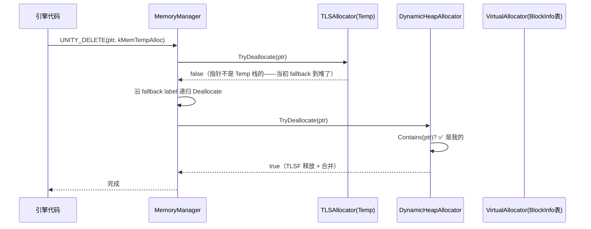

# Deallocate 全流程：一个裸指针如何找回自己的 Allocator

> 源码：`Runtime/Allocator/MemoryManager.cpp`——注意 `VirtualAllocator` 是 `MemoryManager` 的**内嵌类**（定义从 `MemoryManager.cpp:561` 开始），源码树里**没有**独立的 `VirtualAllocator.h`（老版本本篇写错过这个文件名，这里留个记号 no-verify）
> 核心：**释放比分配难——label 可能"骗人"，最终靠 BlockInfo 表按地址反查**。

## 释放比分配难在哪

分配时我们**有 label**——路由表一查就到。释放时表面上也有 label（`UNITY_DELETE(ptr, label)`），但有个阴险的现实：**label 可能"骗人"**。

三种典型场景 label 和指针对不上：

1. **fallback 错位**：分配时 Temp 栈满了，实际从堆里给的；释放时调用方还拿着 `kMemTempAlloc` 来释放——但指针根本不在 Temp 栈里；
2. **跨线程释放**：主线程分配（走 m_MainAllocator），工作线程释放——同一个 label 在两个线程解析出的 allocator 不同（DualThread 的 relatedThreadAllocator 机制）；
3. **调用方传错/没 label**：泛型容器、C 接口回调等场景只有裸指针。

所以释放路径的核心问题是：**只凭一个 8 字节的地址，找到当初的 allocator**。Unity 给了两级答案：

- **快路径**：信任 label → `TryDeallocate`（allocator 自己验证 `Contains(ptr)`，不是我的就返回 false）；
- **慢路径**：label 靠不住 → **按地址反查**。反查的基础设施是 `VirtualAllocator` 的 **BlockInfo 表**——本篇的主角。

## BlockInfo 表：整个进程地址空间的"户口本"

核心思想：所有 allocator 向 OS 要内存都经过同一个入口（`ReserveMemoryBlock`），要的时候**顺手登记**——"这段地址归 allocator #7 所有"。登记粒度是 `kReserveBlockGranularity`（**分平台：PC 64 位 256MB / iOS·主机 256KB / 32 位 64KB**，见 `LowLevelDefaultAllocator.h:35-70`）：

```
进程地址空间（按 256KB 切格）
┌────┬────┬────┬────┬────┬────┐
│ #3 │ #3 │ #7 │ #7 │ #7 │ 0  │   ← 每格一个 BlockInfo{allocatorIdentifier}
└────┴────┴────┴────┴────┴────┘
任意指针 ptr → ptr/256KB = 格号 → 查表 → allocator 编号 → 完事
```

反查 = 一次除法（移位）+ 一次数组读。**不用遍历、不用锁、不碰指针指向的内存**（这点很关键——指针可能是野的）。

## 源码：信任降级的三级瀑布

### 关键 1：Deallocate(ptr, label) —— 带 label 的主入口

```cpp
// MemoryManager.cpp:1872
void MemoryManager::Deallocate(void* ptr, MemLabelRef label, const char* file, int line)
{
    if (ptr == NULL) return;                     // free(NULL) 合法，直接放行

    if (IsTempLabel(label))                      // ── Temp 分支 ──
    {
        bool success = false;
        if (IsTempAllocatorLabel(label))
            success = ((TLSAllocator*)m_FrameTempAllocator)->TLSAllocator::TryDeallocate(ptr);
        else
            success = GetAllocator(label)->TryDeallocate(ptr);
        if (success) return;                     // Temp 栈认领成功

        // ⭐ Temp 栈不认这个指针 → 它当初是 fallback 到堆分配的
        //    → 用 fallback label 重新走一遍 Deallocate（镜像分配的 fallback）
        Deallocate(ptr, GetFallbackLabel(label));
        return;
    }

    // ── 常规分支 ──
    BaseAllocator* alloc = GetAllocator(label);
    if (!alloc->TryDeallocate(ptr))              // ⭐ 快路径：先信 label
    {
        if (GetLabelIdentifier(GetFallbackLabel(label)) != kMemInvalidLabelId)
            return Deallocate(ptr, GetFallbackLabel(label), file, line); // 沿 fallback 链追
        Deallocate(ptr);                         // ⭐ 链尽头 → 无 label 全局反查(关键2)
    }
}
```

整个函数是一张"信任降级"的瀑布——**先信 label（O(1)）→ label 的 fallback 链（每级 O(1)）→ 全局反查（慢但必中）**。`TryDeallocate` 是各 allocator 必须实现的"验伪钞"接口：内部先 `Contains(ptr)`（地址范围判断），是我的就释放并返回 true，不是就返回 false 把球踢回来。

### 关键 2：Deallocate(ptr) —— 无 label 版，全局反查

```cpp
// MemoryManager.cpp:1965
void MemoryManager::Deallocate(void* ptr, const char* file, int line)
{
    if (ptr == NULL) return;

    MEM_TIME_SCOPE(&gNativeDeallocLabelMismatch, kMemDefaultId);  // ⭐ 专属计时器：
                                    // Profiler 里这项高 = 大量 label 错位释放，性能信号

    BaseAllocator* alloc = GetAllocatorContainingPtr(ptr);        // ⭐ 反查（关键3）
    if (alloc)
    {
        VerifyPtrIntegrity(alloc, ptr);
        alloc->Deallocate(ptr);
        return;
    }
    // 反查也失败 → 这个指针不属于任何 Unity allocator
    // （通常是外部 malloc 的指针误传进来，或双重释放）→ 警告/低层 free
}
```

`gNativeDeallocLabelMismatch` 是个隐藏的性能信号：如果 Profiler 里这项持续偏高，说明代码里有大量"分配时 A label、释放时 B label"的错位——通常是业务代码拿错了 label，值得排查。

### 关键 3：GetAllocatorContainingPtr —— 反查的实现

```cpp
// MemoryManager.cpp:2134
BaseAllocator* MemoryManager::GetAllocatorContainingPtr(const void* ptr)
{
    BaseAllocator* alloc = m_LowLevelAllocator.GetAllocatorFromPointer(ptr);
    if (alloc) return alloc;                     // ⭐ 第一优先：BlockInfo 表 O(1) 命中

    for (int i = 0; i < m_NumAllocators; i++)    // 第二优先：遍历问每个 allocator
        if (m_Allocators[i] && m_Allocators[i]->IsAssigned() && m_Allocators[i]->Contains(ptr))
            return m_Allocators[i];              //   （挂在系统 malloc 上的 allocator 走这里）

    if (m_InitialFallbackAllocator->Contains(ptr))
        return m_InitialFallbackAllocator;       // 引擎启动前分配的内存

    return NULL;
}
```

> 注：`GetAllocatorContainingPtr` 定义在 `MemoryManager.cpp:2134`（无 label 的 `Deallocate(ptr)` 在 1972 行调用它）。

三级反查：**BlockInfo 表 O(1) 命中 → 遍历所有 allocator 逐个 Contains → 引擎启动前的 initial fallback**。

## 完整流程（一次典型释放）



如果 label 链也走不通（比如裸指针场景），则直接：

```
Deallocate(ptr) → GetAllocatorContainingPtr(ptr)
  → VirtualAllocator.GetAllocatorFromPointer(ptr)
      → ptr / 256KB = 格号 → BlockInfo 表 → allocator #7
  → allocator #7 的 Deallocate(ptr)
```

## 设计点与代价

| 设计点 | 为什么 | 代价/缺点 |
|--------|-------|----------|
| 反查粒度 256KB（kReserveBlockGranularity） | 格数 = 地址空间/256KB，表可预分配且 O(1)；过细则表太大 | 一个 allocator 只要要过 1B 也占满整个 256KB 格——但反正虚拟地址不值钱 |
| TryDeallocate 作为"验伪钞"接口 | 每层都验证，错 label 不会误释放别人的内存 | 每个 allocator 都要实现 Contains 的地址范围判断 |
| gNativeDeallocLabelMismatch 专属计时器 | label 错位是常见 bug 源，给显式信号 | 平时零开销，只有 Profiler 开启时统计 |
| 反查不碰指针指向的内存 | 指针可能是野的/已释放，读它可能崩溃 | 无法做更深的内容校验（只信地址区间） |

> **一句话总结**：分配靠"身份"（label 路由），释放靠"信任降级"（先信 label，再沿 fallback 链，最后按地址反查）——反查的户口本就是 BlockInfo 表，一次除法一次数组读，连锁都不用。

## 延伸阅读

- 上一篇：[一次分配的完整旅程](./allocator-journey) — 分配路径的镜像
- [AtomicStack：无锁栈](./atomic-stack) — 释放路径上 `PushBucket` 背后的无锁栈
- [TLS：每线程临时内存分配](./tls) — `TryDeallocate` 的三种情形（含 return false 的闭环）
