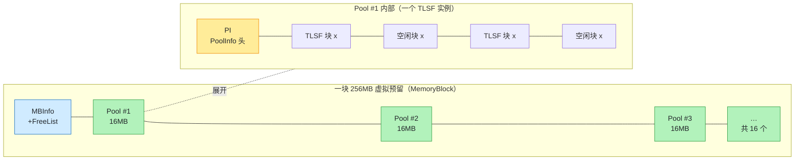
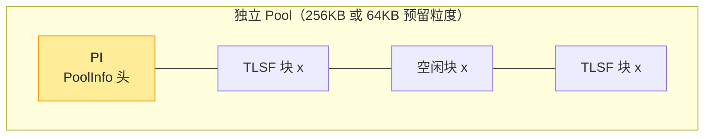
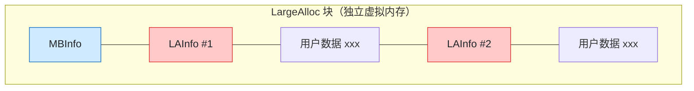
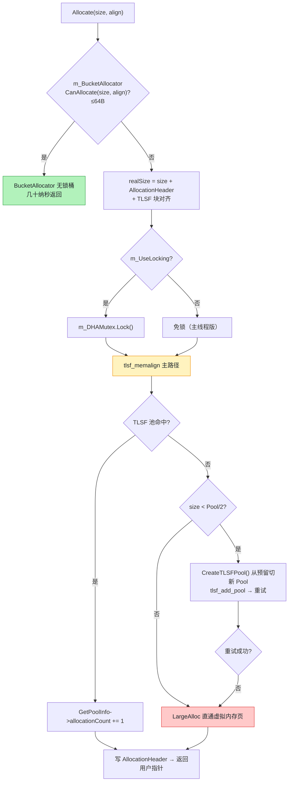

# DynamicHeapAllocator：TLSF 的工程集成

> 源码：`Runtime/Allocator/DynamicHeapAllocator.cpp` / `.h`
> Unity 把纯 C 的 TLSF 封装成生产级分配器：**大块虚拟预留（分平台 64KB~256MB）+ 多 Pool 扩展 + BucketAllocator 快路径 + LargeAlloc 溢出路径**。

## 设计总览（源码注释）

`DynamicHeapAllocator.h` 开头注释直接写明：

> DynamicHeapAllocator - 基于 TLSF 的主力通用分配器
> TLSF (Two-Level Segregated Fit) 算法:
>   VirtualAllocator 预留大块虚拟地址 (kReserveBlockGranularity)
>   → 划分为多个 Pool (每个 Pool 是一个独立的 TLSF 实例)
>   → 每个 Pool 内部 TLSF 管理小块分配
>   - 小分配先尝试 BucketAllocator (≤64B, lock-free, 更快)
>   - 中等分配走 TLSF (确定性 O(1))
>   - 大分配直接向 VirtualAllocator 申请独立块

⚠️ **kReserveBlockGranularity 分平台不同**（`LowLevelDefaultAllocator.h:35-70`）：

| 平台 | 值 | 说明 |
|---|---|---|
| PC/通用 64 位（win/linux，`#else` 分支） | `1<<28` = **256MB** | MEMORY_USE_LARGE_BLOCKS=1，一块预留切多个 Pool |
| iOS / PS4 / PS5 / OSX / Switch | `1<<18` = **256KB** | MEMORY_USE_LARGE_BLOCKS=0 |
| 32 位平台 | `1<<16` = **64KB** | MEMORY_USE_LARGE_BLOCKS=0 |

下文以 PC 64 位（256MB 预留）为例。

## 内存布局

源码注释里有一张 ASCII 图（DynamicHeapAllocator.cpp:21-54），它想表达的是三张图：
**64 位一块 256MB 预留切多个 Pool**、**32 位独立 Pool**、**LargeAlloc 独立大块**。
ASCII 图在网页上看不清，下面用图+表逐区拆解。

### 64 位（MEMORY_USE_LARGE_BLOCKS=1）：一块 256MB 预留切 N 个 Pool



| 区域 | 是什么 | 作用 |
|---|---|---|
| `MBInfo` + `FreeList` | MemoryBlockInfo | 管理 256MB 内所有 Pool 的链表头；整块释放时遍历它 |
| `*`（Pool 起点） | tlsf_pool start | 一个 Pool = 一个独立 TLSF 实例（16MB） |
| `PI` | PoolInfo | 每个 Pool 的头：allocationCount（空 Pool 检测）等 |
| `x` | TLSF 块 | 已分配/空闲块，由 Pool 内部 TLSF 位图+链表管理 |

**关键点**：256MB 只预留不提交——虚拟地址连续，物理内存按 Pool 实际使用 commit。
`m_PoolsPerBlock = 256MB / 16MB = 16`，Pool 逐个懒创建（见下文分配流程第 4 步）。

### 32 位（MEMORY_USE_LARGE_BLOCKS=0）：独立 TLSF Pool



32 位平台预留粒度小（iOS/Switch 256KB、32 位通用 64KB），**装不下"一块切多 Pool"**，
所以每个 Pool 单独一块预留，没有 MBInfo 层——结构简单但预留次数多。

### LargeAlloc：大块独立分配（≥ Pool/2 的请求）



| 区域 | 是什么 | 作用 |
|---|---|---|
| `MBInfo` | 块头 | 挂到 DynamicHeapAllocator 的 LargeAlloc 链表 |
| `LAInfo` | LargeAllocInfo | 每个大分配的头：size、对齐；free 时直接归还虚拟页 |
| `x` | 用户数据 | 大块不进 TLSF Pool，**不参与小块碎片** |

**为什么要绕开 TLSF**：一个 8MB 的分配塞进 16MB Pool 会占掉一半，剩下的空间
碎成没法用的边角料。LargeAlloc 直通虚拟内存页——分配/释放都是整页操作，
和 Pool 内的小块世界完全隔离（`LAInfo` 混排 = 一个预留块里可以有多个大分配）。

### 对应源码

| 布局 | 源码位置 |
|---|---|
| 三张 ASCII 原图 | `DynamicHeapAllocator.cpp:21-54` |
| LargeAllocInfo / MemoryBlockInfo 结构 | `DynamicHeapAllocator.h:89 / 105` |
| LargeAlloc 路径 | `DynamicHeapAllocator.cpp:409` 起 |

## 构造：预留与 TLSF 实例

```cpp
// DynamicHeapAllocator.cpp:84
DynamicHeapAllocator::DynamicHeapAllocator(
    UInt32 poolIncrementSize, bool useLocking,
    BucketAllocator* bucketAllocator, LowLevelVirtualAllocator* llAlloc,
    const char* name, bool checkEmptyOnDestruct)
    : m_BucketAllocator(bucketAllocator)
    , m_UseLocking(useLocking)
{
    m_RequestedPoolSize = poolIncrementSize;   // 单个 Pool 大小（默认 16MB = kDynamicHeapChunkSize）
    m_RequestedBlockSize = LowLevelVirtualAllocator::kReserveBlockGranularity; // PC 64 位 = 256MB
    m_RequestedBlockSize = std::max(m_RequestedBlockSize, (size_t)poolIncrementSize);
#if MEMORY_USE_LARGE_BLOCKS
    m_PoolsPerBlock = m_RequestedBlockSize / poolIncrementSize;  // 一块 256MB 切 N 个 Pool
#endif
    InitializeTLSF();
}

// 创建一个全局 TLSF 控制结构（800 链表头 + 位图）
void DynamicHeapAllocator::InitializeTLSF()
{
    m_TlsfInstance = tlsf_create(GetMemoryManager().LowLevelAllocate(tlsf_size(), tlsf_align_size()));
}
```

## Allocate：三级路径

```cpp
// DynamicHeapAllocator.cpp:409
void* DynamicHeapAllocator::Allocate(size_t size, int align)
{
    // 路径 1：≤64B 走 BucketAllocator（lock-free 桶分配，更快）
    if (m_BucketAllocator != NULL && m_BucketAllocator->CanAllocate(size, align))
    {
        void* realPtr = m_BucketAllocator->Allocate(size, align);
        if (realPtr != NULL)
            return realPtr;
    }

    // realSize 先做 AllocationHeader 开销 + 对齐 + TLSF 块对齐（>32B 时对齐到 2 的幂边界）
    size_t realSize = AllocationHeader::CalculateNeededAllocationSize(size, align);
    if (realSize > 32)
    {
        size_t tlsfalign = (1 << HighestBit(realSize >> 5)) - 1;
        realSize = (realSize + tlsfalign) & ~tlsfalign;
    }

    if (m_UseLocking) m_DHAMutex.Lock();       // 可选互斥锁

    // 路径 2：TLSF（主体）
    newRealPtr = (char*)tlsf_memalign(m_TlsfInstance, allocationAlignment, realSize);
    if (newRealPtr)
        GetPoolInfo(newRealPtr)->allocationCount += 1;

    if (m_UseLocking) m_DHAMutex.Unlock();

    if (newRealPtr == NULL)
    {
        // 路径 2b：TLSF 满了且请求 < Pool/2 → 新建 Pool 扩容（懒扩展）
        if (size < m_RequestedPoolSize / 2)
        {
            size_t blockSize;
            void* memoryBlock = CreateTLSFPool(blockSize);   // 从 256MB 预留里切新 Pool
            tlsf_add_pool(m_TlsfInstance, memoryBlock, blockSize);
            newRealPtr = (char*)tlsf_memalign(m_TlsfInstance, allocationAlignment, realSize);
        }

        if (newRealPtr == NULL)
        {
            // 路径 3：大块 → 直接虚拟内存分配（绕过 TLSF）
            realSize = AllocationHeaderWithSize::CalculateNeededAllocationSize(
                size + sizeof(LargeAllocInfo), align);
            realSize = AlignSize(realSize, m_LLAlloc->GetPageSize());
            void* largeAllocPtr = RequestLargeAllocMemory(realSize, commitSize);
            LargeAllocInfo* largeAllocNode = (LargeAllocInfo*)largeAllocPtr;
            new(largeAllocNode) LargeAllocInfo();
            largeAllocNode->allocatedSize = commitSize;
            mbInfo->m_LargeAllocs.push_back(*largeAllocNode);   // 记录到大块链表
            newRealPtr = (char*)(largeAllocNode + 1);
        }
    }
    // 写入 AllocationHeader（大小/对齐信息，供 free/realloc/Contains 用）
}
```

**三级路径决策**：

| 请求大小 | 路径 | 特点 |
|---|---|---|
| ≤ 64 B | BucketAllocator | 无锁桶，最快 |
| 64 B ~ Pool 大小 | TLSF | O(1) 确定性，碎片可控 |
| ≥ Pool/2 或 TLSF 扩容失败 | LargeAlloc | 直接虚拟分配，独立块 |

## Pool 扩展策略

- 初始：只创建 TLSF 控制结构，**不预分配用户内存**（懒加载）
- 首次分配：`CreateTLSFPool()` 从大块预留中切出第一个 Pool（大小 = `m_RequestedPoolSize`，默认 **16MB** = `kDynamicHeapChunkSize`，MemoryManager.cpp:291；fallback allocator 用 1MB）
- 后续 TLSF 满：`size < m_RequestedPoolSize/2` 时继续切新 Pool 并 `tlsf_add_pool`（一个 TLSF 实例可挂多个 pool）
- 大请求（≥ Pool/2）：直接 `RequestLargeAllocMemory`，避免大块挤占 Pool 空间造成碎片

## 为什么分 Pool

TLSF 的单 pool 是连续内存段。Unity 用大块虚拟预留 + 多 Pool：
1. **虚拟地址连续，物理按需 commit**：预留只是 reserve，真正 commit 才占物理内存
2. **碎片隔离**：大块走 LargeAlloc，不和小块混在同一个 Pool 里
3. **Pool 粒度管理**：Pool 用完可以整块归还，分配计数 `allocationCount` 支持空 Pool 检测

## 分配流程（图文步骤）

总览图（三条路径：Bucket 快路径 / TLSF 主路径 / LargeAlloc 大块直通）：



### 第 1 步：≤64B 走 BucketAllocator 快路径（DynamicHeapAllocator.cpp:409）

```cpp
// 路径 1：≤64B 走 BucketAllocator（lock-free 桶分配，更快）
if (m_BucketAllocator != NULL && m_BucketAllocator->CanAllocate(size, align))
{
    void* realPtr = m_BucketAllocator->Allocate(size, align);
    if (realPtr != NULL)
        return realPtr;
}
```

**为什么先查 Bucket**：小对象（≤64B）是游戏里数量最多的分配（组件、小 buffer）。
BucketAllocator 是纯 lock-free 的定长桶，没有 TLSF 的位图查找开销，几十纳秒返回。
`CanAllocate` 失败或桶满（返回 NULL）才落到底下两条慢路径——**快路径永远不打扰慢路径**。

### 第 2 步：计算 realSize + 加锁（多线程保护）

```cpp
// realSize = 用户 size + AllocationHeader 开销 + 对齐
size_t realSize = AllocationHeader::CalculateNeededAllocationSize(size, align);
if (m_UseLocking)
    m_DHAMutex.Lock();   // 多线程版；主线程专用实例免锁
```

**为什么有锁**：TLSF 本身不是线程安全的。`m_UseLocking` 由构造方决定——
主线程专用分配器免锁（省一次 syscall 级开销），多线程共享实例必须加 `m_DHAMutex`。
这和 TLSAllocator 的"每线程一个实例所以无锁"形成对比：**粒度决定锁策略**。

### 第 3 步：`tlsf_memalign` 主路径——O(1) 两级查找

```cpp
void* ptr = tlsf_memalign(m_TlsfInstance, align, realSize);
```

**内部发生什么**（对应 [TLSF 算法](./tlsf) 一文）：
1. `align` 对齐 size → 映射到二级桶：`fl = 31 - CLZ(size)`（一级）、`sl = size >> (fl-8)`（二级）
2. 位图查"恰好或下一个更大"的空闲块 → 两次位运算定位链表
3. 摘块 → 若剩余 ≥ 块头+最小块则**分割**，余块挂回对应桶

**确定性 O(1)**：无论堆里有 100 个还是 10 万个空闲块，查找时间恒定——这是 Unity 选
TLSF 的核心理由（实时性，帧内分配抖动可控）。

### 第 4 步：池未命中 → 懒扩展新 Pool

```cpp
if (!tlsf 命中 && size < m_RequestedPoolSize / 2)
{
    CreateTLSFPool();            // 从 256MB 预留切出一个 16MB Pool
    tlsf_add_pool(m_TlsfInstance, poolMemory, m_RequestedPoolSize);
    // 重试 tlsf_memalign
}
```

**为什么 size < Pool/2 才扩**：大块（≥ Pool/2）塞进任何 Pool 都会严重碎片化，
不如直接走 LargeAlloc 独立页。这是"**小块进池、大块绕行**"的碎片隔离策略。

### 第 5 步：写 AllocationHeader → 返回

```cpp
// 返回的用户指针前面藏着 AllocationHeader（size/allocator 指针），
// free 时靠它找回 Allocator（见 Deallocate 一文）
return ptr;
```

**用户指针 ≠ 块起点**：指针前 16~32B 是 AllocationHeader（记录块大小和所属分配器），
`free(rawPtr)` 才能反向定位元数据。这三篇正好构成闭环：
[分配](./dynamic-heap) → [回收](./deallocate) → [算法](./tlsf)。

## 与 TLSAllocator 的分工

| | TLSAllocator | DynamicHeapAllocator |
|---|---|---|
| 生命周期 | 帧内临时（Temp） | 长命/通用（Persistent/默认） |
| 结构 | 每线程 StackAllocator | TLSF + Bucket + LargeAlloc |
| 锁 | 无锁 | 可选互斥锁（useLocking） |
| 回收 | 帧末整体重置 | free 时合并 |
| 容量 | Editor 128MB / Runtime 8MB | 大块虚拟预留（PC 256MB）+ 懒扩展 |

**典型协作**：`Allocator.Temp` 数据帧末被 TLSAllocator 整体回收；需要跨帧存活的数据（`Allocator.Persistent`）走 DynamicHeapAllocator；两者都最终向 `LowLevelVirtualAllocator`（系统虚拟内存）要页。

## 关键代码索引

| 位置 | 内容 |
|---|---|
| `DynamicHeapAllocator.cpp:84` | 构造函数（Pool 大小、锁、大块预留） |
| `DynamicHeapAllocator.cpp:113` | `InitializeTLSF()` |
| `DynamicHeapAllocator.cpp:409` | `Allocate()` 三级路径 |
| `DynamicHeapAllocator.cpp:21-54` | 内存布局 ASCII 图 |
| `DynamicHeapAllocator.h` | 设计注释（TLSF 集成策略） |

## 延伸阅读

- [TLSF：两级分割适应算法](./tlsf) — 算法本身
- [TLS：每线程临时内存分配](./tls) — 互补的帧临时分配路径
