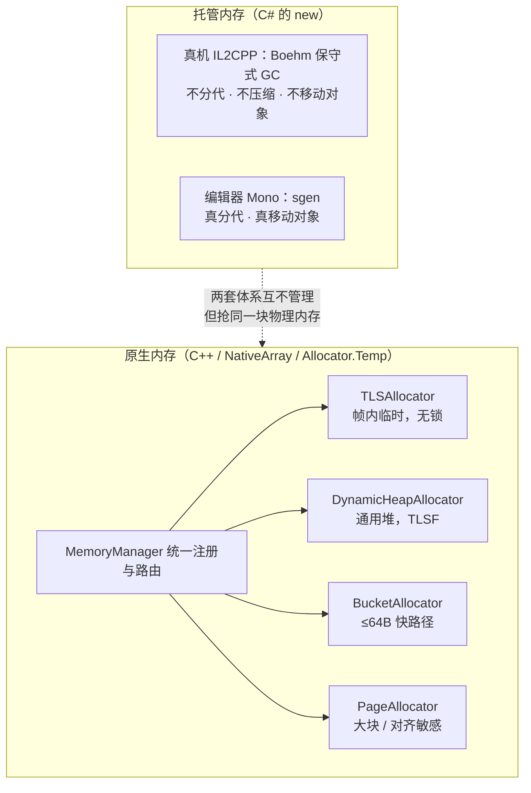
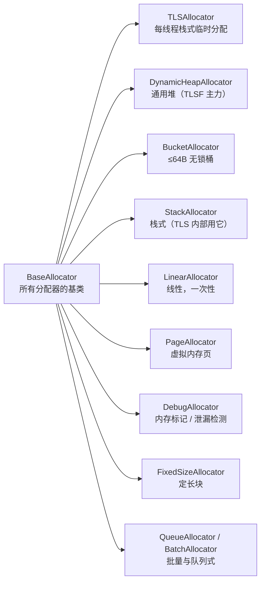

# Unity 内存管理：从「申请 100 字节」到真实地址

> 本系列基于 **Unity 2020 LTS 源码**逐行核实，源码树：`Runtime/Allocator/`、`External/Allocator/tlsf/`、`Runtime/Threads/`、`External/il2cpp/builds/external/bdwgc/`。
> 每一篇里标注的行号都能在源码里翻到；行号由 `scripts/verify_srcrefs.py` 在构建前批量校验。

## 先给完全没接触过的读者

你在 C# 里写 `new GameObject()`，或者在 C++ 里写 `UNITY_MALLOC(kMemDefault, 100)`，
这中间发生了什么？大部分人答："系统给了我一块内存。"

这个答案在 Unity 里**不成立**。Unity 自己不直接找操作系统要内存，中间隔着一整套
自研的分配器。为什么要这么麻烦？三个理由，看懂这三个，整个系列就顺了：

| 为什么要自研分配器 | 具体收益 | 系列里在哪讲 |
|---|---|---|
| **帧内临时内存要极快** | 每帧有大量"用完就扔"的小分配，走系统 malloc 会被锁和查找拖垮 | [TLS 线程临时分配](./tls) |
| **释放时要知道"你是谁"** | Unity 的内存按用途打标签（贴图/动画/音频…），才能出 Memory Profiler 报表 | [一次分配的完整旅程](./allocator-journey) |
| **碎片要可控** | 长期运行的 App 反复分配释放，系统 malloc 容易把堆搞碎 | [TLSF 算法](./tlsf)、[DynamicHeap](./dynamic-heap) |

一句话记住全貌：**Unity 的内存是两套完全独立的体系，别混着理解。**

## 30 秒速查表：我要的分配该走哪条路

| 你写的代码 | 实际走哪条路 | 关键特性 |
|---|---|---|
| `Allocator.Temp`（C#） | `kMemTempAlloc` → `TLSAllocator` | 每线程一个栈，"帧末"整体回收，**无锁** |
| `Allocator.Persistent`（C#） | `kMemDefault` → `DynamicHeapAllocator` | 通用堆，走 TLSF 算法，可选锁 |
| `UNITY_MALLOC(label, n)`（C++） | 按 `label` 查路由表 | 见 [旅程篇](./allocator-journey) 的路由表 |
| `new GameObject()`（C#） | 托管堆 → GC | 与上面全都没关系，走 GC |

::: tip 一个反直觉的事实
`Runtime/Allocator/MemoryManager.h:226` 里那个 `IsTempAllocatorLabel()` 说明：
**"是不是临时分配"是靠 label 判断的，不是靠指针本身**。
这直接导致了释放时的一个大坑——label 可能"骗人"，
详见 [Deallocate 全流程](./deallocate)。
:::

## 分配器家族地图

`MemoryManager` 底下挂着十几个派生自 `BaseAllocator` 的分配器，各管一摊：

真正在游戏里高频使用的只有前三个。其余多数用在编辑器、构建期或特定子系统里。

## 按顺序读（推荐路线）

第一次接触这个主题，**不要按侧栏从上往下读**，按下面三段走：

### 第一段：建立全局（必读，约 20 分钟）

1. [**一次分配的完整旅程**](./allocator-journey) — 从 `UNITY_MALLOC` 宏一路走到真实地址。
   读完你会知道"label 路由 → DualThread → Bucket/TLSF/大块"这条瀑布是怎么流的。
2. [**TLS：每线程临时内存分配**](./tls) — 为什么帧内临时内存可以做到**完全无锁**。

### 第二段：看算法本身（选读，看你想多深）

3. [**TLSF：两级分割适应算法**](./tlsf) — 两级位图如何在 O(1) 内找到合适的空闲块。
   配 [🧪 交互模拟器](./tlsf-sim) 可以自己点着看分割与合并。
4. [**DynamicHeapAllocator**](./dynamic-heap) — TLSF 在工程上怎么落地：256MB 虚拟预留、
   多 Pool 扩展、≤64B 走 BucketAllocator 快路径。
5. [**AtomicStack：无锁栈**](./atomic-stack) — 128 位 DCAS 如何免疫 ABA 问题。

### 第三段：那些"反直觉"的部分（进阶）

6. [**Deallocate 全流程**](./deallocate) — 释放比分配难：一个裸指针怎么找回自己的分配器。
7. [**托管堆 GC**](./managed-heap-gc) — 为什么真机上**不分代、不压缩**，
   "保守式"到底保守在哪。配 [🧪 GC 模拟器](./managed-heap-gc#动手体验保守式标记-清除-gc-模拟器)。
8. [**class 与 object 的存储结构**](./object-layout) — 一个 C# 对象在内存里长什么样。
   配 [🧪 内存布局查看器](./object-layout-sim)。

## 动手玩

看文字会困，就点这些：

- [🧪 **TLSF 可视化模拟器**](./tlsf-sim) — 单步执行分配/释放，看位图与块的分裂合并
- [🧪 **GC 标记-清除模拟器**](./managed-heap-gc#动手体验保守式标记-清除-gc-模拟器) — 看保守式扫描怎么"误判"
- [🚀 **一次分配的完整旅程**](./allocator-journey) — 带单步时间线的全链路演示
- [🧱 **内存布局查看器**](./object-layout-sim) — 切换类型看对象头、字段对齐、填充

## 术语表（遇到不懂的回来查）

| 术语 | 一句话解释 |
|---|---|
| **label（内存标签）** | Unity 给每块内存打的用途标记，如 `kMemTempAlloc`、`kMemDefault`。用于路由和 Profiler 统计 |
| **TLS** | Thread Local Storage，线程局部存储。每个线程一份，所以不需要锁 |
| **TLSF** | Two-Level Segregated Fit，两级分割适应。先用 2 的幂分大档，再在大档内等分 32 小格 |
| **fl / sl** | first-level / second-level，TLSF 两级位图的下标 |
| **block header（块头）** | 每个内存块前面记录 size / 链表指针的元数据 |
| **内部碎片** | 分配出去但用户用不到的那部分（比如申请 100 字节实际给了 112） |
| **外部碎片** | 空闲总量够，但被切得太散，凑不出一个连续的大块 |
| **Boehm GC** | 保守式垃圾回收器，IL2CPP 在真机上用的那个 |
| **保守式** | 扫描时不能确定一个数字"是不是指针"，就假设它是——宁可不回收，不可错回收 |
| **sgen** | Mono 的精确分代 GC，编辑器里用的那个 |

## 常见误解（先破再立）

::: warning 误解一：C# 的 `new` 和 C++ 的 `UNITY_NEW` 是一回事
不是。前者进 GC 管，后者进 MemoryManager 管。一个对象在 C# 侧创建，
但它的底层数据（比如 Texture 的像素）可能在原生堆里——两边都要看。
:::

::: warning 误解二：`Allocator.Temp` 是"很快的堆分配"
它是**每线程的栈**，不能跨帧持有，帧末整体弹栈回收。
把它当普通堆用（比如存进一个长期引用的字段）会拿到已经失效的内存。
:::

::: warning 误解三：真机 GC 会压缩内存，所以不会有碎片
IL2CPP 用的 Boehm GC **不移动对象**，因此**不会压缩**。
这也是为什么 Unity 反复强调"减少托管堆分配"——碎片一旦形成，没人帮你收拾。
:::

## 自检清单

读完整个系列，你应该能回答：

- [ ] 同一个 `UNITY_MALLOC` 调用，为什么可能落到三个不同的分配器上？
- [ ] TLS 分配为什么可以不加锁？它靠什么保证线程安全？
- [ ] TLSF 的"两级位图"解决了什么问题？一级够不够？
- [ ] 申请 400 字节，为什么分配器可能实际给你 416 字节？多出来的去哪了？
- [ ] 为什么释放一个裸指针比分配它更难？
- [ ] 真机 GC 为什么不分代、不压缩？这带来什么后果？
- [ ] 一个 C# 的 `class` 实例，在内存里从低地址到高地址依次是什么？

答不上来？点这里看每题的答案在哪一篇

| 问题 | 答案位置 |
|---|---|
| 1 | [一次分配的完整旅程](./allocator-journey) |
| 2 | [TLS](./tls) |
| 3 | [TLSF](./tlsf) |
| 4 | [TLSF](./tlsf) 的"切还是整块给"判据 |
| 5 | [Deallocate](./deallocate) |
| 6 | [托管堆 GC](./managed-heap-gc) |
| 7 | [class 与 object 的存储结构](./object-layout) |

