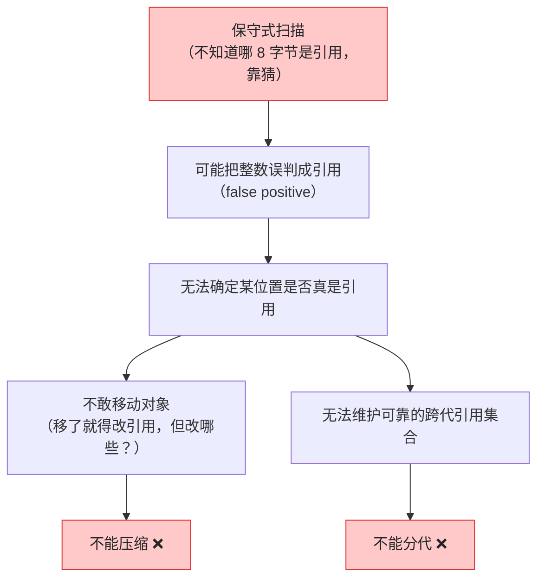
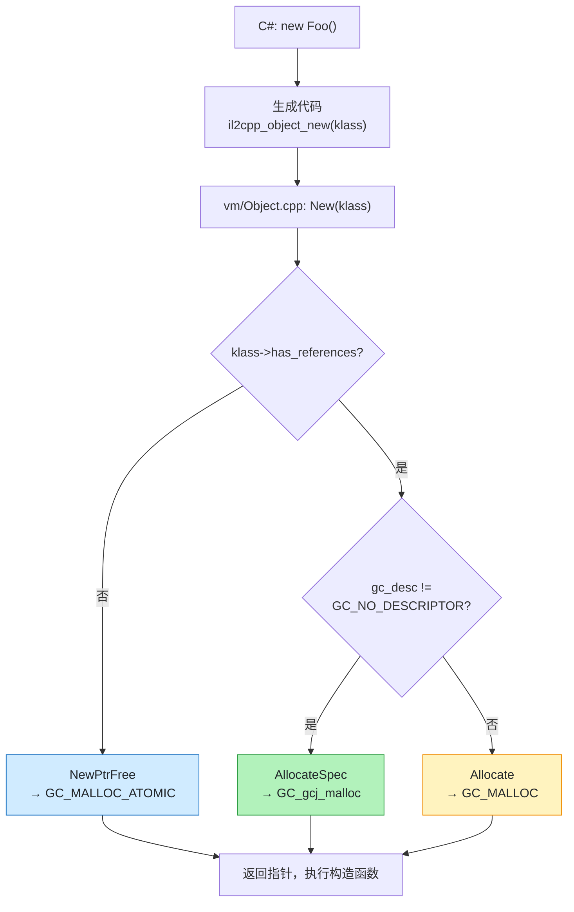
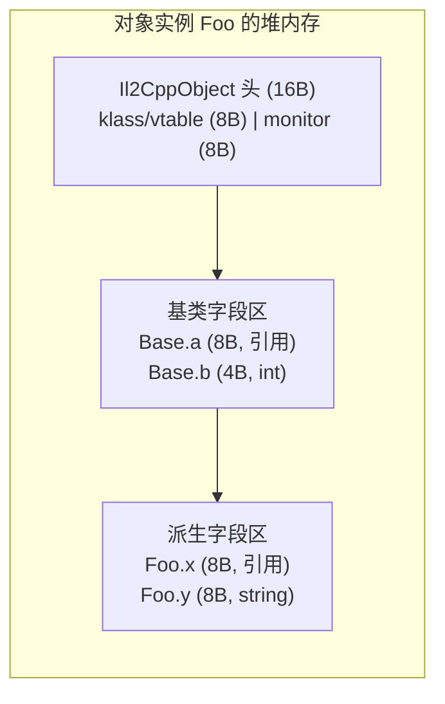

# 托管堆 GC：为什么不分代、不压缩

> 源码：`External/il2cpp/builds/libil2cpp/gc/BoehmGC.cpp` + `External/il2cpp/builds/external/bdwgc/`
> 核心：**IL2CPP 用的 Boehm 是保守式 GC——"不分代不压缩"不是偷懒，是保守式扫描的必然结果**。
> 本页行号由 `scripts/verify_srcrefs.py` 校验。

> ⚠️ **范围声明**：本篇结论全部基于 **IL2CPP 后端**（Unity 2020 LTS 打包默认后端）。
> **Mono 后端（Editor 默认）用的是 sgen，在每一个维度上结论都相反**——真分代、真移动对象、
> card table 写屏障。跨后端对比见文末，那里也讲了为什么"Editor 测着没问题、真机出事"。

## 先说人话：C# 为什么不用 free，以及代价是什么

C++ 里你 `new` 一个对象，就得记得 `delete`——忘了就是内存泄漏。
C# 换了个思路：**你只管 new，收尸的活儿交给 GC**。听着很美好，但"自动收尸"这件事
本身要付出代价，而代价的大小取决于 GC **怎么判断一块内存还有没有人用**。

判断方法只有两大类：

| 方法 | 怎么判断"还活着" | 需要什么前提 |
|---|---|---|
| **精确式**（.NET CLR、Mono sgen） | 运行时**确切知道**每个位置是不是引用，顺着引用链走 | 编译器和运行时全程保存类型信息 |
| **保守式**（IL2CPP 用的 Boehm） | **不确定就猜**：任何"看起来像堆地址"的字长都当成引用 | 不需要精确信息，能兼容 C/C++ 混合代码 |

保守式的"猜"带来一个连锁反应，这是整篇的核心因果链：



一句话：**"猜"这个决定，把"压缩"和"分代"两条优化路都堵死了。**
下面所有细节都是这条因果链的展开。

| 机制 | 本该带来的好处 | 为什么保守式用不了 |
|---|---|---|
| **压缩** | 消除碎片，分配退化成指针加法，极快 | 移动对象必须修正所有指向它的引用，但保守式不知道哪些是引用 |
| **分代** | 只扫新对象，省下全堆扫描 | 分代需要精确维护"老对象指向新对象"的集合，同样要求引用精确 |

**那 Unity 靠什么降卡顿？** 不靠上面两条，靠**增量式**（把一次长暂停切成很多小片段）
+ **写屏障**（保证切片期间标记不出错）。这两件事在下面都有专节。

## 术语先对齐

| 术语 | 一句话解释 |
|---|---|
| **托管堆** | C# 侧 `new` 出来的对象所在的堆，由 GC 管理（和引擎原生堆是两套系统） |
| **保守式 GC** | 扫描时"拿不准就当它是引用"，宁可错留不可错收 |
| **精确式 GC** | 运行时确切知道每个位置是不是引用 |
| **false positive** | 误判：一个普通整数恰好长得像堆地址，被当成引用 |
| **浮动垃圾** | 因为误判而被"假活"保留下来的垃圾对象，本轮收不掉 |
| **标记-清除** | 从根出发标记可达对象，未被标记的就是垃圾 |
| **STW** | Stop The World：GC 期间业务线程全部暂停 |
| **增量式 GC** | 把一次 GC 切成多个时间片，片间让业务线程跑一会儿 |
| **写屏障** | 业务线程改引用时通知 GC"这块变脏了"，防止漏标 |
| **三色不变式** | 增量 GC 的正确性条件：不能出现"黑对象指向白对象"且无人记录 |
| **GCJ 描述符** | Unity 给每个类编译期生成的引用位图，让**对象内部**的扫描变精确 |
| **分代** | 按存活时间分代，优先扫新对象（IL2CPP 不用） |
| **压缩** | 把存活对象挪到一起消除碎片（IL2CPP 不做） |

> 📌 **一个必要的"半精确"修正**：Unity 对 Boehm 做了工程化升级——用 **GCJ 描述符**让
> **对象内部字段精确识别**，保守的部分收缩到**栈、寄存器、静态区、string/array**。
> 所以准确的表述是：**"栈上/静态区保守 + 对象内半精确"的 GC**。
> 下文先按保守式讲因果（因为因果链是保守式决定的），机制细节见
> [IL2CPP 与 BoehmGC 的关联](#il2cpp-与-boehmgc-的关联适配层与调用链)。

## 常见误解

::: warning 误解一："Unity 的 GC 和 .NET 差不多，都是分代的，Gen0 很快"
这是**引入这一整套优化的最大障碍**。IL2CPP 后端用的 Boehm GC **既不分代也不压缩**，
"Gen0/Gen1/Gen2" 这套心智模型在这里完全不成立。
你从 .NET 那边学来的"小对象死得快所以便宜"的直觉，在真机上是错的。
:::

::: warning 误解二：不分代不压缩 = Unity 偷懒
反过来。**这是保守式的必然结果，不是选择**。
要做分代和压缩，前提是运行时能精确回答"这 8 个字节是不是引用"——
而 IL2CPP 要兼容"C# 与 C++ 混合、栈上可能有任意裸指针"的现实，
一旦选了保守式，那两条路就自动关闭了。Unity 能做的补救是**增量式 + 写屏障**。
:::

::: warning 误解三：对象内部字段也是靠猜的
不是。这是本页最容易被忽略的一层：Unity 用 **GCJ 描述符**（每个类编译期生成的引用 bitmap）
把**对象内部**的扫描变成了精确的。所以一个 `class` 里的 `int` 字段**不会**被误判成引用。
真正还在"猜"的是：**线程栈、寄存器、静态区**这几块——因为那里的字节无法在编译期定性。
:::

::: warning 误解四：Editor 里跑得挺顺，真机应该也没问题
Editor 默认走 **Mono/sgen**（真分代真压缩），真机 IL2CPP 走 **Boehm**（保守式）。
两者的性能特征和踩坑方式完全不同——**"Editor 测不出真机的 GC 问题"是字面意义上的真话**。
:::

## 这里说的"内存"不是原生堆那个内存

前面几篇讲的是**原生堆**（`UNITY_NEW` / TLSF / MemoryManager），那套内存由引擎 C++ 代码手工管理，谁分配谁释放。

本篇讲的是**托管堆**（managed heap）——C# 侧 `new` 出来的对象所在的堆，由 GC 自动回收。两者是**完全独立的两套系统**，只在几个交界处（如 `AllocateFixed`）相遇。

一个高频误解需要先破掉：

> ❌ "Unity 的 GC 和 .NET 的 GC 差不多，都是分代的，Gen0 很快"

这在 IL2CPP 后端上是**错的**。.NET CLR 的 GC 是**分代 + 压缩（compacting）**的，而 IL2CPP 用的是 **Boehm-Demers-Weiser GC（bdwgc）**，它**既不分代也不移动对象**。两者的性能模型、优化手段、踩坑方式全都不一样。

### 分代与压缩分别解决什么问题

| 机制 | 解决的问题 | 依赖的前提 |
|------|-----------|-----------|
| **分代**（generational） | 大多数对象朝生夕死 ⇒ 只扫新对象，省下全堆扫描 | 能**精确知道**哪些是跨代引用（需写屏障 + 精确类型信息） |
| **压缩**（compacting） | 消除碎片，分配退化为指针 bump，极快 | 能**移动对象**并修正所有指向它的引用（需精确知道每个引用在哪） |

两者的共同前提是 **precise GC（精确式 GC）**：运行时必须能准确回答"内存里这 8 个字节到底是不是一个对象引用"。

而 Boehm 是 **conservative GC（保守式 GC）**：它**猜**。任何看起来像堆地址的字长都被当作潜在引用。这个根本选择，直接决定了后面所有结论——也就是开头那条因果链。

## 动手体验：保守式标记-清除 GC 模拟器

> 用对象图模拟 Boehm 的标记-清除（mark-sweep）：从根引用出发标记可达对象，
> 清除阶段回收垃圾。试试打开"保守式扫描"开关——把整数误判成引用，看垃圾怎么"假活"。

<script setup>
import GcSimulator from './components/GcSimulator.vue'
</script>

<GcSimulator />

**对照源码**：模拟器里的标记阶段对应 `bdwgc/mark.c:648` 的 `GC_mark_from`；清除/归还路径对应 `bdwgc/malloc.c:562` 的 `GC_free`；增量式开关对应 `gc.h:820` 的 `GC_enable_incremental()` 与 `gc.h:395` 的 `GC_set_time_limit()`。

**增量式开关怎么玩**（勾「增量式 GC」后跑单步）：
1. **非增量 = STW**：GC 期间按钮全灰（业务线程暂停），一步一步走完再还给你
2. **增量式**：标记流程在 1/3、2/3 处出现「⏸ 时间片结束」——此刻按钮解禁（顶部出现「时间片间隙·可操作」），**点「断开一个引用」模拟业务线程跑了一帧**
3. **写屏障开**：标记开始后才死掉的对象会被重新置灰重扫 → 清除阶段正常回收（三色不变式救援）
4. **写屏障关**：同样操作下该对象已标黑不重扫 → 本轮当存活放行 = **漏标浮动垃圾**（这就是 Unity 增量 GC 必须开写屏障的原因）

### 单步学习模式（推荐）

默认开启**单步模式**：点「▶ 运行 GC」后不会自动播放，而是进入步骤面板——每步显示一句教学说明（为什么这个对象可达、为什么被回收、误判发生在哪），点「下一步 ▶」逐个执行，当前对象带蓝色高亮框，右上角显示步骤进度（如 `步骤 3/12`）。

建议学习顺序：

1. **单步模式跑一遍标记阶段**：看对象如何从 Root 沿引用链逐个被点亮（橙色）——注意 obj8 → obj2 → obj4 的环：即使成环，BFS 去重后也只会标记一次
2. **遇到 ⚠️ 误判步骤时停一下**：理解"存活对象的整数字段值恰好等于某垃圾地址"为什么会让保守式 GC 判断错误
3. **单步走清除阶段**：看每个垃圾对象被扫描判定的过程，以及浮动垃圾"看起来存活但实际是垃圾"（红框 + ⚠️ 误判存活徽标）
4. **关掉单步模式**（或点「⏩ 自动完成」）看完整动画对比；切换「保守式扫描」开关跑两遍，对比回收数量差异
5. **自己造场景**：点「+ 分配对象」加孤儿对象（无引用 → 必成垃圾）、「断开一个引用」制造新垃圾，再单步跑 GC 验证你的判断

> 单步模式的每步都是**可解释的**：标记 = 从根沿引用链传播，清除 = 未被标记即垃圾。如果你对某一步的判定有疑问，说明对象图里还有你没看懂的引用关系——这正是学习点。

## 源码三行代码定死结论

### 不分代 —— 最大代数恒为 0

```cpp
// BoehmGC.cpp:160
int32_t
il2cpp::gc::GarbageCollector::GetMaxGeneration()
{
    return 0;
}
```

这是硬编码的 `return 0`，不是运行时算出来的。C# 侧 `GC.MaxGeneration` 拿到的就是它。

推论：`GC.Collect(0)`、`GC.Collect(1)`、`GC.Collect(2)` 在 IL2CPP 下**行为完全相同**，都是一次全堆回收。代码里写 `GC.Collect(0)` 期望"只收 Gen0、开销小"是**无效优化**。

### 不移动 —— 官方注释直说

```cpp
// BoehmGC.cpp:393
void*
il2cpp::gc::GarbageCollector::AllocateFixed(size_t size, void *descr)
{
    // Note that we changed the implementation from mono.
    // In our case, we expect that
    // a) This memory will never be moved
    // b) This memory will be scanned for references
    // c) This memory will remain 'alive' until explicitly freed
    // GC_MALLOC_UNCOLLECTABLE fulfills all these requirements
```

理由 a) **This memory will never be moved** 是作为**既定事实**陈述的。

推论：`GCHandle.Alloc(obj, GCHandleType.Pinned)` 在 IL2CPP 下的"钉住"语义近乎免费——对象本来就不会动。但**不要因此就滥用 pinned handle**，它仍有句柄表开销，且会让代码在 Mono 后端上产生完全不同的成本。

### 保守式扫描的开关

```cpp
// BoehmGC.cpp:93
    // This tells the GC that we are not scanning dynamic library data segments and that
    // the GC tracked data structures need ot be manually pushed and marked.
    // Call this before GC_INIT since the initialization logic uses this value.
    GC_set_no_dls(1);
```

`no_dls` = no dynamic library data segments。Unity 关掉了 bdwgc 对动态库数据段的自动扫描，改为手动 push 根。这是对保守式扫描范围的**收窄优化**，但不改变"栈和寄存器仍然是保守扫描"的本质。

## IL2CPP 与 BoehmGC 的关联：适配层与调用链

> 直接回答三个问题：**① Unity 源码树里到底有没有 GC 代码？② Boehm 是怎么"接"进 IL2CPP 的？③ .NET 的 GC 和它有什么本质区别？**

### ① 源码在哪：引擎没有，但 IL2CPP 目录里有完整两套

> **名词澄清**：Boehm = Boehm-Demers-Weiser GC（算法/作者名），bdwgc = 它的开源仓库名，libgc = 它的库链接名——**是同一个实现**。Unity 里 `gc/BoehmGC.cpp`（适配层）和 `external/bdwgc/`（本体）是同一套东西的两面。

| 位置 | 内容 | 说明 |
|---|---|---|
| `Runtime/`（引擎本体） | ❌ **没有 GC 实现** | 引擎 C++ 不管托管堆——托管内存是脚本运行时的事 |
| `External/il2cpp/builds/libil2cpp/gc/` | ✅ **GC 适配层**（13 个文件） | `BoehmGC.cpp`（Boehm 适配）、`GarbageCollector.cpp`（il2cpp 自己的 GC 接口）、`GCHandle.cpp`、`WriteBarrier.cpp`、`NullGC.cpp`（无 GC 后端） |
| `External/il2cpp/builds/external/bdwgc/` | ✅ **Boehm 本体完整源码**（33 个 .c） | `alloc.c` / `mark.c` / `reclaim.c` / `blacklst.c` / `backgraph.c` 等——**这就是那个"猜指针"的 GC 的全部实现** |
| `External/MonoBleedingEdge/` | ❌ **0 个 .c 文件** | Mono 只有预编译产物（builds.7z），无 C 源码——所以 Mono 侧结论只能靠产物证据（见后文） |

### ② 怎么接进去的：编译期宏 + 适配层接口

```cpp
// libil2cpp/il2cpp-config.h:189
#define IL2CPP_GC_BOEHM 1
#define IL2CPP_GC_NULL !IL2CPP_GC_BOEHM
```

**GC 后端是编译期选定的**（Unity 2020 这版构建选 Boehm），不是运行时开关。选 Boehm 时，`gc/BoehmGC.cpp` 被编译，它把 il2cpp 的 GC 抽象接口逐一映射到 bdwgc API：

| il2cpp 接口（GarbageCollector.h） | BoehmGC.cpp 实现 | bdwgc API |
|---|---|---|
| `Allocate(size)` | `return GC_MALLOC(size)` | 保守分配 |
| `AllocateFixed(size, descr)` | `return GC_MALLOC_UNCOLLECTABLE(size)` | 不回收内存（Pinned） |
| `FreeFixed(addr)` | `GC_FREE(addr)` | 手动释放 |
| `Collect(maxGeneration)` | `GC_gcollect()` | 全堆回收 |
| `StartIncrementalCollection()` | `GC_enable_incremental()` | 增量模式 |
| `MakeDescriptorForObject(bitmap, numbits)` | `GC_make_descriptor(...)` | GCJ 描述符 |

### ③ 一次 C# `new` 的完整 GC 路径



三条分支各是什么（对照源码）：

| 分支 | 条件 | 走哪条 GC 接口 | 扫描方式 |
|---|---|---|---|
| **NewPtrFree** | `klass->has_references == false` | `GC_MALLOC_ATOMIC` | Boehm **完全不扫描**这个对象（里面确定没有引用） |
| **AllocateSpec** | 有引用，且 `gc_desc != GC_NO_DESCRIPTOR` | `GC_gcj_malloc` | **GCJ 描述符模式**：对象内部的引用被**精确**识别 |
| **Allocate** | 有引用，但没有描述符 | `GC_MALLOC` | 保守模式：整个对象当字节流扫，可能误判 |

入口链路：`C# new Foo()` → 生成代码调用 `il2cpp_object_new(klass)`（`libil2cpp/il2cpp-api.cpp:1033`）
→ `vm/Object.cpp: New(klass)` 里按上表三分支（`vm/Object.cpp:285-310`）。

### ④ 关键深化：GCJ 描述符 = "半精确" GC

这是 Unity 对 Boehm 最值的工程化改造——**不是完全靠猜**：

```cpp
// vm/Class.cpp:1960 SetupGCDescriptor —— 每个类初始化时
void SetupGCDescriptor(Il2CppClass* klass)
{
    GetBitmapNoInit(klass, bitmap, maxSetBit, 0);   // 遍历字段，标记哪些 offset 是引用
    if (klass == il2cpp_defaults.string_class)
        klass->gc_desc = MakeDescriptorForString();            // string → 无描述符（保守）
    else if (klass->rank)
        klass->gc_desc = MakeDescriptorForArray();             // array → 无描述符（保守）
    else
        klass->gc_desc = MakeDescriptorForObject(bitmap, (int)maxSetBit + 1);
}

// gc/BoehmGC.cpp:350
void* GarbageCollector::MakeDescriptorForObject(size_t *bitmap, int numbits)
{
    if (numbits >= 30)                    // bitmap 超过 30 位装不下 → 退回保守
        return GC_NO_DESCRIPTOR;
    return (void*)GC_make_descriptor((GC_bitmap)bitmap, numbits);  // GCJ bitmap 描述符
}
```

含义：

- **普通对象**：编译期生成引用 bitmap（哪个字段偏移是引用）→ `GC_gcj_malloc` 精确标记——**这类对象内部不会误判**；
- **string / array**：无描述符 → 保守扫描（内容可能被误判）——这就是为什么"整数字段恰好等于某地址"的 false positive 仍然存在；
- **bitmap > 30 位**（字段太多的对象）：退回保守；
- **栈、寄存器、静态区**：永远保守（无类型信息）。

所以之前所有"保守式"结论的正确边界是：**对象内引用"半精确"（GCJ 描述符），根集合（栈/寄存器/静态区）与 string/array 内容"保守"**。不分代、不压缩的结论不变——因为根集合和未覆盖对象仍是保守的，移动对象依然危险。

### ⑤ 深挖：bitmap 是怎么来的（顺序要求与对象布局）

`SetupGCDescriptor` 不是随便生成 bitmap 的——**它要求字段布局先就绪**，且 bitmap 与内存布局严格一一对应：

```
数据流：metadata 字段表 → SetupFields 填 field->offset → GetBitmapNoInit 按 offset 置位 → GC_make_descriptor → klass->gc_desc
```

**对象实例布局**（64 位，对象头 16 字节）：



**引用 bitmap 语义**（`set_bit(bitmap, offset / sizeof(void*))`，Class.cpp:1905）——每个 bit = 对象里一个 8 字节 word：

```
word:     0     1     2     3     4     5
        ┌─────┬─────┬─────┬─────┬─────┬─────┐
        │head │head │a    │b    │x    │y    │
        │klass│mon. │(ref)│(int)│(ref)│(ref)│
        └─────┴─────┴─────┴─────┴─────┴─────┘
bit:      0     1     1     0     1     1      → GC_make_descriptor(0b110110)
```

**顺序要求（三条硬依赖）**：

1. **bitmap 位 = 绝对 offset/8**——offset 由 `SetupFields` 从 metadata 填入（Class.cpp:823 `field->offset = fieldOffsets[fieldIndex]`）。SetupGCDescriptor 调用点（Class.cpp:1485）在 SetupFields（308 行）之后，**字段布局没就绪 bitmap 全错**；
2. **struct 字段递归**（Class.cpp:1934）：遇到 `VALUETYPE` 字段要 `Class::Init(fieldClass)` **递归进 struct 内部**把引用字段也置位——被递归的 struct 类必须先初始化（否则查不到 `has_references`）；
3. **遍历 = 当前类 → parent 链向上**（Class.cpp:1873-1928），但置位用绝对偏移——**bitmap 与内存布局严格一一对应**，字段声明顺序/继承顺序改变会直接改 bitmap 值。

**Il2CppClass（klass）是什么**：整个类型的运行时"总台账"（il2cpp-class-internals.h:388，注释明确分两段）：

- **Always valid（身份段）**：`image / name / namespace / parent / gc_desc / klass(自指针 hack)`——构造即用；
- **需 Init（布局/行为段）**：`fields[] / methods[] / properties[] / implementedInterfaces[] / static_fields / rgctx_data / typeHierarchy`——Class::Init 逐个填；
- **实例数据**：`instance_size / actualSize / element_size / static_fields_size / flags / token / field_count`。

谁都在用它：**分配**（Object.cpp 查 `instance_size`/`has_references`/`gc_desc` 走三分支）、**方法调用**（vtable）、**类型检查**（parent/typeHierarchy）、**GC**（gc_desc）、**泛型**（generic_class/rgctx_data）。**klass 是 C# 类型在 IL2CPP 世界里的化身**。


## 那 Unity 靠什么降卡顿？—— 增量式

既然分代这条路被堵死，Unity 走的是**增量式（incremental）**：把一次长 GC 切成多个 ≤3ms 的小步，摊到多帧完成。

```
Player Settings 勾选 "Use Incremental GC"
   │  BuildPostProcessor.cs:1414-1415
   ▼
libsuffix += "-wbarriers"              ← 链接期换库，不是运行时开关！
   │  iOSSupport.cs:646
   ▼
选中 LibIl2CppNet40WithWriteBarriers 变体
   │  libil2cpp.jam.cs:272-273
   ▼
-DIL2CPP_ENABLE_WRITE_BARRIERS=1  +  -DIL2CPP_INCREMENTAL_TIME_SLICE=3
   │  BoehmGC.cpp:103-108
   ▼
GC_enable_incremental()  +  GC_set_time_limit(3ms)
```

```cpp
// BoehmGC.cpp:103
#if IL2CPP_ENABLE_WRITE_BARRIERS
    GC_enable_incremental();
#if IL2CPP_INCREMENTAL_TIME_SLICE
    GC_set_time_limit(IL2CPP_INCREMENTAL_TIME_SLICE);
#endif
#endif
```

```csharp
// BuildPostProcessor.cs:1409（iOS/Android 打包脚本）
var level = PlayerSettings.GetApiCompatibilityLevel(bs.targetGroup);
if (level == ApiCompatibilityLevel.NET_4_6 || level == ApiCompatibilityLevel.NET_Standard_2_0)
{
    libsuffix += "-net40";
    if (PlayerSettings.gcWBarrierValidation || PlayerSettings.gcIncremental)
        libsuffix += "-wbarriers";
}
```

这段代码有**两个容易被忽略的关键信息**：

1. **写屏障默认是关的，且是链接期决定的。** 5 个 libil2cpp 变体里只有 2 个带写屏障。不勾 Incremental GC，链接的就是不带屏障的 `.a`，`SetWriteBarrier` 编译期就不存在，**零运行时开销**。这不是 if 判断能省的那种"零开销"，是代码根本没编译进去。
2. **`.NET 3.5` 兼容级别下增量 GC 根本不可用。** 上面那段在 `level == NET_4_6 || NET_Standard_2_0` 的 if 里。老项目卡在 .NET 3.5 的话，勾了 Incremental GC 也没用。

## 写屏障：标记到一半时被改了怎么办

增量式 GC 的正确性依赖写屏障——标记进行到一半时，如果业务代码改了对象引用，必须告诉 GC "这块变脏了，重新扫"。

### 调用链：从高频宏到脏位

```
IL2CPP_OBJECT_SETREF(obj, field, value)          ← 生成代码里的高频宏
  → il2cpp_gc_wbarrier_set_field()                 il2cpp-api.cpp:786
        *targetAddress = object;                   ← 先写值
        GarbageCollector::SetWriteBarrier(...)     ← 后标记（顺序不可反）
  → GC_END_STUBBORN_CHANGE(ptr)                    BoehmGC.cpp:205
  → GC_end_stubborn_change(p)                      mallocx.c:614
  → GC_dirty(p)                                    gc_priv.h:2196
  → async_set_pht_entry_from_index(GC_dirty_pages, PHT_HASH(p))
```

```cpp
// il2cpp-api.cpp:786
void il2cpp_gc_wbarrier_set_field(Il2CppObject *obj, void **targetAddress, void *object)
{
    *targetAddress = object;
    GarbageCollector::SetWriteBarrier(targetAddress);
}
```

**写在前、标记在后**。反过来会有竞态：标记完到写入之间若发生 GC，这次修改就漏标了。

### 双重门控：编译期 + 运行期

```c
// gc_priv.h:2196
# define GC_dirty(p) (GC_incremental ? GC_dirty_inner(p) : (void)0)
```

即使编译进了写屏障（变体选对了），`GC_incremental` 为 false 时仍是**纯 no-op**。所以真正生效需要：**链接带屏障的变体** ∧ **运行时 `GC_enable_incremental()` 已调用**。

### 粒度是页，不是卡片，更不是字段

Unity 对 bdwgc 做了一处关键改动——无条件启用 `MANUAL_VDB`：

```c
// gcconfig.h:28
#define MANUAL_VDB
```

这个顶层定义会把其它所有脏页检测方案全部 undef 掉。bdwgc 自己的注释解释了语义：

```
 * MANUAL_VDB:  Stacks and static data are always considered dirty.
 *              Heap pages are considered dirty if GC_dirty(p) has been
 *              called on some pointer p pointing to somewhere inside
 *              an object on that page.  A GC_dirty() call on a large
 *              object directly dirties only a single page, but for
 *              MANUAL_VDB we are careful to treat an object with a dirty
 *              page as completely dirty.
```

**关键：一个页脏 ⇒ 整个对象视为全脏。** 粒度是 `HBLKSIZE`（页），不是 CLR/sgen 那种 card table 的卡片粒度。

这正好解释了一个看起来像 bug 的地方——`SetWriteBarrier` 收了 `size` 却不用：

```cpp
// GarbageCollector.cpp:333
#if IL2CPP_ENABLE_WRITE_BARRIERS
    void il2cpp::gc::GarbageCollector::SetWriteBarrier(void **ptr, size_t size)
    {
#if IL2CPP_ENABLE_STRICT_WRITE_BARRIERS
        for (size_t i = 0; i < size / sizeof(void**); i++)
            SetWriteBarrier(ptr + i);
#else
        SetWriteBarrier(ptr);
#endif
    }
```

`IL2CPP_ENABLE_STRICT_WRITE_BARRIERS` 在全 il2cpp 树里**只有两处 `#if` 引用、零处 `#define`**（rg 全树交叉验证）。⇒ 那个 for 循环是**死代码**，实际永远只置第一个指针所在页的脏位。⇒ 因为页级粒度下整个对象已被视为全脏，这么做**是正确的**，不是 bug。

### 历史包袱：借尸还魂的 stubborn API

调用链里那个 `GC_end_stubborn_change` 名字很怪，因为它是 bdwgc 上游**已废弃**的 API：

```c
// mallocx.c:604
GC_API void * GC_CALL GC_malloc_stubborn(size_t lb)   { return GC_malloc(lb); }
GC_API void GC_CALL GC_change_stubborn(const void *p) { /* Empty. */ }
GC_API void GC_CALL GC_end_stubborn_change(const void *p)
{
    GC_dirty(p); /* entire object */
}
```

`gc.h:520` 注释明说 *"The 'stubborn' objects allocation is not supported anymore"*。`GC_malloc_stubborn` 直接转发、`GC_change_stubborn` 是空函数——**只有 `GC_end_stubborn_change` 还有实现，Unity 借这个废弃 API 的壳来实现写屏障**。

## 实战注意点

### 无效的"优化"

| 写法 | 在 IL2CPP 下的真实效果 |
|------|----------------------|
| `GC.Collect(0)` 想只收 Gen0 | ❌ 与 `GC.Collect()` 完全等价，全堆回收 |
| 依赖 `GC.MaxGeneration` 做分代逻辑 | ❌ 恒为 0 |
| 为"避免对象晋升到老年代"而做对象复用 | ⚠️ 动机是错的（没有代），但**结论仍对**——减少分配本身就有价值 |
| 用 pinned handle "防止对象被移动" | ⚠️ IL2CPP 下对象本就不动；但 Mono 后端会动，跨后端代码仍需 pin |

### 真正有效的手段

1. **减少分配频率**（唯一的根本手段）——对象池、避免装箱、避免闭包捕获、`struct` + `in`/`ref` 传参、字符串拼接用 `StringBuilder`
2. **开 Incremental GC** 把长停顿摊成 ≤3ms 的小步（注意 .NET 4.x 兼容级别前提）
3. **警惕碎片**——不压缩意味着碎片**永久存在**。长时间运行 + 大对象频繁分配释放会导致堆持续膨胀（"堆只涨不缩"的常见成因）
4. **`GC.Collect()` 的时机**——放在场景切换/加载屏这类用户感知不到的点

### 增量式 GC 的代价

不是白拿的：

- **写屏障开销**：每次引用赋值多一次函数调用 + 脏位设置（虽然很轻）
- **总吞吐下降**：分多次做的总开销高于一次做完
- **浮动垃圾**：增量期间变成垃圾的对象，本轮可能收不掉，要等下一轮

对**帧率敏感**的游戏值得开；对**总耗时敏感**的场景（如加载期批处理）可能反而不划算。

## Mono 后端对比：结论完全相反

> 🔴 **以上所有结论仅对 IL2CPP 后端成立。Mono 后端（sgen）在每一个维度上都相反。**

Unity 检出树里没有 Mono 的 C 源码（`External/MonoBleedingEdge/` 只有预编译产物 + 公开头文件），但有三条产物级证据链可以独立复现：

**Q1：用的是 sgen，不是 boehm** —— `versions-{platform}.txt` 第 12 行均为 `GC: sgen (concurrent by default)`；树内二进制实测 `mono --version` 同样输出。

**Q2：真分代 + 真移动对象** —— `GC.MaxGeneration` 实测 = 1（IL2CPP 恒为 0）；二进制内嵌串 `copy_object_no_checks`、`!SGEN_OBJECT_IS_FORWARDED`、`evacuation-threshold=P`——copy + forwarded（转发指针）+ evacuate（疏散）三件套齐全 = 典型移动式 GC。

**Q3：card table，不是页级脏位** —— 存在 JIT 写屏障操作码 `OP_CARD_TABLE_WBARRIER`，且 `strings | grep WBARRIER` 全量结果里没有 remset 专用 opcode。

### 对比表

| 维度 | IL2CPP（Boehm/bdwgc） | Mono（sgen） |
|---|---|---|
| GC 实现 | Boehm 保守式 | sgen（concurrent by default） |
| 是否分代 | ❌ 否，`GetMaxGeneration()` 恒 0 | ✅ 是，实测 `GC.MaxGeneration == 1` |
| 是否移动对象 | ❌ 否，"never be moved" | ✅ 是（copy / forwarding pointer / evacuate） |
| 写屏障机制 | MANUAL_VDB 页级脏位 | card table（JIT `OP_CARD_TABLE_WBARRIER`） |
| 屏障粒度 | 页（`HBLKSIZE`） | 卡片（上游 Mono 通常是 512B，本树无法证实） |
| 证据强度 | 源码行号（17 处实测） | 产物级（版本文件行号 + 二进制符号 + 运行实测） |

### 这个差异对写代码意味着什么

| 场景 | IL2CPP | Mono |
|---|---|---|
| `GC.Collect(0)` | 与全堆回收等价，无意义 | 真的只收 nursery，**有意义** |
| `GC.MaxGeneration` 分支逻辑 | 恒 0，分支永远走同一边 | 为 1，两边都可能走 |
| pinned `GCHandle` | 对象本就不动，近乎免费 | **真的在阻止移动，有实际成本** |
| 长期运行的碎片 | ❌ 不压缩，碎片永久累积 | ✅ 移动式回收会整理 |
| 写屏障开销 | 仅在开 Incremental GC 时存在 | **常驻**（JIT 恒发射 card 标记） |

**⚠️ 最危险的是跨后端假设**：在 Editor（Mono）里测出来没问题的 GC 行为，到真机（IL2CPP）上可能完全不同——尤其是**碎片累积**和 `GC.Collect(0)` 这两项。Editor 下 sgen 会帮你整理碎片，真机上 Boehm 不会。

### .NET CoreCLR：第三种后端（平时说的 ".NET GC" 是它）

> 玩家设备上的 Unity 游戏跑的是 Boehm；PC 上的 .NET 应用（以及 Unity 未来可能切换的 NativeAOT/自定义后端）跑的是 **CoreCLR GC**——**这才是大多数 .NET 文档讲的"分代 GC"**。三端对比：

| 维度 | Unity IL2CPP（Boehm/bdwgc） | Unity Mono（sgen） | .NET CoreCLR |
|---|---|---|---|
| 精确性 | **半精确**：GCJ 描述符管对象内，栈/静态区/string/array 保守 | **完全精确**（JIT 报告栈帧引用） | **完全精确**（JIT 报告栈帧引用） |
| 分代 | ❌ 不分代，`GetMaxGeneration()`=0 | ✅ 2 代（nursery + major） | ✅ 3 代（gen0/1/2）+ LOH（大对象堆，≥85,000B） |
| 是否移动/压缩 | ❌ 不移动 | ✅ nursery 复制（copying） | ✅ gen0/1 压缩（plan → relocate → compact）；LOH 不压缩（代价高） |
| 分配 | GC_MALLOC（位图查找） | nursery bump 指针（快） | bump 指针 + 分配量子（8k quantum，无锁） |
| 写屏障 | MANUAL_VDB 页级脏位（仅增量时） | card table（JIT 常驻） | **card table**（JIT 常驻，标记跨代引用） |
| 并发/后台 GC | 增量式（3ms 时间片） | concurrent（by default） | 后台 GC（WKS/SVR 两种模式） |
| 触发方式 | 分配/手动 Collect | 分配/手动 Collect | 分配预算超限（allocation budget） |
| 浮点垃圾 | 增量期有 | concurrent 期有 | 后台 GC 期有 |

要点（对齐 CoreCLR 官方设计文档 [garbage-collection.md](https://github.com/dotnet/runtime/blob/main/docs/design/coreclr/botr/garbage-collection.md)）：

- **分代是为了"只收一部分"**：收集 gen0 只需看卡表标记的跨代引用 + 根，不用全堆扫——这是 Boehm 做不到的（它没有可靠的跨代引用集合）；
- **压缩是为了分配快**：gen0 压缩后空闲区连续，分配退化为 bump 指针 + 8KB quantum 无锁分配（CoreCLR 文档 "Efficient locking" 一节）——Boehm 的 GC_MALLOC 要走位图/空闲链表；
- **LOH 不压缩**（≥85KB 对象）：移动大对象太贵，用独立的代 + 非压缩回收——这跟 Boehm 的"大对象不移动"理由同源（移动成本高），但 CoreCLR 是**主动设计选择**，Boehm 是**保守扫描的被迫**。

**一句话**：.NET 的 GC 是"精确 + 分代 + 压缩"的集大成者，Unity IL2CPP 的 Boehm 是"半精确 + 不分代 + 不压缩"的保守派，Mono sgen 夹在中间（精确 + 分代 + nursery 复制）。三者性能模型完全不同，**用 .NET 的 GC 知识套 Unity IL2CPP 会得出错误结论**。

## 文献与参考来源

### 外部文献（URL 已验证可访问）

| 文献 | 说明 |
|---|---|
| [CoreCLR Garbage Collection Design（Maoni Stephens, 2015）](https://github.com/dotnet/runtime/blob/main/docs/design/coreclr/botr/garbage-collection.md) | .NET GC 官方设计文档：分代/卡表/压缩/WKS·SVR/后台 GC 全流程 |
| [Mono SGen Generational GC（官方文档）](https://www.mono-project.com/docs/advanced/garbage-collector/sgen) | sgen 的 nursery（默认 4MB，可用 `MONO_GC_PARAMS` 调）、分代、并发机制 |
| [Mono 构建选项（README）](https://github.com/mono/mono) | `--with-sgen` / `--with-libgc`：Mono 历史上同时支持 Boehm 与 sgen 两种后端（`mono-boehm` / `mono-sgen` 两个二进制） |
| [bdwgc 官方仓库（ivmai/bdwgc）](https://github.com/ivmai/bdwgc) | Boehm-Demers-Weiser GC 本体：`alloc.c`/`mark.c`/`reclaim.c` 等源码 + 论文（doc/） |
| Boehm & Weiser, *Garbage Collection in an Uncooperative Environment* (1988) | 保守式 GC 奠基论文（ACM 原文 403 反爬，可经 bdwgc 仓库 doc/ 或学校镜像获取） |
| *The Garbage Collection Handbook* (Jones, Hosking, Moss) | GC 领域标准参考书（CoreCLR 官方文档也推荐） |
| *Pro .NET Memory Management* (Maoni Stephens) | .NET GC 实操向权威书（CoreCLR 官方文档推荐） |

### 本地源码路径索引（Unity 2020 LTS）

| 路径 | 内容 |
|---|---|
| `External/il2cpp/builds/libil2cpp/il2cpp-config.h:189` | `IL2CPP_GC_BOEHM 1` 编译期选后端 |
| `External/il2cpp/builds/libil2cpp/gc/` | GC 适配层：BoehmGC.cpp / GarbageCollector.cpp / GCHandle.cpp / WriteBarrier.cpp / NullGC.cpp |
| `External/il2cpp/builds/libil2cpp/vm/Object.cpp:285-310` | 分配三分支（NewPtrFree / AllocateSpec / Allocate） |
| `External/il2cpp/builds/libil2cpp/vm/Class.cpp:1960` | SetupGCDescriptor：每类生成引用 bitmap |
| `External/il2cpp/builds/libil2cpp/gc/BoehmGC.cpp:350` | MakeDescriptorForObject → GC_make_descriptor |
| `External/il2cpp/builds/libil2cpp/il2cpp-api.cpp:1033` | il2cpp_object_new 生成代码入口 |
| `External/il2cpp/builds/external/bdwgc/` | Boehm 本体（alloc.c / mark.c / reclaim.c / blacklst.c ... 33 个 .c） |
| `External/MonoBleedingEdge/` | Mono 预编译产物（**无 C 源码**） |

## 证据索引（行号已实测复验）

| 结论 | 文件 | 行号 |
|------|------|------|
| 最大代数恒 0 | `libil2cpp/gc/BoehmGC.cpp` | 160-164 |
| 内存永不移动 | `libil2cpp/gc/BoehmGC.cpp` | 398 |
| 关闭动态库段扫描 | `libil2cpp/gc/BoehmGC.cpp` | 96 |
| 启用增量 GC | `libil2cpp/gc/BoehmGC.cpp` | 104 |
| 时间片 3ms | `libil2cpp/gc/BoehmGC.cpp` | 106 |
| 屏障入口（带 size，size 被忽略） | `libil2cpp/gc/GarbageCollector.cpp` | 334-342 |
| 写序：先写值后标记 | `libil2cpp/il2cpp-api.cpp` | 786-790 |
| STRICT 屏障零定义（死代码） | 全 `External/il2cpp/` 树 | 仅 2 处 `#if`，0 处 `#define` |
| MANUAL_VDB 顶层定义 | `bdwgc/include/private/gcconfig.h` | 28 |
| GC_dirty 双重门控 | `bdwgc/include/private/gc_priv.h` | 2196 |
| stubborn API 借壳 | `bdwgc/mallocx.c` | 604-617 |
| 勾选项 → 换库 | `BuildPostProcessor.cs` | 1414-1415 |
| 编译期选 Boehm 后端 | `libil2cpp/il2cpp-config.h` | 189-190 |
| GC 描述符生成 | `libil2cpp/vm/Class.cpp` | 1960-1980 |
| 分配三分支（描述符/原子/保守） | `libil2cpp/vm/Object.cpp` | 285-310 |
| GCJ 描述符 → bdwgc | `libil2cpp/gc/BoehmGC.cpp` | 350-362 |
| 对象分配 C API 入口 | `libil2cpp/il2cpp-api.cpp` | 1033 |

**踩过的坑（自我修正记录）**：

1. 曾误判 "bdwgc 本体不在源码树"——只查了 `External/` 顶层和 `libil2cpp/gc/` 就下结论。实际在 `External/il2cpp/builds/external/bdwgc/`，**174 个 .c/.h 完整源码**。→ 教训：零命中 ≠ 不存在，必须换路径交叉验证。
2. bdwgc 的 `gc.h:384-386` 注释提到 "leaving generational collection enabled"——这是**上游文档遗留**，与 Unity 这版实现矛盾（`GetMaxGeneration()` 恒 0）。→ 教训：**注释与实现冲突时信实现**。

## 自检清单

读完本篇，你应该能回答（答不上来的回去看对应小节）：

- [ ] 保守式 GC 的"保守"具体保守在哪一步？它宁可犯哪种错？
- [ ] 为什么"不能移动对象"会连带导致"不能分代"？（提示：跨代引用集合）
- [ ] 什么叫"浮动垃圾"？它是在标记阶段还是清除阶段产生的？
- [ ] GCJ 描述符让哪一部分的扫描变精确了？哪一部分仍然是保守的？
- [ ] 增量式 GC 把长暂停切成了什么？代价是什么？
- [ ] 写屏障要防的那个错误场景，用三色不变式怎么描述？
- [ ] 为什么"Editor 里不卡"不能推出"真机也不卡"？
- [ ] 你写代码时**真正有效**的减 GC 手段有哪些？（对照"实战注意点"里的无效优化清单）

## 延伸阅读

- [AtomicStack：无锁栈](./atomic-stack) — 为什么"托管堆的 GC 是天然的 ABA 防护"
- [TLSF：两级分割适应算法](./tlsf) — 原生堆侧的碎片治理，与托管堆形成对照
- [一次分配的完整旅程](./allocator-journey) — 原生堆的分配全流程
