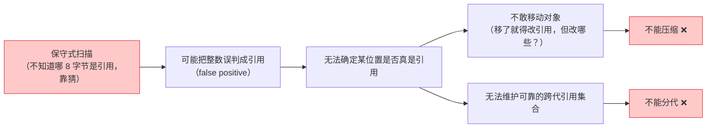

# 托管堆 GC：为什么不分代、不压缩

> 源码：`External/il2cpp/builds/libil2cpp/gc/BoehmGC.cpp` + `External/il2cpp/builds/external/bdwgc/`
> 核心：**IL2CPP 用的 Boehm 是保守式 GC——"不分代不压缩"不是偷懒，是保守式扫描的必然结果**。

> ⚠️ **范围声明**：本篇结论全部基于 **IL2CPP 后端**（Unity 2020 LTS 打包默认后端）。
> **Mono 后端（Editor 默认）用的是 sgen，在每一个维度上结论都相反**——真分代、真移动对象、
> card table 写屏障。跨后端对比见文末，那里也讲了为什么"Editor 测着没问题、真机出事"。

## 这里说的"内存"不是原生堆那个内存

前面几篇讲的是**原生堆**（`UNITY_NEW` / TLSF / MemoryManager），那套内存由引擎 C++ 代码手工管理，谁分配谁释放。

本篇讲的是**托管堆**（managed heap）——C# 侧 `new` 出来的对象所在的堆，由 GC 自动回收。两者是**完全独立的两套系统**，只在几个交界处（如 `AllocateFixed`）相遇。

一个高频误解需要先破掉：

> ❌ "Unity 的 GC 和 .NET 的 GC 差不多，都是分代的，Gen0 很快"

这在 IL2CPP 后端上是**错的**。.NET CLR 的 GC 是**分代 + 压缩（compacting）**的，而 IL2CPP 用的是 **Boehm-Demers-Weiser GC（bdwgc）**，它**既不分代也不移动对象**。两者的性能模型、优化手段、踩坑方式全都不一样。

### 分代与压缩分别解决什么问题

| 机制 | 解决的问题 | 依赖的前提 |
|------|-----------|-----------|
| **分代**（generational） | 大多数对象朝生夕死 ⇒ 只扫新对象，省下全堆扫描 | 能**精确知道**哪些是跨代引用（需写屏障 + 精确类型信息） |
| **压缩**（compacting） | 消除碎片，分配退化为指针 bump，极快 | 能**移动对象**并修正所有指向它的引用（需精确知道每个引用在哪） |

两者的共同前提是 **precise GC（精确式 GC）**：运行时必须能准确回答"内存里这 8 个字节到底是不是一个对象引用"。

而 Boehm 是 **conservative GC（保守式 GC）**：它**猜**。任何看起来像堆地址的字长都被当作潜在引用。这个根本选择，直接决定了后面所有结论。

```
保守式扫描 ⇒ 可能把一个整数误判成引用（false positive）
          ⇒ 无法确定某个位置到底是不是引用
          ⇒ 不敢移动对象（移了就得改引用，但不确定哪些是引用）
          ⇒ 不能压缩 ❌
          ⇒ 也难以维护可靠的跨代引用集合
          ⇒ 不能分代 ❌
```



**"不分代不压缩"不是 Unity 偷懒，是保守式 GC 的必然结果。**

## 🧪 动手体验：保守式标记-清除 GC 模拟器

> 用对象图模拟 Boehm 的标记-清除（mark-sweep）：从根引用出发标记可达对象，
> 清除阶段回收垃圾。试试打开"保守式扫描"开关——把整数误判成引用，看垃圾怎么"假活"。

<script setup>
import GcSimulator from './components/GcSimulator.vue'
</script>

<GcSimulator />

**对照源码**：模拟器里的标记阶段对应 `bdwgc/mark.c` 的 `GC_mark_from`，清除阶段对应 `alloc.c` 的 `GC_free` 扫描回收；增量式开关对应 `GC_enable_incremental()` + `GC_set_time_limit(3ms)`。

### 单步学习模式（推荐）

默认开启**单步模式**：点「▶ 运行 GC」后不会自动播放，而是进入步骤面板——每步显示一句教学说明（为什么这个对象可达、为什么被回收、误判发生在哪），点「下一步 ▶」逐个执行，当前对象带蓝色高亮框，右上角显示步骤进度（如 `步骤 3/12`）。

建议学习顺序：

1. **单步模式跑一遍标记阶段**：看对象如何从 Root 沿引用链逐个被点亮（橙色）——注意 obj8 → obj2 → obj4 的环：即使成环，BFS 去重后也只会标记一次
2. **遇到 ⚠️ 误判步骤时停一下**：理解"存活对象的整数字段值恰好等于某垃圾地址"为什么会让保守式 GC 判断错误
3. **单步走清除阶段**：看每个垃圾对象被扫描判定的过程，以及浮动垃圾"看起来存活但实际是垃圾"（红框 + ⚠️ 误判存活徽标）
4. **关掉单步模式**（或点「⏩ 自动完成」）看完整动画对比；切换「保守式扫描」开关跑两遍，对比回收数量差异
5. **自己造场景**：点「+ 分配对象」加孤儿对象（无引用 → 必成垃圾）、「断开一个引用」制造新垃圾，再单步跑 GC 验证你的判断

> 单步模式的每步都是**可解释的**：标记 = 从根沿引用链传播，清除 = 未被标记即垃圾。如果你对某一步的判定有疑问，说明对象图里还有你没看懂的引用关系——这正是学习点。

## 源码三行代码定死结论

### 不分代 —— 最大代数恒为 0

```cpp
// BoehmGC.cpp:160
int32_t
il2cpp::gc::GarbageCollector::GetMaxGeneration()
{
    return 0;
}
```

这是硬编码的 `return 0`，不是运行时算出来的。C# 侧 `GC.MaxGeneration` 拿到的就是它。

推论：`GC.Collect(0)`、`GC.Collect(1)`、`GC.Collect(2)` 在 IL2CPP 下**行为完全相同**，都是一次全堆回收。代码里写 `GC.Collect(0)` 期望"只收 Gen0、开销小"是**无效优化**。

### 不移动 —— 官方注释直说

```cpp
// BoehmGC.cpp:393
void*
il2cpp::gc::GarbageCollector::AllocateFixed(size_t size, void *descr)
{
    // Note that we changed the implementation from mono.
    // In our case, we expect that
    // a) This memory will never be moved
    // b) This memory will be scanned for references
    // c) This memory will remain 'alive' until explicitly freed
    // GC_MALLOC_UNCOLLECTABLE fulfills all these requirements
```

理由 a) **This memory will never be moved** 是作为**既定事实**陈述的。

推论：`GCHandle.Alloc(obj, GCHandleType.Pinned)` 在 IL2CPP 下的"钉住"语义近乎免费——对象本来就不会动。但**不要因此就滥用 pinned handle**，它仍有句柄表开销，且会让代码在 Mono 后端上产生完全不同的成本。

### 保守式扫描的开关

```cpp
// BoehmGC.cpp:93
    // This tells the GC that we are not scanning dynamic library data segments and that
    // the GC tracked data structures need ot be manually pushed and marked.
    // Call this before GC_INIT since the initialization logic uses this value.
    GC_set_no_dls(1);
```

`no_dls` = no dynamic library data segments。Unity 关掉了 bdwgc 对动态库数据段的自动扫描，改为手动 push 根。这是对保守式扫描范围的**收窄优化**，但不改变"栈和寄存器仍然是保守扫描"的本质。

## 那 Unity 靠什么降卡顿？—— 增量式

既然分代这条路被堵死，Unity 走的是**增量式（incremental）**：把一次长 GC 切成多个 ≤3ms 的小步，摊到多帧完成。

```
Player Settings 勾选 "Use Incremental GC"
   │  BuildPostProcessor.cs:1414-1415
   ▼
libsuffix += "-wbarriers"              ← 链接期换库，不是运行时开关！
   │  iOSSupport.cs:646
   ▼
选中 LibIl2CppNet40WithWriteBarriers 变体
   │  libil2cpp.jam.cs:272-273
   ▼
-DIL2CPP_ENABLE_WRITE_BARRIERS=1  +  -DIL2CPP_INCREMENTAL_TIME_SLICE=3
   │  BoehmGC.cpp:103-108
   ▼
GC_enable_incremental()  +  GC_set_time_limit(3ms)
```

```cpp
// BoehmGC.cpp:103
#if IL2CPP_ENABLE_WRITE_BARRIERS
    GC_enable_incremental();
#if IL2CPP_INCREMENTAL_TIME_SLICE
    GC_set_time_limit(IL2CPP_INCREMENTAL_TIME_SLICE);
#endif
#endif
```

```csharp
// BuildPostProcessor.cs:1409（iOS/Android 打包脚本）
var level = PlayerSettings.GetApiCompatibilityLevel(bs.targetGroup);
if (level == ApiCompatibilityLevel.NET_4_6 || level == ApiCompatibilityLevel.NET_Standard_2_0)
{
    libsuffix += "-net40";
    if (PlayerSettings.gcWBarrierValidation || PlayerSettings.gcIncremental)
        libsuffix += "-wbarriers";
}
```

这段代码有**两个容易被忽略的关键信息**：

1. **写屏障默认是关的，且是链接期决定的。** 5 个 libil2cpp 变体里只有 2 个带写屏障。不勾 Incremental GC，链接的就是不带屏障的 `.a`，`SetWriteBarrier` 编译期就不存在，**零运行时开销**。这不是 if 判断能省的那种"零开销"，是代码根本没编译进去。
2. **`.NET 3.5` 兼容级别下增量 GC 根本不可用。** 上面那段在 `level == NET_4_6 || NET_Standard_2_0` 的 if 里。老项目卡在 .NET 3.5 的话，勾了 Incremental GC 也没用。

## 写屏障：标记到一半时被改了怎么办

增量式 GC 的正确性依赖写屏障——标记进行到一半时，如果业务代码改了对象引用，必须告诉 GC "这块变脏了，重新扫"。

### 调用链：从高频宏到脏位

```
IL2CPP_OBJECT_SETREF(obj, field, value)          ← 生成代码里的高频宏
  → il2cpp_gc_wbarrier_set_field()                 il2cpp-api.cpp:786
        *targetAddress = object;                   ← 先写值
        GarbageCollector::SetWriteBarrier(...)     ← 后标记（顺序不可反）
  → GC_END_STUBBORN_CHANGE(ptr)                    BoehmGC.cpp:205
  → GC_end_stubborn_change(p)                      mallocx.c:614
  → GC_dirty(p)                                    gc_priv.h:2196
  → async_set_pht_entry_from_index(GC_dirty_pages, PHT_HASH(p))
```

```cpp
// il2cpp-api.cpp:786
void il2cpp_gc_wbarrier_set_field(Il2CppObject *obj, void **targetAddress, void *object)
{
    *targetAddress = object;
    GarbageCollector::SetWriteBarrier(targetAddress);
}
```

**写在前、标记在后**。反过来会有竞态：标记完到写入之间若发生 GC，这次修改就漏标了。

### 双重门控：编译期 + 运行期

```c
// gc_priv.h:2196
# define GC_dirty(p) (GC_incremental ? GC_dirty_inner(p) : (void)0)
```

即使编译进了写屏障（变体选对了），`GC_incremental` 为 false 时仍是**纯 no-op**。所以真正生效需要：**链接带屏障的变体** ∧ **运行时 `GC_enable_incremental()` 已调用**。

### 粒度是页，不是卡片，更不是字段

Unity 对 bdwgc 做了一处关键改动——无条件启用 `MANUAL_VDB`：

```c
// gcconfig.h:28
#define MANUAL_VDB
```

这个顶层定义会把其它所有脏页检测方案全部 undef 掉。bdwgc 自己的注释解释了语义：

```
 * MANUAL_VDB:  Stacks and static data are always considered dirty.
 *              Heap pages are considered dirty if GC_dirty(p) has been
 *              called on some pointer p pointing to somewhere inside
 *              an object on that page.  A GC_dirty() call on a large
 *              object directly dirties only a single page, but for
 *              MANUAL_VDB we are careful to treat an object with a dirty
 *              page as completely dirty.
```

**关键：一个页脏 ⇒ 整个对象视为全脏。** 粒度是 `HBLKSIZE`（页），不是 CLR/sgen 那种 card table 的卡片粒度。

这正好解释了一个看起来像 bug 的地方——`SetWriteBarrier` 收了 `size` 却不用：

```cpp
// GarbageCollector.cpp:333
#if IL2CPP_ENABLE_WRITE_BARRIERS
    void il2cpp::gc::GarbageCollector::SetWriteBarrier(void **ptr, size_t size)
    {
#if IL2CPP_ENABLE_STRICT_WRITE_BARRIERS
        for (size_t i = 0; i < size / sizeof(void**); i++)
            SetWriteBarrier(ptr + i);
#else
        SetWriteBarrier(ptr);
#endif
    }
```

`IL2CPP_ENABLE_STRICT_WRITE_BARRIERS` 在全 il2cpp 树里**只有两处 `#if` 引用、零处 `#define`**（rg 全树交叉验证）。⇒ 那个 for 循环是**死代码**，实际永远只置第一个指针所在页的脏位。⇒ 因为页级粒度下整个对象已被视为全脏，这么做**是正确的**，不是 bug。

### 历史包袱：借尸还魂的 stubborn API

调用链里那个 `GC_end_stubborn_change` 名字很怪，因为它是 bdwgc 上游**已废弃**的 API：

```c
// mallocx.c:604
GC_API void * GC_CALL GC_malloc_stubborn(size_t lb)   { return GC_malloc(lb); }
GC_API void GC_CALL GC_change_stubborn(const void *p) { /* Empty. */ }
GC_API void GC_CALL GC_end_stubborn_change(const void *p)
{
    GC_dirty(p); /* entire object */
}
```

`gc.h:520` 注释明说 *"The 'stubborn' objects allocation is not supported anymore"*。`GC_malloc_stubborn` 直接转发、`GC_change_stubborn` 是空函数——**只有 `GC_end_stubborn_change` 还有实现，Unity 借这个废弃 API 的壳来实现写屏障**。

## 实战注意点

### 无效的"优化"

| 写法 | 在 IL2CPP 下的真实效果 |
|------|----------------------|
| `GC.Collect(0)` 想只收 Gen0 | ❌ 与 `GC.Collect()` 完全等价，全堆回收 |
| 依赖 `GC.MaxGeneration` 做分代逻辑 | ❌ 恒为 0 |
| 为"避免对象晋升到老年代"而做对象复用 | ⚠️ 动机是错的（没有代），但**结论仍对**——减少分配本身就有价值 |
| 用 pinned handle "防止对象被移动" | ⚠️ IL2CPP 下对象本就不动；但 Mono 后端会动，跨后端代码仍需 pin |

### 真正有效的手段

1. **减少分配频率**（唯一的根本手段）——对象池、避免装箱、避免闭包捕获、`struct` + `in`/`ref` 传参、字符串拼接用 `StringBuilder`
2. **开 Incremental GC** 把长停顿摊成 ≤3ms 的小步（注意 .NET 4.x 兼容级别前提）
3. **警惕碎片**——不压缩意味着碎片**永久存在**。长时间运行 + 大对象频繁分配释放会导致堆持续膨胀（"堆只涨不缩"的常见成因）
4. **`GC.Collect()` 的时机**——放在场景切换/加载屏这类用户感知不到的点

### 增量式 GC 的代价

不是白拿的：

- **写屏障开销**：每次引用赋值多一次函数调用 + 脏位设置（虽然很轻）
- **总吞吐下降**：分多次做的总开销高于一次做完
- **浮动垃圾**：增量期间变成垃圾的对象，本轮可能收不掉，要等下一轮

对**帧率敏感**的游戏值得开；对**总耗时敏感**的场景（如加载期批处理）可能反而不划算。

## Mono 后端对比：结论完全相反

> 🔴 **以上所有结论仅对 IL2CPP 后端成立。Mono 后端（sgen）在每一个维度上都相反。**

Unity 检出树里没有 Mono 的 C 源码（`External/MonoBleedingEdge/` 只有预编译产物 + 公开头文件），但有三条产物级证据链可以独立复现：

**Q1：用的是 sgen，不是 boehm** —— `versions-{platform}.txt` 第 12 行均为 `GC: sgen (concurrent by default)`；树内二进制实测 `mono --version` 同样输出。

**Q2：真分代 + 真移动对象** —— `GC.MaxGeneration` 实测 = 1（IL2CPP 恒为 0）；二进制内嵌串 `copy_object_no_checks`、`!SGEN_OBJECT_IS_FORWARDED`、`evacuation-threshold=P`——copy + forwarded（转发指针）+ evacuate（疏散）三件套齐全 = 典型移动式 GC。

**Q3：card table，不是页级脏位** —— 存在 JIT 写屏障操作码 `OP_CARD_TABLE_WBARRIER`，且 `strings | grep WBARRIER` 全量结果里没有 remset 专用 opcode。

### 对比表

| 维度 | IL2CPP（Boehm/bdwgc） | Mono（sgen） |
|---|---|---|
| GC 实现 | Boehm 保守式 | sgen（concurrent by default） |
| 是否分代 | ❌ 否，`GetMaxGeneration()` 恒 0 | ✅ 是，实测 `GC.MaxGeneration == 1` |
| 是否移动对象 | ❌ 否，"never be moved" | ✅ 是（copy / forwarding pointer / evacuate） |
| 写屏障机制 | MANUAL_VDB 页级脏位 | card table（JIT `OP_CARD_TABLE_WBARRIER`） |
| 屏障粒度 | 页（`HBLKSIZE`） | 卡片（上游 Mono 通常是 512B，本树无法证实） |
| 证据强度 | 源码行号（17 处实测） | 产物级（版本文件行号 + 二进制符号 + 运行实测） |

### 这个差异对写代码意味着什么

| 场景 | IL2CPP | Mono |
|---|---|---|
| `GC.Collect(0)` | 与全堆回收等价，无意义 | 真的只收 nursery，**有意义** |
| `GC.MaxGeneration` 分支逻辑 | 恒 0，分支永远走同一边 | 为 1，两边都可能走 |
| pinned `GCHandle` | 对象本就不动，近乎免费 | **真的在阻止移动，有实际成本** |
| 长期运行的碎片 | ❌ 不压缩，碎片永久累积 | ✅ 移动式回收会整理 |
| 写屏障开销 | 仅在开 Incremental GC 时存在 | **常驻**（JIT 恒发射 card 标记） |

**⚠️ 最危险的是跨后端假设**：在 Editor（Mono）里测出来没问题的 GC 行为，到真机（IL2CPP）上可能完全不同——尤其是**碎片累积**和 `GC.Collect(0)` 这两项。Editor 下 sgen 会帮你整理碎片，真机上 Boehm 不会。

## 证据索引（行号已实测复验）

| 结论 | 文件 | 行号 |
|------|------|------|
| 最大代数恒 0 | `libil2cpp/gc/BoehmGC.cpp` | 160-164 |
| 内存永不移动 | `libil2cpp/gc/BoehmGC.cpp` | 398 |
| 关闭动态库段扫描 | `libil2cpp/gc/BoehmGC.cpp` | 96 |
| 启用增量 GC | `libil2cpp/gc/BoehmGC.cpp` | 104 |
| 时间片 3ms | `libil2cpp/gc/BoehmGC.cpp` | 106 |
| 屏障入口（带 size，size 被忽略） | `libil2cpp/gc/GarbageCollector.cpp` | 334-342 |
| 写序：先写值后标记 | `libil2cpp/il2cpp-api.cpp` | 786-790 |
| STRICT 屏障零定义（死代码） | 全 `External/il2cpp/` 树 | 仅 2 处 `#if`，0 处 `#define` |
| MANUAL_VDB 顶层定义 | `bdwgc/include/private/gcconfig.h` | 28 |
| GC_dirty 双重门控 | `bdwgc/include/private/gc_priv.h` | 2196 |
| stubborn API 借壳 | `bdwgc/mallocx.c` | 604-617 |
| 勾选项 → 换库 | `BuildPostProcessor.cs` | 1414-1415 |

**踩过的坑（自我修正记录）**：

1. 曾误判 "bdwgc 本体不在源码树"——只查了 `External/` 顶层和 `libil2cpp/gc/` 就下结论。实际在 `External/il2cpp/builds/external/bdwgc/`，**174 个 .c/.h 完整源码**。→ 教训：零命中 ≠ 不存在，必须换路径交叉验证。
2. bdwgc 的 `gc.h:384-386` 注释提到 "leaving generational collection enabled"——这是**上游文档遗留**，与 Unity 这版实现矛盾（`GetMaxGeneration()` 恒 0）。→ 教训：**注释与实现冲突时信实现**。

## 延伸阅读

- [AtomicStack：无锁栈](./atomic-stack) — 为什么"托管堆的 GC 是天然的 ABA 防护"
- [TLSF：两级分割适应算法](./tlsf) — 原生堆侧的碎片治理，与托管堆形成对照
- [一次分配的完整旅程](./allocator-journey) — 原生堆的分配全流程
