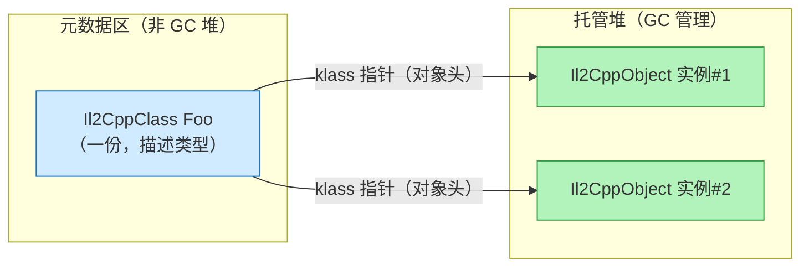
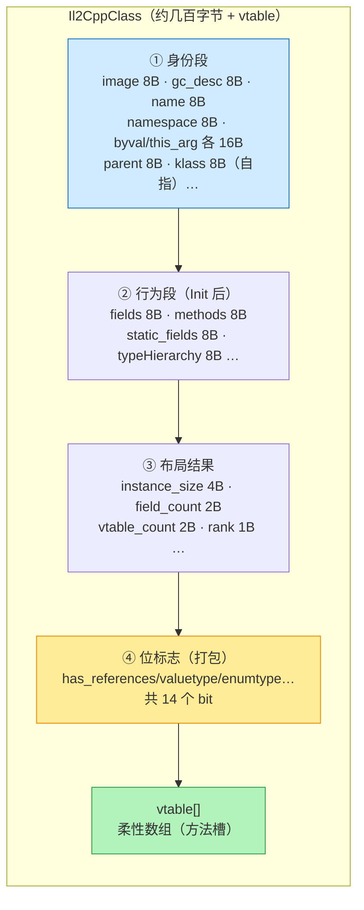

# IL2CPP 对象与类型的内存布局：class 与 object 的存储结构

> 源码：`libil2cpp/il2cpp-class-internals.h:388`（Il2CppClass）、`libil2cpp/il2cpp-object-internals.h:66`（Il2CppObject）、`libil2cpp/vm/Class.cpp`（布局初始化）
> 核心：**C# 的"类"在 IL2CPP 里分裂成两个东西——`Il2CppClass`（类型描述符，全程序集共享一份）和 `Il2CppObject`（对象实例，每个 new 一份）**。

## 先分清：class 和 object 是两套存储

| | Il2CppClass | Il2CppObject |
|---|---|---|
| 对应 C# | `typeof(Foo)` / 类型元数据 | `new Foo()` 的实例 |
| 数量 | **每个类型一份**（进程内共享） | **每个 new 一份**（堆上） |
| 存放 | 静态区/元数据区（不在 GC 堆） | **托管堆**（由 GC 管理） |
| 内容 | 类型身份 + 布局信息 + 方法表 + GC 描述符 | 对象头 + 实例字段值 |
| 谁在用 | 分配、方法调用、类型检查、GC | 业务代码 |



**对象头里的 `klass` 指针**就是两者的桥梁：`obj->klass` 让你从任何实例反查它的类型描述符（`obj.GetType()` 的实现）。

---

## Part A：Il2CppClass —— 类型怎么存

### 结构体完整字段（il2cpp-class-internals.h:388）

```cpp
typedef struct Il2CppClass
{
    // ── ① Always valid 段：类型身份，构造后立即可用 ──
    const Il2CppImage* image;              // 所属程序集
    void* gc_desc;                         // GCJ 描述符（GC 用，见 Part C）
    const char* name;                      // 类型名
    const char* namespaze;                 // 命名空间（源码笔误 namespaze）
    Il2CppType byval_arg;                  // 按值传递时的类型信息
    Il2CppType this_arg;                   // 实例方法 this 参数类型
    Il2CppClass* element_class;            // 数组元素类型
    Il2CppClass* castClass;                // 强转目标
    Il2CppClass* declaringType;            // 外部类（嵌套类型的宿主）
    Il2CppClass* parent;                   // ⭐ 基类
    Il2CppGenericClass* generic_class;     // 泛型实例上下文
    Il2CppMetadataTypeHandle typeMetadataHandle;
    const Il2CppInteropData* interopData;
    Il2CppClass* klass;                    // hack：指向自己（伪装 MonoVTable）

    // ── ② 需 Init 段：布局与行为，Class::Init 逐个填 ──
    FieldInfo* fields;                     // 字段表（含每个字段的 offset）
    const EventInfo* events;
    const PropertyInfo* properties;
    const MethodInfo** methods;            // 方法表
    Il2CppClass** nestedTypes;
    Il2CppClass** implementedInterfaces;
    Il2CppRuntimeInterfaceOffsetPair* interfaceOffsets;
    void* static_fields;                   // ⭐ 静态字段存储区（独立于实例）
    const Il2CppRGCTXData* rgctx_data;
    Il2CppClass** typeHierarchy;           // 继承链缓存（快速 parent 检查）

    void* unity_user_data;
    uint32_t initializationExceptionGCHandle;
    uint32_t cctor_started, cctor_finished;
    ALIGN_TYPE(8) size_t cctor_thread;

    // ── ③ 实例数据：布局结果 ──
    uint32_t instance_size;                // ⭐ 实例总大小（分配时用）
    uint32_t actualSize;
    uint32_t element_size;
    int32_t native_size;
    uint32_t static_fields_size;
    uint32_t thread_static_fields_size;
    int32_t thread_static_fields_offset;
    uint32_t flags;
    uint32_t token;                        // metadata 令牌

    uint16_t method_count, property_count, field_count;  // 各表数量
    uint16_t event_count, nested_type_count, vtable_count;
    uint16_t interfaces_count, interface_offsets_count;

    uint8_t typeHierarchyDepth;            // 继承深度
    uint8_t genericRecursionDepth;
    uint8_t rank;                          // 数组维数
    uint8_t minimumAlignment, naturalAligment, packingSize;

    // ── ④ 位标志（1 字节打包）：Object.cpp 分配时的判断依据 ──
    uint8_t initialized_and_no_error : 1;
    uint8_t valuetype : 1;
    uint8_t initialized : 1;
    uint8_t enumtype : 1;
    uint8_t is_generic : 1;
    uint8_t has_references : 1;            // ⭐ 有无引用字段（分配三分支第一判断）
    uint8_t init_pending : 1;
    uint8_t size_inited : 1;
    uint8_t has_finalize : 1;
    uint8_t has_cctor : 1;
    uint8_t is_blittable : 1;
    uint8_t is_import_or_windows_runtime : 1;
    uint8_t is_vtable_initialized : 1;
    uint8_t has_initialization_error : 1;
    VirtualInvokeData vtable[IL2CPP_ZERO_LEN_ARRAY];  // 虚表（柔性数组）
} Il2CppClass;
```

### 内存布局图（64 位，指针 8B）



### 关键成员详解

| 成员 | 大小(64位) | 作用 | 谁读它 |
|---|---|---|---|
| `gc_desc` | 8B | GCJ 描述符（引用 bitmap） | **GC**（Object.cpp 分配三分支） |
| `instance_size` | 4B | 实例总字节数（头+字段+padding） | **分配**（`Object::New` 按它开内存） |
| `has_references` | 1bit | 对象内有没有引用字段 | **分配**（无引用走 `GC_MALLOC_ATOMIC`） |
| `fields[]` | 8B 指针 | 字段表（FieldInfo，含 offset） | 布局、GC bitmap、反射 |
| `static_fields` | 8B | **静态字段存储区指针**（独立分配） | 静态访问（`Foo.staticField` 编译成 `klass->static_fields + offset`） |
| `parent` | 8B | 基类指针 | 继承检查、布局遍历 |
| `typeHierarchy[]` | 8B×N | 从 Object 到本类的指针链 | 快速 `is` 检查 |
| `vtable[]` | 8B×N | 虚方法槽 | 虚调用 |
| `valuetype/enumtype/rank` | 各1bit/1B | 类型分类 | 各种运行时分支 |

> **static 字段不在对象实例里**：`klass->static_fields` 指向独立内存区（Class.cpp:798 按 `static_fields_size` 分配），实例的 `instance_size` 不含它。这也是为什么 **static 字段是 GC Root**（它不随实例生死，需要一直可达）。

---

## Part B：Il2CppObject —— 实例怎么存

### 对象头（il2cpp-object-internals.h:66）

```cpp
typedef struct Il2CppObject
{
    union {
        Il2CppClass *klass;   // 类型描述符指针（也是虚表入口）
        Il2CppVTable *vtable;
    };
    MonitorData *monitor;     // 锁/监控数据（lock 语句、wait 用）
} Il2CppObject;
```

**对象头固定 16 字节**（64 位）：`klass/vtable` 8B + `monitor` 8B。**任何对象实例的前 16 字节都是这个**，之后才是字段区。

### 每个成员怎么存：存储方式速查表

| C# 成员类型 | 存储方式 | 大小(64位) | 对齐 | GC bitmap |
|---|---|---|---|---|
| `class`/`string`/`array`/`object`（引用） | **堆指针** | 8B | 8B | ✅ 置位 |
| `int`/`float`/`uint`（4B 值类型） | **内联值** | 4B | 4B | ❌ |
| `bool`/`byte`/`sbyte` | 内联值 | 1B | 1B | ❌ |
| `short`/`ushort`/`char` | 内联值 | 2B | 2B | ❌ |
| `long`/`double`/`ulong` | 内联值 | 8B | 8B | ❌ |
| `IntPtr`/`UIntPtr`/裸指针 | 内联值 | 8B | 8B | ❌（PTR 不置位） |
| `enum` | 底层类型内联（通常 4B） | 4B | 4B | ❌ |
| **`struct` 字段** | **内联展开**（成员直接嵌在对象里） | 成员之和+padding | 最大成员 | 递归置位 |
| `static` 字段 | **不在对象里**（`klass->static_fields`） | — | — | —（GC Root） |
| `const` | 编译期常量，无存储 | — | — | — |

### 完整示例：一个"全类型"类

```csharp
class Player : Character        // Character : Object
{
    public string name;         // 引用 → 8B 堆指针
    public int level;           // 值类型 → 4B 内联
    public float hp;            // 4B 内联
    public bool isAlive;        // 1B 内联
    public Item mainWeapon;     // 引用 → 8B 堆指针（Item 实例在堆上）
    public int[] buffs;         // array 引用 → 8B 指针（数组对象在堆上）
    public Vector3 pos;         // struct → 12B 内联展开（3×float）
    public IntPtr nativePtr;    // 指针 → 8B 内联
}
// Vector3 { float x, y, z; }   // struct 字段
// static int playerCount;      // ⭐ 不在实例里！
```

### 内存条逐字节图（64 位，含对齐 padding）

```
offset  大小 内容                          说明
──────────────────────────────────────────────────────────────────
0x00    8B  klass/vtable 指针  ──────────  Il2CppObject 头（16B）
0x08    8B  monitor 指针  ──────────────┘
0x10    8B  name → "Alice"（堆上 string 对象）     引用 ⭐
0x18    4B  level = 42                         内联值
0x1C    4B  hp = 100.0f                        内联值
0x20    1B  isAlive = true
0x21    7B  [padding]  ← 对齐到 8B 边界（下一个引用字段需要）
0x28    8B  mainWeapon → Item 实例（堆上）       引用 ⭐
0x30    8B  buffs → int[3]（堆上数组对象）        引用 ⭐
0x38    12B pos.x / pos.y / pos.z               struct 内联展开
0x44    4B  [padding]  ← 对齐到 8B 边界
0x48    8B  nativePtr                           指针（非引用，GC 不扫）
──────────────────────────────────────────────────────────────────
0x50    总大小 instance_size = 0x50 = 80 字节
```

**GC bitmap**（每个 bit = 一个 8B word）：

```
word:   0    1    2    3    4    5    6    7    8    9
       ┌────┬────┬────┬────┬────┬────┬────┬────┬────┬────┐
       │head│head│name│lev+│isAl│pad │weap│buffs│pos │pos+│
       │kls │mon │→str│hp  │Al  │    │→Itm│→arr│3f  │nat │
       └────┴────┴────┴────┴────┴────┴────┴────┴────┴────┘
bit:    0    0    1    0    0    0    1    1    0    0
```

置位的 word：`name`(2)、`mainWeapon`(6)、`buffs`(7)——`GetBitmapNoInit` 按 `offset/8` 置位的结果（`pos` struct 里的 float 不置位；`nativePtr` 是 PTR 类型不置位）。

### 对齐规则（为什么有 padding）

.NET 默认布局（SequentialLayout）规则，IL2CPP 在代码生成期就按它算好 `fieldOffsets` 写入 metadata：

1. **引用字段必须 8B 对齐**（`IL2CPP_ASSERT(0 == (offset % sizeof(void*)))`，Class.cpp:1904）
2. 值类型字段按自身大小对齐（int 4B、short 2B、bool 1B）
3. 相邻字段间插入 padding 满足对齐；结构尾部对齐到**最大成员对齐值**（通常 8B）
4. struct 字段按它的最大成员对齐（Vector3 最大 float=4B，但下一个引用字段要求 8B → 尾部补 4B）

**实例总大小**：`instance_size` = 对象头 16B + 字段区 + padding，由代码生成器预计算（`Class::Init` 时从 metadata 读入，Object.cpp:299/304 分配时直接用）。

---

## Part C：代码 ↔ 布局 ↔ GC 的三角对应（记忆法）

```
C# 代码（声明）          内存布局（存储）              GC 行为（bitmap/分配路径）
─────────────────────────────────────────────────────────────────────────
引用字段  string name;   → 8B 堆指针（bit 置位）    → has_references=true
                                                      → AllocateSpec/GC_gcj_malloc
                                                      → 标记时沿指针扫目标
值类型字段  int level;   → 4B 内联值（bit 清 0）    → 不参与引用扫描
                                                      → 对象无引用时走 GC_MALLOC_ATOMIC
struct 字段 Vector3 pos; → 内联展开（按成员递归）    → GetBitmapNoInit 递归置位内部引用
static 字段 count;       → klass->static_fields      → GC Root（不随实例）
对象头 obj->klass        → 16B（klass+monitor）      → GC 从它拿 gc_desc/instance_size
```

**记忆口诀**：*引用存指针、值类型存值、struct 展开、static 外置、头 16 字节、bitmap 按 word。*

## 源码索引

| 内容 | 位置 |
|---|---|
| Il2CppClass 结构 | `libil2cpp/il2cpp-class-internals.h:388` |
| Il2CppObject 结构 | `libil2cpp/il2cpp-object-internals.h:66` |
| FieldInfo（含 offset） | `libil2cpp/il2cpp-class-internals.h:205` |
| 分配三分支（读 instance_size/has_references/gc_desc） | `libil2cpp/vm/Object.cpp:285-310` |
| bitmap 按 offset/8 置位 | `libil2cpp/vm/Class.cpp:1869-1928` |
| struct 递归置位 | `libil2cpp/vm/Class.cpp:1934` |
| static_fields_size 计算 | `libil2cpp/vm/Class.cpp:798` |

## 延伸阅读

- [托管堆 GC：为什么不分代不压缩](./managed-heap-gc) — gc_desc 从哪来、GC 怎么用 bitmap
- [一次分配的完整旅程](./allocator-journey) — 原生堆侧的对象分配
- 🧪 [内存布局查看器](./object-layout-sim) — 交互式：选类看内存条逐字节
