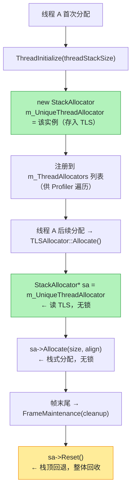

# TLS：每线程临时内存分配（TLSAllocator）

> 源码：`Runtime/Allocator/TLSAllocator.h` / `TLSAllocator.cpp` / `StackAllocator.cpp`
> 核心：**每个线程一个独立的 StackAllocator**，通过 TLS（Thread-Local Storage）保存指针，实现完全无锁的帧临时分配。
> 本页行号由 `scripts/verify_srcrefs.py` 校验。

<script setup>
import TlsFrameSimulator from './components/TlsFrameSimulator.vue'
</script>

## 先说人话：为什么"每线程一个栈"能免掉锁

多线程分配内存时的经典麻烦是：**大家共用一本账**。谁要用，谁就得先锁住账本，
改完再放开。分配越频繁，抢得越凶，CPU 大量时间花在等锁上。

Unity 在这里换了个思路：**账本一人一本，谁也不用看别人的。**

- 线程 A 的临时内存，只有线程 A 会分配、只有线程 A 会回收；
- 那就干脆给每个线程一条**独立的栈**，指针存在该线程自己的 TLS 槽里；
- 没有共享状态 → **没有锁可争** → 分配就是"栈顶往上挪一格"。

帧末更省事：这一帧所有临时内存都不要了，那么**把栈顶指针拨回起点**就完事了——
不用一块块 free，O(1)。

::: tip 一句话记住
`Allocator.Temp` 快的真正原因不是"用了什么高级算法"，而是**它根本没有共享**，
所以省掉了锁，也省掉了"找一块合适空闲内存"的搜索。
:::

## 亲手玩一下

<TlsFrameSimulator />

（下面开始是逐层深入的源码细节。）

## 设计目标

源码注释（TLSAllocator.h）明确写：

> 设计目标：为每个线程提供独立的 StackAllocator，实现完全无锁的帧临时分配。
> - 通过 TLS 存储每线程的 StackAllocator 指针
> - 每个线程的分配/释放操作完全独立，**零锁竞争**
> - 帧末尾 `FrameMaintenance()` 重置 StackAllocator（整体回收）

为什么需要它：游戏一帧内会有大量短生命周期临时对象（`Allocator.Temp`、中间 buffer、临时容器）。如果都走全局堆（还要加锁），会引入竞争和碎片。按线程隔离 + 栈式分配 + 帧末整体重置，是最优解。

## 核心结构：TLS 存指针

```cpp
// TLSAllocator.h:78
static UNITY_TLS_VALUE(StackAllocator*) m_UniqueThreadAllocator;
static int s_NumberOfInstances;
```

- `UNITY_TLS_VALUE(type)` 宏是 Unity 跨平台 TLS 抽象，定义在 `Runtime/Threads/ThreadSpecificValue.h`：
  - `UNITY_DYNAMIC_TLS` 开启时：`ThreadSpecificValue<type>`，继承 `baselib::ThreadLocalStorage<T>`（动态 TLS，运行时按线程查询）
  - 否则：`thread_local ThreadSpecificValueEmulation<type>`（C++11 静态 TLS，编译期分配槽位）
- `m_UniqueThreadAllocator` 是**静态成员**——因为某些平台要求 TLS 变量必须是静态的，所以 TLSAllocator 设计为单例（`s_NumberOfInstances` 断言保证只有一个实例）。

## 每线程的分配流程



```
线程 A 首次分配
  → ThreadInitialize(threadStackSize)
      → 为当前线程 new 一个 StackAllocator
      → m_UniqueThreadAllocator = 该 StackAllocator（存入 TLS）
      → 注册到 m_ThreadAllocators 列表（供 Profiler 遍历）

线程 A 后续分配
  → TLSAllocator::Allocate()
      → StackAllocator* sa = m_UniqueThreadAllocator   ← 读 TLS，无锁
      → return sa->Allocate(size, align)               ← 栈式分配，无锁

帧末尾
  → FrameMaintenance(cleanup)
      → sa->Reset()                                    ← 栈顶回退，整体回收
```

分配/释放完全不碰锁——这就是"无锁帧分配"的实现方式。

## 内存块复用池（跨线程）

线程退出时，栈内存块不直接还给系统，而是进入复用池：

```cpp
// TLSAllocator.h:96
// [内存块复用池]
// 线程退出 → 内存块入池
// 新线程启动 → 从池中取（避免系统调用）
struct AvailableBlocks : public ListElement
{
    void* blockMemory;
    size_t blockSize;
};
List<AvailableBlocks> m_AvailableBlocks;   // 受 m_AllocatorTableLock 保护
```

流程：线程 `ThreadCleanup()` → `ReturnBlock()` 把当前线程的 StackAllocator 内存块压入 `m_AvailableBlocks`；新线程 `ThreadInitialize()` → 优先 `GetNewBlock()` 从池中复用。只在池空时才向 `LowLevelVirtualAllocator` 申请新块。

## 容量管理

源码注释（TLSAllocator.h:19-22）：

| 环境 | 起始容量 | 可扩展上限 | 扩展倍数 |
|---|---|---|---|
| Editor | 16 MB | 128 MB | 8× |
| Runtime | 4 MB | 8 MB | 2× |

- 超出上限后**不再扩展**，回退到 fallback allocator（`DynamicHeapAllocator`）
- `SetBlockSizeForCurrentThread(blockSize)` 可给当前线程设置起始块大小（不同线程可配不同大小）

## 使用场景

- `ALLOC_TEMP_AUTO` / `kMemTempAlloc` label 的分配都走这里
- C# 侧对应 `Allocator.Temp`（`NativeArray<T>(n, Allocator.Temp)` 等）
- 典型用途：渲染一帧内的临时几何数据、临时字符串/容器、每帧重建的小结构

## 关键特性总结

| 特性 | 实现 |
|---|---|
| 无锁 | TLS 每线程独立 StackAllocator，零共享状态 |
| 帧回收 | `FrameMaintenance()` 栈顶重置，O(1) 整体释放 |
| 线程亲和 | 块随线程走，线程退出归还池 |
| 容量上限 | Editor 128MB / Runtime 8MB，超出回退全局堆 |
| 与 TLSF 的关系 | 互补：TLS 管"短命帧内存"，TLSF 管"长命通用内存" |

## 常见误解

::: warning 误解一：线程一创建就分配了栈内存
不是。栈是**惰性创建**的——`ThreadInitialize` 在该线程**第一次分配**时才被调用
（`TLSAllocator.cpp:54`）。你创建 100 个线程但只用其中 2 个做临时分配，
就只有那 2 个会真的占内存。
:::

::: warning 误解二：TLS 栈上的内存可以随便 free
`StackAllocator` 是**后进先出**的（`StackAllocator.cpp:156` 的 `Deallocate` 只处理栈顶）。
你没法"抽掉中间一块"。这在实践中通常不是问题，因为临时变量的作用域本身就是 LIFO 的，
但如果你想在帧中途释放一个早先分配的临时块，它其实什么都不会做——真正的回收要等帧末。
:::

::: warning 误解三：栈满了会一直扩容
有硬上限：Editor 16MB 起、最多扩到 128MB（8 倍）；Runtime 4MB 起、最多 8MB（2 倍）
（源码注释 `TLSAllocator.h:19-22`）。超了**不再扩容**，而是回退到 fallback allocator
（`DynamicHeapAllocator`）——这条回退链在 `MemoryManager::Allocate` 里完成。所以"Temp 分配一定快"
这个假设在极端情况下不成立。
:::

## 自检清单

- [ ] 能说出"无锁"在这里是靠什么实现的（提示：不是靠算法，是靠结构）
- [ ] 能解释为什么帧末回收是 O(1)，以及这个 O(1) 换来了什么限制
- [ ] 能说出线程退出时内存块为什么不还给操作系统
- [ ] 能解释为什么 `TLSAllocator` 被设计成单例（`s_NumberOfInstances` 断言）
- [ ] 能说出 `Allocator.Temp` 超限后的行为

## 延伸阅读

- 下一篇：[TLSF：两级分割适应算法](./tlsf) — DynamicHeapAllocator 的底层算法
- [DynamicHeapAllocator：TLSF 的工程集成](./dynamic-heap)
- [一次分配的完整旅程](./allocator-journey) — 回到 Temp 分流那个岔路口
