# TLSF：两级分割适应算法（Two-Level Segregated Fit）

> 源码：`External/Allocator/tlsf/tlsf.c`（v3.1，Matthew Conte 实现）
> 这是 Unity `DynamicHeapAllocator` 的底层通用分配算法。本文逐行拆解。

## 为什么是 TLSF

传统分配器（dlmalloc 等）在 free 时需要遍历或按 best-fit 搜索，最坏 O(n)。游戏引擎要求**确定性**：一帧内的分配/释放不能出现偶发长耗时。

TLSF（Two-Level Segregated Fit）的核心承诺（源码注释）：

> TLSF achieves O(1) cost for malloc and free operations by limiting the search for a free block to a free list of guaranteed size adequate to fulfill the request, combined with efficient free list queries using bitmasks and architecture-specific bit-manipulation routines.

即：**用两级空闲链表 + 位图（bitmap）+ 位操作指令（ffs/fls），把"找合适空闲块"从遍历变成查位图，O(1)**。同时 free 时做前后相邻块合并（coalescing），对抗外部碎片。

## 常量配置

```c
// tlsf.c:211 二级线性细分对数（每个一级类下 2^5 = 32 个二级槽）
SL_INDEX_COUNT_LOG2 = 5;

// 64 位：所有分配 8 字节对齐；32 位：4 字节
ALIGN_SIZE_LOG2 = 3 (64bit) / 2 (32bit);

// 64 位支持最大块 1<<32 字节；32 位 1<<30
FL_INDEX_MAX = 32 (64bit) / 30 (32bit);

// 一级位图数 = 32 - 8 + 1 = 25（64 位）
FL_INDEX_SHIFT  = SL_INDEX_COUNT_LOG2 + ALIGN_SIZE_LOG2 = 5 + 3 = 8;
FL_INDEX_COUNT  = FL_INDEX_MAX - FL_INDEX_SHIFT + 1 = 25;

// 小块阈值：小于 1<<8 = 256 字节的块全部进第 0 个一级类
SMALL_BLOCK_SIZE = 1 << FL_INDEX_SHIFT = 256;
```

**关键数字（64 位）**：一级类 25 个、二级槽 32 个 → 空闲链表数组 `blocks[25][32]` = 800 个表头；两个位图 `fl_bitmap`（25 位）+ `sl_bitmap[25]`（各 32 位）。

## 数据结构

### 块头（block_header_t）

```c
// tlsf.c:302
typedef struct block_header_t
{
    struct block_header_t* prev_phys_block;  // 前一物理块指针（仅当前一块 free 时有效）
    size_t size;                             // 本块大小（不含头），低 2 位存状态
    struct block_header_t* next_free;        // 空闲链表：下一空闲块（仅 free 时有效）
    struct block_header_t* prev_free;        // 空闲链表：上一空闲块（仅 free 时有效）
} block_header_t;
```

**size 字段低 2 位复用**（tlsf.c:316-322）：

```c
bit 0: block_header_free_bit      = 1<<0   // 本块是否空闲
bit 1: block_header_prev_free_bit = 1<<1   // 前一块是否空闲
```

取真实大小：`block->size & ~(free_bit | prev_free_bit)`。

**关键技巧**：`prev_phys_block` 字段实际存放在**前一块的末尾**（前一块 free 时才有意义），避免每块都多付一个指针的开销——`block_header_overhead = sizeof(size_t)`，即对外只暴露 size 字段作为头开销。

### 控制结构（control_t）

```c
// tlsf.c:345
typedef struct control_t
{
    block_header_t block_null;              // 空链表哨兵
    unsigned int fl_bitmap;                 // 一级位图：哪些一级类非空
    unsigned int sl_bitmap[FL_INDEX_COUNT]; // 二级位图：每个一级类内哪些二级槽非空
    block_header_t* blocks[FL_INDEX_COUNT][SL_INDEX_COUNT]; // 800 个空闲链表头
} control_t;
```

## 两级映射（mapping）

**核心思想**：给定块大小 size，算出它属于哪个 (fl, sl) 槽。一级类按 2 的幂分档（fl ≈ log2(size)），二级类把每档再线性切 32 份。

```c
// tlsf.c:508 插入用映射（精确）
static void mapping_insert(size_t size, int* fli, int* sli)
{
    if (size < SMALL_BLOCK_SIZE)              // < 256B：全部进 0 号一级类
    {
        fl = 0;
        sl = size / (SMALL_BLOCK_SIZE / SL_INDEX_COUNT);  // sl = size / 8
    }
    else
    {
        fl = tlsf_fls_sizet(size);            // fl = floor(log2(size))
        sl = (size >> (fl - SL_INDEX_COUNT_LOG2)) ^ (1 << SL_INDEX_COUNT_LOG2);
        fl -= (FL_INDEX_SHIFT - 1);           // 归一到 0..24
    }
}

// tlsf.c:528 分配用映射（向上取整，保证选中的块 >= 请求）
static void mapping_search(size_t size, int* fli, int* sli)
{
    if (size >= SMALL_BLOCK_SIZE)
    {
        const size_t round = (1 << (tlsf_fls_sizet(size) - SL_INDEX_COUNT_LOG2)) - 1;
        size += round;                        // 向上取整到本一级类的 32 分位
    }
    mapping_insert(size, fli, sli);
}
```

**举个例子（64 位）**：请求 1000 字节 →
- `fls(1000)` = 9（2^9=512 ≤ 1000 < 2^10=1024）
- `sl = (1000 >> (9-5)) ^ (1<<5) = (1000>>4) ^ 32 = 62 ^ 32 = 30`
- `fl = 9 - 7 = 2` → 落槽 `blocks[2][30]`

## 查找（search_suitable_block）：两级位图 O(1)

```c
// tlsf.c:538
static block_header_t* search_suitable_block(control_t* control, int* fli, int* sli)
{
    int fl = *fli, sl = *sli;

    // 1. 先看本一级类内：从 sl 往高位的二级位图
    unsigned int sl_map = control->sl_bitmap[fl] & (~0U << sl);
    if (!sl_map)
    {
        // 2. 本一级类没有合适槽 → 看更高一级类（fl+1 及以上）
        const unsigned int fl_map = control->fl_bitmap & (~0U << (fl + 1));
        if (!fl_map)
            return 0;                          // 内存耗尽
        fl = tlsf_ffs(fl_map);                 // 找到最低的非空一级类
        *fli = fl;
        sl_map = control->sl_bitmap[fl];       // 该一级类全部二级槽
    }
    sl = tlsf_ffs(sl_map);                     // 找到最低的非空二级槽
    *sli = sl;
    return control->blocks[fl][sl];            // 链表头第一个块
}
```

**O(1) 的关键**：`fls`（find last set）/ `ffs`（find first set）用 CPU 指令（gcc `__builtin_clz`、MSVC `_BitScanReverse` 等，tlsf.c:53-175 各平台分支），一条指令定位位图中最高的 1 位。查找最多两次位图操作，无遍历。

## 空闲链表维护（insert / remove）

```c
// 插入：头插法 + 置位图
static void insert_free_block(control_t* control, block_header_t* block, int fl, int sl)
{
    block_header_t* current = control->blocks[fl][sl];
    block->next_free = current;
    block->prev_free = &control->block_null;
    current->prev_free = block;
    control->blocks[fl][sl] = block;          // 新块做链表头
    control->fl_bitmap |= (1 << fl);          // 置一级位图
    control->sl_bitmap[fl] |= (1 << sl);      // 置二级位图
}

// 移除：双向链表摘除 + 空链表时清位图
static void remove_free_block(control_t* control, block_header_t* block, int fl, int sl)
{
    next->prev_free = prev;
    prev->next_free = next;
    if (control->blocks[fl][sl] == block)     // 是链表头
    {
        control->blocks[fl][sl] = next;
        if (next == &control->block_null)     // 链表空了
        {
            control->sl_bitmap[fl] &= ~(1 << sl);
            if (!control->sl_bitmap[fl])      // 二级全空
                control->fl_bitmap &= ~(1 << fl);  // 清一级位图
        }
    }
}
```

## 分割（block_split）与分配后 trim

分配到一个比请求大的块时，把剩余部分切出来还给池：

```c
// tlsf.c:642 把 block 切成 size 大小的已用块 + 剩余空闲块
static block_header_t* block_split(block_header_t* block, size_t size)
{
    block_header_t* remaining = offset_to_block(block_to_ptr(block), size - block_header_overhead);
    const size_t remain_size = block_size(block) - (size + block_header_overhead);
    block_set_size(remaining, remain_size);   // 剩余块大小
    block_set_size(block, size);              // 本块大小
    block_mark_as_free(remaining);            // 剩余块标记 free 并链上下一块
    return remaining;
}
```

分配主流程 `block_locate_free` + `block_prepare_used`：

```c
// tlsf.c:748
static block_header_t* block_locate_free(control_t* control, size_t size)
{
    mapping_search(size, &fl, &sl);            // 1. 映射到 (fl, sl)
    block = search_suitable_block(control, &fl, &sl);  // 2. 位图查找
    if (block)
    {
        remove_free_block(control, block, fl, sl);     // 3. 摘出链表
    }
    return block;
}

// tlsf.c:768
static void* block_prepare_used(control_t* control, block_header_t* block, size_t size)
{
    block_trim_free(control, block, size);     // 4. 尾部多余还池
    block_mark_as_used(block);                 // 5. 标记已用
    return block_to_ptr(block);
}
```

`block_trim_free`：若 `block_size(block) >= sizeof(block_header_t) + size`（能再放下一个最小块），就 split 并把剩余插入空闲链表。

## 合并（coalescing）：free 时的前后合并

```c
// tlsf.c:664 把 block 并入前一物理块（prev 扩容）
static block_header_t* block_absorb(block_header_t* prev, block_header_t* block)
{
    prev->size += block_size(block) + block_header_overhead;
    block_link_next(prev);
    return prev;
}

// tlsf.c:674 释放时先向前合并
static block_header_t* block_merge_prev(control_t* control, block_header_t* block)
{
    if (block_is_prev_free(block))
    {
        block_remove(control, prev);           // 从空闲链表摘出前块
        block = block_absorb(prev, block);     // 前块吞并本块
    }
    return block;
}

// tlsf.c:689 再向后合并
static block_header_t* block_merge_next(control_t* control, block_header_t* block)
{
    if (block_is_free(next))                   // 下一块空闲
    {
        block_remove(control, next);
        block = block_absorb(block, next);     // 本块吞并下一块
    }
    return block;
}
```

free 主流程：合并前 → 合并后 → 插入空闲链表 → 置位图。

## malloc / free 全流程

```mermaid
flowchart TB
    subgraph malloc
        A1["tlsf_malloc(tlsf, size)"] --> A2["adjust_request_size(size, ALIGN)<br/>对齐 + 最小块约束"]
        A2 --> A3["block_locate_free()<br/>① mapping_search → (fl, sl)<br/>② search_suitable_block 位图查找<br/>③ remove_free_block 摘出链表"]
        A3 --> A4["block_prepare_used()<br/>④ block_trim_free 尾部多余还池<br/>⑤ block_mark_as_used<br/>⑥ 返回 block_to_ptr"]
    end
    subgraph free
        B1["tlsf_free(tlsf, ptr)"] --> B2["block_from_ptr(ptr)<br/>指针回算块头"]
        B2 --> B3["block_merge_prev(control, block)<br/>向前合并（前块空闲时）"]
        B3 --> B4["block_merge_next(control, block)<br/>向后合并（后块空闲时）"]
        B4 --> B5["block_mark_as_free(block)"]
        B5 --> B6["block_insert(control, block)<br/>mapping_insert → 头插 + 置位图"]
    end
    style A3 fill:#fff3bf,stroke:#f08c00,color:#212529
    style A4 fill:#b2f2bb,stroke:#2f9e44,color:#212529
    style B3 fill:#d0ebff,stroke:#1971c2,color:#212529
    style B4 fill:#d0ebff,stroke:#1971c2,color:#212529
```



```
tlsf_malloc(tlsf, size)
  ├─ adjust_request_size(size, ALIGN)   # 对齐 + 最小块约束
  ├─ block_locate_free(control, adjust) # mapping_search → search_suitable_block → remove
  └─ block_prepare_used(control, block, adjust)  # trim 尾部 → mark used → 返回指针

tlsf_free(tlsf, ptr)
  ├─ block = block_from_ptr(ptr)        # 指针回算块头
  ├─ block = block_merge_prev(control, block)   # 向前合并
  ├─ block = block_merge_next(control, block)   # 向后合并
  ├─ block_mark_as_free(block)
  └─ block_insert(control, block)       # mapping_insert → 头插 + 置位图
```

## memalign（对齐分配）

`tlsf_memalign`（tlsf.c:1108）多一个对齐间隙处理：如果块起点不对齐，需要 `gap_minimum = sizeof(block_header_t)` 空间，把前导间隙 `block_trim_free_leading` 切出来还池——因为前一块是已用的，不能改它的大小。

## 复杂度与特性

| 操作 | 复杂度 | 说明 |
|---|---|---|
| malloc | **O(1)** | 位图查找 + 链表头取块，常数次位操作 |
| free | **O(1)** | 前后合并 + 头插，常数次指针操作 |
| 内部碎片 | 低 | 分配后 trim 尾部还池；每块 8/16 字节头 |
| 外部碎片 | 可控 | free 时贪心合并相邻空闲块 |
| 确定性 | 强 | 无遍历、无随机化，适合实时系统 |

**代价**：800 个链表头 + 位图的控制结构固定开销（`tlsf_size()` 约几 KB）；合并只在 free 时相邻块间做，不跨空闲块链扫描。

## 与 Unity 的关系

- `External/Allocator/tlsf` 是纯 C 实现，被 `Runtime/Allocator/DynamicHeapAllocator.cpp` 直接 include 使用（`#include "External/Allocator/tlsf/tlsf.h"`）
- Unity 的集成做了工程化改造：多 Pool 管理、256MB 虚拟预留、BucketAllocator 快路径、LargeAlloc 溢出路径——见下一篇 [DynamicHeapAllocator：TLSF 的工程集成](./dynamic-heap)
